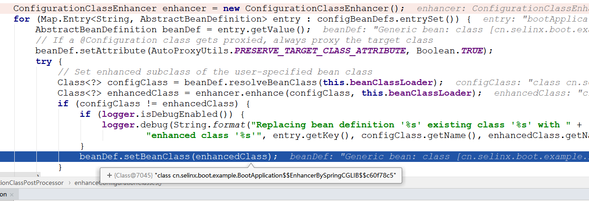
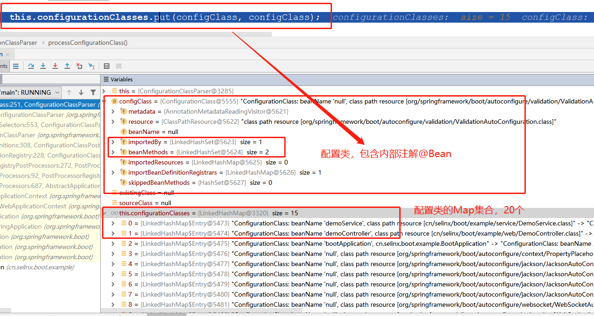

`SpringBoot非Web环境启动分析-1.5.x版本
==========================

> 2019-08-15：好记性不如烂笔头。
>
> 懂底层原理是成为高手的必经之路！
>
> 越是简单的方法，包含的内容越多！

[TOC]

## 阅读本文前提示

核心关注点：[onRefresh](#onRefresh) 和 [finishBeanFactoryInitialization](#finishBeanFactoryInitialization) 启动嵌入式容器和完成Bean的实例化。

## 一、Web环境下启动分析

pom.xml

```xml
<dependencies>
    <dependency>
        <groupId>org.springframework.boot</groupId>
        <artifactId>spring-boot-starter</artifactId>
    </dependency>
    <dependency>
        <groupId>org.springframework.boot</groupId>
        <artifactId>spring-boot-starter-web</artifactId>
    </dependency>
</dependencies>
```

java

```java
@SpringBootApplication
public class BootApplication {
    public static void main(String[] args) {
        // 简单的入口，实际包含非常多内容
        SpringApplication.run(BootApplication.class, args);
    }
}
```


### SpringApplication执行方法

SpringApplication#run静态公有方法，参数：对象或对象数组，一个可变String

#### 构造SpringApplication对象

构造阶段：推断了web类型，实例化了`spring.factories`配置文件的`ApplicationContextInitializer`和`ApplicationListener` 两个接口的实现类，推断了主类。

##### deduceWebEnvironment

根据当前环境是否存在某些类，目前都存在。因为引入了`spring-boot-starter-tomcat`。

```java
// 推断是否web类型：是否同时存在下面两个类: 
// 1.javax.servlet.Servlet
// 2.org.springframework.web.context.ConfigurableWebApplicationContext

private boolean deduceWebEnvironment() {
	for (String className : WEB_ENVIRONMENT_CLASSES) {
		if (!ClassUtils.isPresent(className, null)) {
			return false;
		}
	}
	return true;
}

// ClassUtils#isPresent---》 这个方法很有用，判断当前环境是否存在某个类
public static boolean isPresent(String className, ClassLoader classLoader) {
	try {
		forName(className, classLoader);
		return true;
	}
	catch (Throwable ex) {
		// Class or one of its dependencies is not present...
		return false;
	}
}
```

##### ApplicationContextInitializer

目前类如下，共6个。在这里初始化，在[applyInitializers调用](#3.applyInitializers) 被调用initialize方法

```properties
# /spring-boot/1.5.21.RELEASE/spring-boot-1.5.21.RELEASE.jar!/META-INF/spring.factories
# Application Context Initializers
org.springframework.context.ApplicationContextInitializer=\
org.springframework.boot.context.ConfigurationWarningsApplicationContextInitializer,\
org.springframework.boot.context.ContextIdApplicationContextInitializer,\
org.springframework.boot.context.config.DelegatingApplicationContextInitializer,\
org.springframework.boot.context.embedded.ServerPortInfoApplicationContextInitializer

// # spring-boot-autoconfigure-1.5.22.RELEASE.jar!\META-INF\spring.factories
# Initializers
org.springframework.context.ApplicationContextInitializer=\
org.springframework.boot.autoconfigure.SharedMetadataReaderFactoryContextInitializer,\
org.springframework.boot.autoconfigure.logging.AutoConfigurationReportLoggingInitializer
```

利用Spring工厂机制，实例化`ApplicationContextInitializer`实现类，并排序对象集合。常用于web应用中注册属性源。

```java
// Spring实例化Bean的工厂方法
private <T> Collection<? extends T> getSpringFactoriesInstances(Class<T> type) {
	return getSpringFactoriesInstances(type, new Class<?>[] {});
}

private <T> Collection<? extends T> getSpringFactoriesInstances(Class<T> type, Class<?>[] parameterTypes,
		Object... args) {
	// 1.Java类加载器：获取当前线程的加载器，安全起见采用该方式
	ClassLoader classLoader = Thread.currentThread().getContextClassLoader();
	// Use names and ensure unique to protect against duplicates
	// 加载每个jar包下：META-INF/spring.factories配置文件中：type对应值（类名全路径）
	Set<String> names = new LinkedHashSet<String>(SpringFactoriesLoader.loadFactoryNames(type, classLoader));
	// 采用反射机制实例化对象的实例
	List<T> instances = createSpringFactoriesInstances(type, parameterTypes, classLoader, args, names);
	// AnnotationAwareOrderComparator排序器，升序排雷,order值越小优先级越高。
	AnnotationAwareOrderComparator.sort(instances);
	return instances;
}
```

* 实现方式

  * 实现类：org.springframework.core.io.support.SpringFactoriesLoader

  * 配置资源：META-INF/spring.factories

  * 排序：AnnotationAwareOrderComparator#sort

##### ApplicationListener

利用Spring工厂加载机制，实例化`ApplicationListener`实现类，并排序对象集合，同上。

实现了SpringBoot的事件：`SpringApplicationEvent`

* 日志监听器：LoggingApplicationListener

* 配置文件关注：`ConfigFileApplicationListener`
* 线程中触发早期初始化：`BackgroundPreinitializer`
* 字符编码监听器：`FileEncodingApplicationListener`
* Liquibase数据库结构管理监听：LiquibaseServiceLocatorApplicationListener，当类存在是`liquibase.servicelocator.CustomResolverServiceLocator`

```properties
# 工厂配置文件
# /spring-boot-autoconfigure/1.5.21.RELEASE/spring-boot-autoconfigure-1.5.21.RELEASE.jar!/META-INF/spring.factories

# Application Listeners,这个类在初始化时
org.springframework.context.ApplicationListener=\
org.springframework.boot.autoconfigure.BackgroundPreinitializer

# /spring-boot/1.5.21.RELEASE/spring-boot-1.5.21.RELEASE.jar!/META-INF/spring.factories
org.springframework.context.ApplicationListener=\
org.springframework.boot.ClearCachesApplicationListener,\
org.springframework.boot.builder.ParentContextCloserApplicationListener,\
org.springframework.boot.context.FileEncodingApplicationListener,\
org.springframework.boot.context.config.AnsiOutputApplicationListener,\
org.springframework.boot.context.config.ConfigFileApplicationListener,\
org.springframework.boot.context.config.DelegatingApplicationListener,\
org.springframework.boot.liquibase.LiquibaseServiceLocatorApplicationListener,\
org.springframework.boot.logging.ClasspathLoggingApplicationListener,\
org.springframework.boot.logging.LoggingApplicationListener
```


##### deduceMainApplicationClass

```java
// 根据当前堆栈信息，比对方法名是否等于"main",然后反射生成类信息
private Class<?> deduceMainApplicationClass() {
	try {
		StackTraceElement[] stackTrace = new RuntimeException().getStackTrace();
		for (StackTraceElement stackTraceElement : stackTrace) {
			if ("main".equals(stackTraceElement.getMethodName())) {
				return Class.forName(stackTraceElement.getClassName());
			}
		}
	}
	catch (ClassNotFoundException ex) {
		// Swallow and continue
	}
	return null;
}
```

**1、什么是StackTrace**

StackTrace(堆栈轨迹)存放的就是方法调用栈的信息，每次调用一个方法会产生一个方法栈，当前方法调用另外一个方法时会使用栈将当前方法的现场信息保存在此方法栈当中，获取这个栈就可以得到方法调用的详细过程。例如：异常处理中常用的e.printStackTrace()实质就是打印异常调用的堆栈信息。

```
Thread.currentThread().getStackTrace()
new RuntimeException().getStackTrace()
```

**2、什么是StackTraceElement**

StackTraceElement表示StackTrace(堆栈轨迹)中的一个方法对象，通过这个对象可以获取调用栈当中的调用过程信息，包括方法的类名、方法名、文件名以及调用的行数。查看StackTraceElement 类的源代码，我们可以获取方法所在行、所在类等的信息；


#### 运行SpringApplication方法

SpringApplication#run：非静态公有方法，参数：一个可变String。run方法实现了方法的重载。

返回`ConfigurableApplicationContext`对象实例


```java
/**
 * Run the Spring application, creating and refreshing a new
 * {@link ApplicationContext}.
 * 
 * 运行Spring应用，创建并刷新一个新的ApplicationContext上下文。
 * 注意：ConfigurableApplicationContext是一个接口
 * 
 * @param args the application arguments (usually passed from a Java main method)
 * @return a running {@link ApplicationContext}
 */
public ConfigurableApplicationContext run(String... args) {
	StopWatch stopWatch = new StopWatch();
    // spring计时器启动
	stopWatch.start();
    // 上下文赋值null
	ConfigurableApplicationContext context = null;
    // 错误分析赋值null
	FailureAnalyzers analyzers = null;
    // 配置java.awt.headless属性true，headless工具包就会被使用
    // Headless模式是在缺少显示屏、键盘或者鼠标时的系统配置
	configureHeadlessProperty();
    // new 一个SpringApplicationRunListeners，包含了spring.factories下的SpringApplicationRunListener实例集合
	SpringApplicationRunListeners listeners = getRunListeners(args);
    /* 1. 事件监听器开启，采用了组合模式，for循环开启每一个。EventPublishingRunListener
     * SpringApplicationRunListener触发所有的ApplicationListener调用starting
     */
	listeners.starting();
	try {
        // new DefaultApplicationArguments，参数为空，source是commandLineArgs。命令行参数
		ApplicationArguments applicationArguments = new DefaultApplicationArguments(
				args);
        // 2. 准备环境变量:StandardServletEnvironment或StandardEnvironment
		ConfigurableEnvironment environment = prepareEnvironment(listeners,
				applicationArguments);
        // 3. Banner打印
		Banner printedBanner = printBanner(environment);
        // 4. 创建ApplicationContext上下文：加载了内部定义和主类Bean定义
		context = createApplicationContext();
        // 5. 错误分析
		analyzers = new FailureAnalyzers(context);
        // 6. 准备ApplicationContext上下文
		prepareContext(context, environment, listeners, applicationArguments,
				printedBanner);
        // 7. 刷新上下文，真正的核心了
		refreshContext(context);
		afterRefresh(context, applicationArguments);
		listeners.finished(context, null);
		stopWatch.stop();
		if (this.logStartupInfo) {
			new StartupInfoLogger(this.mainApplicationClass)
					.logStarted(getApplicationLog(), stopWatch);
		}
		return context;
	}
	catch (Throwable ex) {
		handleRunFailure(context, listeners, analyzers, ex);
		throw new IllegalStateException(ex);
	}
}
```

##### 1.配置Headless：configureHeadlessProperty

Headless模式是在缺少显示屏、键盘或者鼠标时的系统配置

参考： [java.awt.headless系统设定](https://www.cnblogs.com/wudi-dudu/p/7871405.html)

##### 2. 获取SpringBoot的运行监听器：getRunListeners

构建`SpringApplicationRunListeners`对象

读取`spring.factories`配置文件的`SpringApplicationRunListener`实现类。赋值给`SpringApplicationRunListeners`

##### 3.监听开始运行事件：listeners.starting

触发事件调用链

```properties
SpringApplicationRunListeners 迭代--> EventPublishingRunListener 委派--> SimpleApplicationEventMulticaster 广播 --> getApplicationListeners(event, type) 获取事件相关联的ApplicationListener --> 调用每个ApplicationListener#onApplicationEvent事件。
```

核心源码：

```java
class SpringApplicationRunListeners {


	private final List<SpringApplicationRunListener> listeners;
	
	// 采用Spring工厂方法读取spring.factories里面配置的SpringApplicationRunListener对象列表。
	SpringApplicationRunListeners(Log log, Collection<? extends SpringApplicationRunListener> listeners) {
		this.log = log;
		this.listeners = new ArrayList<SpringApplicationRunListener>(listeners);
	}
	
	// 组合模式，迭代执行所有的SpringApplicationRun监听事件
	public void starting() {
		for (SpringApplicationRunListener listener : this.listeners) {
			listener.starting();
		}
	}

}
// 目前唯一的SpringApplication运行监听器
public class EventPublishingRunListener implements SpringApplicationRunListener, Ordered {
	
	// SpringApplication对象
	private final SpringApplication application;

	private final String[] args;

	private final SimpleApplicationEventMulticaster initialMulticaster;

	// 构造方法，给属性赋值，将SpringApplication对象，作为属性传入。
	public EventPublishingRunListener(SpringApplication application, String[] args) {
		this.application = application;
		this.args = args;
		this.initialMulticaster = new SimpleApplicationEventMulticaster();
		for (ApplicationListener<?> listener : application.getListeners()) {
			this.initialMulticaster.addApplicationListener(listener);
		}
	}

	@Override
	public int getOrder() {
		return 0;
	}

	@Override
	@SuppressWarnings("deprecation")
	public void starting() {
		// 将SpringApplication对象，又作为属性传入给ApplicationStartedEvent
		this.initialMulticaster.multicastEvent(new ApplicationStartedEvent(this.application, this.args));
	}
}	
	
```


##### 4. 准备环境变量：prepareEnvironment

```java
// web下返回：StandardServletEnvironment，继承StandardEnvironment
ConfigurableEnvironment environment = prepareEnvironment(listeners, applicationArguments);
// 返回下列属性
// 1. servletConfigInitParams = StubPropertySource
// 2. servletContextInitParams = StubPropertySource
// 3. systemProperties = MapPropertySource 系统参数：java.vm , urs.dir , sun.desktop
// 4. systemEnvironment = SystemEnvironmentPropertySoufece  系统环境变量： M2_HOME , JAVA_HOME , PATH
// 5. random = RandomValuePropertySource 随机long值
// 6. applicationConfigurationProperties = ConfigFileApplicationListener$ConfigurationPropertySources 用户自定义配置yml
```

调用`listeners.environmentPrepared(environment)` ，先添加一个名为`random` 的`RandomValuePropertySource`，再读取文件`application.properties`

`ConfigFileApplicationListener` 读取外部化配置文件。调用链如下

```properties
SpringApplicationRunListeners 迭代--> EventPublishingRunListener 委派EnvironmentPostProcessor.postProcessEnvironment --> ConfigFileApplicationListener.postProcessEnvironment 后置处理。
```

##### 5. 输出广告： printBanner

实际调用：SpringApplicationBannerPrinter的print方法，默认是`SpringBootBanner`

String version = SpringBootVersion.getVersion(); 获取SpringBoot版本

```java
class SpringBootBanner implements Banner {

	private static final String[] BANNER = { "",
			"  .   ____          _            __ _ _",
			" /\\\\ / ___'_ __ _ _(_)_ __  __ _ \\ \\ \\ \\",
			"( ( )\\___ | '_ | '_| | '_ \\/ _` | \\ \\ \\ \\",
			" \\\\/  ___)| |_)| | | | | || (_| |  ) ) ) )",
			"  '  |____| .__|_| |_|_| |_\\__, | / / / /",
			" =========|_|==============|___/=/_/_/_/" };

	private static final String SPRING_BOOT = " :: Spring Boot :: ";

	private static final int STRAP_LINE_SIZE = 42;

	@Override
	public void printBanner(Environment environment, Class<?> sourceClass,
			PrintStream printStream) {
		for (String line : BANNER) {
			printStream.println(line);
		}
        // 获取当前SpringBoot的版本
		String version = SpringBootVersion.getVersion();
		version = (version != null) ? " (v" + version + ")" : "";
		String padding = "";
		while (padding.length() < STRAP_LINE_SIZE
				- (version.length() + SPRING_BOOT.length())) {
			padding += " ";
		}

		printStream.println(AnsiOutput.toString(AnsiColor.GREEN, SPRING_BOOT,
				AnsiColor.DEFAULT, padding, AnsiStyle.FAINT, version));
		printStream.println();
	}

}
```

##### 6. 创建上下文：createApplicationContext

web情况下：`ConfigurableApplicationContext`的实例对象是`AnnotationConfigEmbeddedWebApplicationContext`。

非web实例对象是`AnnotationConfigApplicationContext`。

```properties
# return (ConfigurableApplicationContext) BeanUtils.instantiate(contextClass);
# 类继承如下
AnnotationConfigEmbeddedWebApplicationContext --> EmbeddedWebApplicationContext --> GenericWebApplicationContext --> GenericApplicationContext 且 implements ConfigurableWebApplicationContext, ThemeSource --> WebApplicationContext --> ServletContext getServletContext()
```

构造方法如下：

```java
public class AnnotationConfigEmbeddedWebApplicationContext extends EmbeddedWebApplicationContext {

	private final AnnotatedBeanDefinitionReader reader;

	private final ClassPathBeanDefinitionScanner scanner;

	private Class<?>[] annotatedClasses;

	private String[] basePackages;
	
	// 默认构造方法
	public AnnotationConfigEmbeddedWebApplicationContext() {
		// 注解 Bean定义读取器--
		this.reader = new AnnotatedBeanDefinitionReader(this);
		// 类路径 Bean定义扫描器
		this.scanner = new ClassPathBeanDefinitionScanner(this);
	}
	
}
```

######  AnnotatedBeanDefinitionReader

实例化对象时，处理了`DefaultListableBeanFactory`内部类的定义和一些属性赋值。

引出了注解配置工具类 ：`AnnotationConfigUtils#registerAnnotationConfigProcessors` 注册了内部Bean定义。

注册Bean定义的方式是：`beanFactory.registerBeanDefinition(beanName, beanDefinition)` 默认类是`DefaultListableBeanFactory`。

```java
public class AnnotatedBeanDefinitionReader {

	private final BeanDefinitionRegistry registry;

	private BeanNameGenerator beanNameGenerator = new AnnotationBeanNameGenerator();

	private ScopeMetadataResolver scopeMetadataResolver = new AnnotationScopeMetadataResolver();

	private ConditionEvaluator conditionEvaluator;


	/**
	 * registry = AnnotationConfigEmbeddedWebApplicationContext
	 * getOrCreateEnvironment = StandardServletEnvironment
	 */
	public AnnotatedBeanDefinitionReader(BeanDefinitionRegistry registry) {
		this(registry, getOrCreateEnvironment(registry));
	}

	/**
	 * @since 3.1
	 */
	public AnnotatedBeanDefinitionReader(BeanDefinitionRegistry registry, Environment environment) {
		Assert.notNull(registry, "BeanDefinitionRegistry must not be null");
		Assert.notNull(environment, "Environment must not be null");
		this.registry = registry;
		// Conditional条件装配
		this.conditionEvaluator = new ConditionEvaluator(registry, environment, null);
		// 非常重要：注册注解配置处理器AnnotationConfigProcessors
		// 1. 注解类顺序比较器 : AnnotationAwareOrderComparator
		// 2. 上下文注解条件装配解析器：ContextAnnotationAutowireCandidateResolver
		// 3. 注册内部类定义internalXXX：registerBeanDefinition(String,RootBeanDefinition)
		AnnotationConfigUtils.registerAnnotationConfigProcessors(this.registry);
	}
}	
```

###### ClassPathBeanDefinitionScanner

```java
/**
 * 类路径Bean定义扫描器
 *
 * @since 2.5
 * @see AnnotationConfigApplicationContext#scan
 * @see org.springframework.stereotype.Component
 * @see org.springframework.stereotype.Repository
 * @see org.springframework.stereotype.Service
 * @see org.springframework.stereotype.Controller
 */
public class ClassPathBeanDefinitionScanner extends ClassPathScanningCandidateComponentProvider {

	private final BeanDefinitionRegistry registry;
	
    // 默认的bean定义属性
	private BeanDefinitionDefaults beanDefinitionDefaults = new BeanDefinitionDefaults();

	private String[] autowireCandidatePatterns;
	
    // 注解默认名称生成器：value属性，默认名称查看Introspector.decapitalize()
	private BeanNameGenerator beanNameGenerator = new AnnotationBeanNameGenerator();

    // @Scope 注解处理器：ConfigurableBeanFactory#SCOPE_PROTOTYPE
    // value：prototype,singleton，request，session
    // proxyMode：jdk,cglib,no=default
	private ScopeMetadataResolver scopeMetadataResolver = new AnnotationScopeMetadataResolver();

	private boolean includeAnnotationConfig = true;

	public ClassPathBeanDefinitionScanner(BeanDefinitionRegistry registry) {
		this(registry, true);
	}

	public ClassPathBeanDefinitionScanner(BeanDefinitionRegistry registry, boolean useDefaultFilters) {
		this(registry, useDefaultFilters, getOrCreateEnvironment(registry));
	}

	public ClassPathBeanDefinitionScanner(BeanDefinitionRegistry registry, boolean useDefaultFilters,
			Environment environment) {

		this(registry, useDefaultFilters, environment,
				(registry instanceof ResourceLoader ? (ResourceLoader) registry : null));
	}

	// registry和resourceLoader 都是AnnotationConfigEmbeddedWebApplicationContext
	public ClassPathBeanDefinitionScanner(BeanDefinitionRegistry registry, boolean useDefaultFilters,
			Environment environment, ResourceLoader resourceLoader) {

		Assert.notNull(registry, "BeanDefinitionRegistry must not be null");
		this.registry = registry;
		// 默认true
		if (useDefaultFilters) {
			// 注册默认的过滤器
			registerDefaultFilters();
		}
		// StandardServletEnvironment
		setEnvironment(environment);
		// 资源加载器：resourcePatternResolver和metadataReaderFactory
		setResourceLoader(resourceLoader);
	}

}
```

##### 7.错误分析：FailureAnalyzers

```java
analyzers = new FailureAnalyzers(context)
```

实例化`FailureAnalyzer`，共11。

给是`BeanFactoryAware` 的analyzer赋值`BeanFactory`对象。包括：`NoUniqueBeanDefinitionFailureAnalyzer` , `NoSuchBeanDefinitionFailureAnalyzer`，

在调用`NoSuchBeanDefinitionFailureAnalyzer#setBeanFactory` 方法时，注册Bean名称为：`autoConfigurationReport` 值为：ConditionEvaluationReport类 的Bean。第一个单例bean。

```properties
#\spring-boot-1.5.22.RELEASE.jar!\META-INF\spring.factories
# Failure Analyzers
org.springframework.boot.diagnostics.FailureAnalyzer=\
org.springframework.boot.diagnostics.analyzer.BeanCurrentlyInCreationFailureAnalyzer,\
org.springframework.boot.diagnostics.analyzer.BeanNotOfRequiredTypeFailureAnalyzer,\
org.springframework.boot.diagnostics.analyzer.BindFailureAnalyzer,\
org.springframework.boot.diagnostics.analyzer.ConnectorStartFailureAnalyzer,\
org.springframework.boot.diagnostics.analyzer.NoSuchMethodFailureAnalyzer,\
org.springframework.boot.diagnostics.analyzer.NoUniqueBeanDefinitionFailureAnalyzer,\
org.springframework.boot.diagnostics.analyzer.PortInUseFailureAnalyzer,\
org.springframework.boot.diagnostics.analyzer.ValidationExceptionFailureAnalyzer

# spring-boot-autoconfigure-1.5.22.RELEASE.jar!\META-INF\spring.factories
# Failure analyzers
org.springframework.boot.diagnostics.FailureAnalyzer=\
org.springframework.boot.autoconfigure.diagnostics.analyzer.NoSuchBeanDefinitionFailureAnalyzer,\
org.springframework.boot.autoconfigure.jdbc.DataSourceBeanCreationFailureAnalyzer,\
org.springframework.boot.autoconfigure.jdbc.HikariDriverConfigurationFailureAnalyzer
```


##### 8.准备上下文：prepareContext

```java
// 准备上下文，入参：context，前面读取的environment，监听器，程序参数，banner
prepareContext(context, environment, listeners, applicationArguments, printedBanner);
```

具体如下：


###### 1.setEnvironment

```java
@Override
public void setEnvironment(ConfigurableEnvironment environment) {
	// 将SpringApplication读取到的环境变量赋值给当前上下文
	super.setEnvironment(environment);
	// 给AnnotatedBeanDefinitionReader赋予环境变量，实际赋值给ConditionEvaluator属性
	this.reader.setEnvironment(environment);
	// 给AnnotatedBeanDefinitionReader赋予环境变量
	this.scanner.setEnvironment(environment);
}
```

###### 2.postProcessApplicationContext

应用上下文后置处理，目前`SpringApplication`对象内的属性都为空，无操作。

###### 3.applyInitializers

循环调用`SpringApplication`前面初始化的`ApplicationContextInitializer` 对象，执行6个初始化器的`initialize`方法。目前是初始化applicationContext属性！

```java
// SpringApplication#applyInitializers方法
protected void applyInitializers(ConfigurableApplicationContext context) {
	for (ApplicationContextInitializer initializer : getInitializers()) {
		Class<?> requiredType = GenericTypeResolver.resolveTypeArgument(initializer.getClass(),ApplicationContextInitializer.class);
		// 表明initializer的类型参数必须是ConfigurableApplicationContext的对象
		Assert.isInstanceOf(requiredType, context, "Unable to call initializer.");
		initializer.initialize(context);
	}
}
```

具体initialize方法执行如下，主要是操作应用上下文（applicationContext）。

```shell
#1. DelegatingApplicationContextInitializer 代理自定义的ApplicationContextInitializer
实例化环境变量配置`context.initializer.classes` 自定义上下文初始化器，并执行各自的`initialize`方法。目前没有配置，所以无任何操作。

#2. ContextIdApplicationContextInitializer
给applicatioContext赋值id属性值,规则是：name(spring.application.name) : profile : index(server.port)

#3. ConfigurationWarningsApplicationContextInitializer # 添加BeanFactoryPostProcessor
创建ConfigurationWarningsPostProcessor(包含ComponentScanPackageCheck对象)，添加到上下文应用中。

#4. ServerPortInfoApplicationContextInitializer # 添加ApplicationListener监听器
:事件是EmbeddedServletContainerInitializedEvent，注意这个是applicationContext的监听器，不是SpringApplication的。

#5. SharedMetadataReaderFactoryContextInitializer # 添加BeanFactoryPostProcessor
创建CachingMetadataReaderFactoryPostProcessor，添加到上下文应用中。

#6. AutoConfigurationReportLoggingInitializer # 添加ApplicationListener监听器
创建AutoConfigurationReportListener对象，添加到应用上下文中，并从BeanFactory获取ConditionEvaluationReport赋值给当前Initializer的report属性，加载上级report,目前没有上级。
```


###### 4.listeners.contextPrepared

调用SpringBoot的监听器`EventPublishingRunListener`，执行`contextPrepared`方法，目前为空方法。

###### 5.输出启动日志和profile

日志内容

```shell
# startup信息
Starting BootApplication on thinkpad-cjp with PID 18364 (D:\Workspace\Idea_2019\cjp1016\springboot-examples\springboot-1.x-examples\springboot-1.5.x-project\target\classes started by cjp in D:\Workspace\Idea_2019\cjp1016\springboot-examples)
# profile信息
No active profile set, falling back to default profiles: default
```

源码如下

```java
if (this.logStartupInfo) {
	// 1. 输出主类启动日志信息
	logStartupInfo(context.getParent() == null);
	// 2. 输出profile日志信息
	logStartupProfileInfo(context);
}

// 1. 创建StartupInfoLogger对象，运行logStarting方法
protected void logStartupInfo(boolean isRoot) {
	if (isRoot) {
		new StartupInfoLogger(this.mainApplicationClass).logStarting(getApplicationLog());
	}
}

// SpringApplication类的方法，获取SLF4JLocationAwareLog
protected Log getApplicationLog() {
	if (this.mainApplicationClass == null) {
		return logger;
	}
	return LogFactory.getLog(this.mainApplicationClass);
}

// StartupInfoLogger类的方法，入参是SLF4JLocationAwareLog
public void logStarting(Log log) {
	Assert.notNull(log, "Log must not be null");
	if (log.isInfoEnabled()) {
		log.info(getStartupMessage());
	}
	if (log.isDebugEnabled()) {
		log.debug(getRunningMessage());
	}
}

// StartupInfoLogger内的方法，获取启动信息
private String getStartupMessage() {
	StringBuilder message = new StringBuilder();
	message.append("Starting ");
    // ClassUtils.getShortName,主类的短名称
	message.append(getApplicationName());
	message.append(getVersion(this.sourceClass));
    // InetAddress.getLocalHost().getHostName()
	message.append(getOn());
    // 进程id：System.getProperty("PID")
	message.append(getPid());
    // ApplicationHome home = new ApplicationHome(this.sourceClass)
    // home.getSource().getAbsolutePath()
    // System.getProperty("user.name")和System.getProperty("user.dir")
	message.append(getContext());
	return message.toString();
}

/**
 * 2. 输出激活的profile信息，默认没有激活default
 * SpringApplication内的方法
 * Called to log active profile information.
 * @param context the application context
 */
protected void logStartupProfileInfo(ConfigurableApplicationContext context) {
	Log log = getApplicationLog();
	if (log.isInfoEnabled()) {
		String[] activeProfiles = context.getEnvironment().getActiveProfiles();
        // 没有激活profile
		if (ObjectUtils.isEmpty(activeProfiles)) {
			String[] defaultProfiles = context.getEnvironment().getDefaultProfiles();
			log.info("No active profile set, falling back to default profiles: "
					+ StringUtils.arrayToCommaDelimitedString(defaultProfiles));
		}
        // 激活profile
		else {
			log.info("The following profiles are active: "
					+ StringUtils.arrayToCommaDelimitedString(activeProfiles));
		}
	}
}
```

###### 6.registerSingleton注册单例

* 注册Bean名称为：`springApplicationArguments` 值为：DefaultApplicationArguments类 的Bean

来源是commandLineArgs。

* 注册Bean名称为：`springBootBanner` 值为：PrintedBanner#PrintedBanner内部类 的Bean

###### 7.Load the sources

加载主类信息:load，在[创建上下文](#AnnotatedBeanDefinitionReader) 就已经调用工具类`AnnotationConfigUtils#registerAnnotationConfigProcessors`，注册了内部Bean定义。

此时将`@SpringBootApplication`修饰的类，注入到Bean定义中。

注册Bean定义的方式是：`BeanDefinitionReaderUtils.registerBeanDefinition(definitionHolder, this.registry)`，底层注册Bean定义核心依然是：`beanFactory.registerBeanDefinition(beanName, beanDefinition)`

```java

/**
 * 加载主要资源
 * context=AnnotationConfigApplicationContext
 * sources=主类
 */
protected void load(ApplicationContext context, Object[] sources) {
	if (logger.isDebugEnabled()) {
		logger.debug("Loading source " + StringUtils.arrayToCommaDelimitedString(sources));
	}
	// 1. 创建BeanDefinitionLoader，
	BeanDefinitionLoader loader = createBeanDefinitionLoader(getBeanDefinitionRegistry(context), sources);
	// 2. 当前为null
	if (this.beanNameGenerator != null) {
		loader.setBeanNameGenerator(this.beanNameGenerator);
	}
	// 3. 当前为null
	if (this.resourceLoader != null) {
		loader.setResourceLoader(this.resourceLoader);
	}
	// 4. 环境变量
	if (this.environment != null) {
		loader.setEnvironment(this.environment);
	}
	// 5. 执行BeanDefinitionLoader的load方法
	loader.load();
}


/**
 * 1. BeanDefinitionLoader的构造方法
 * registry=AnnotationConfigApplicationContext
 * sources=主类
 */
BeanDefinitionLoader(BeanDefinitionRegistry registry, Object... sources) {
	Assert.notNull(registry, "Registry must not be null");
	Assert.notEmpty(sources, "Sources must not be empty");
	this.sources = sources;
	// 注入AnnotatedBeanDefinitionReader 又创建了一次
	this.annotatedReader = new AnnotatedBeanDefinitionReader(registry);
	// 注入XmlBeanDefinitionReader
	this.xmlReader = new XmlBeanDefinitionReader(registry);
	// 如果groovy存在，那么创建GroovyBeanDefinitionReader
	if (isGroovyPresent()) {
		this.groovyReader = new GroovyBeanDefinitionReader(registry);
	}
	// 注入ClassPathBeanDefinitionScanner，又创建了一次
	this.scanner = new ClassPathBeanDefinitionScanner(registry);
	// 注入ClassExcludeFilter：
	this.scanner.addExcludeFilter(new ClassExcludeFilter(sources));
}

// 5. 执行BeanDefinitionLoader的load方法
private int load(Class<?> source) {
	if (isGroovyPresent()) {
		// Any GroovyLoaders added in beans{} DSL can contribute beans here
		if (GroovyBeanDefinitionSource.class.isAssignableFrom(source)) {
			GroovyBeanDefinitionSource loader = BeanUtils.instantiateClass(source,
					GroovyBeanDefinitionSource.class);
			load(loader);
		}
	}
	// 
	if (isComponent(source)) {
		// 核心方法AnnotatedBeanDefinitionReader注册source
		this.annotatedReader.register(source);
		return 1;
	}
	return 0;
}

// 判断主类是否是@Component注解，@SpringBootApplication是的，返回true
private boolean isComponent(Class<?> type) {
	// This has to be a bit of a guess. The only way to be sure that this type is
	// eligible is to make a bean definition out of it and try to instantiate it.
	if (AnnotationUtils.findAnnotation(type, Component.class) != null) {
		return true;
	}
	// Nested anonymous classes are not eligible for registration, nor are groovy
	// closures
	if (type.getName().matches(".*\\$_.*closure.*") || type.isAnonymousClass() || type.getConstructors() == null
			|| type.getConstructors().length == 0) {
		return false;
	}
	return true;
}
```

AnnotatedBeanDefinitionReader注册source

BeanDefinitionReaderUtils.registerBeanDefinition核心方法，注册当前主类Bean。

```java
/**
 * 当前annotatedClass，是程序主类，其他参数null
 */
public void registerBean(Class<?> annotatedClass, String name, Class<? extends Annotation>... qualifiers) {
	// 含有StandardAnnotationMetadata，当前是@SpringBootApplication
	AnnotatedGenericBeanDefinition abd = new AnnotatedGenericBeanDefinition(annotatedClass);
	// 是否该忽视，当前否
	if (this.conditionEvaluator.shouldSkip(abd.getMetadata())) {
		return;
	}
	// ScopeMetadata元信息: singleton ,ScopedProxyMode.NO
	ScopeMetadata scopeMetadata = this.scopeMetadataResolver.resolveScopeMetadata(abd);
	// scope = singleton
	abd.setScope(scopeMetadata.getScopeName());
	// 见AnnotationBeanNameGenerator#determineBeanNameFromAnnotation，默认：decapitalize方法
	String beanName = (name != null ? name : this.beanNameGenerator.generateBeanName(abd, this.registry));
	// 处理公共的定义注解，见AnnotatedTypeMetadata#isAnnotated方法
	AnnotationConfigUtils.processCommonDefinitionAnnotations(abd);
	// 默认为null
	if (qualifiers != null) {
		for (Class<? extends Annotation> qualifier : qualifiers) {
			if (Primary.class == qualifier) {
				abd.setPrimary(true);
			}
			else if (Lazy.class == qualifier) {
				abd.setLazyInit(true);
			}
			else {
				abd.addQualifier(new AutowireCandidateQualifier(qualifier));
			}
		}
	}
	// 创建BeanDefinitionHolder对象，没有别名
	BeanDefinitionHolder definitionHolder = new BeanDefinitionHolder(abd, beanName);
	// 工具类处理scopeProxy模式，默认NO，是Generic bean！！否则采用CGLIB代理类
	definitionHolder = AnnotationConfigUtils.applyScopedProxyMode(scopeMetadata, definitionHolder, this.registry);
	/**
     * 注册definitionHolder到当前的AnnotationConfigApplication的BeanFactory里面
	 * 实际调用this.beanFactory.registerBeanDefinition(beanName, beanDefinition);
	 * 最终存放到beanDefinitionMap里面，之前已经存放了6个。
     */	 
	BeanDefinitionReaderUtils.registerBeanDefinition(definitionHolder, this.registry);
}


/**
 * Bean 名称的生成规则。name是类名
 * <p>
 * Thus "FooBah" becomes "fooBah" and "X" becomes "x", but "URL" stays
 * as "URL".
 *
 * @param  name The string to be decapitalized.
 * @return  The decapitalized version of the string.
 */
public static String decapitalize(String name) {
	if (name == null || name.length() == 0) {
		return name;
	}
	if (name.length() > 1 && Character.isUpperCase(name.charAt(1)) &&
					Character.isUpperCase(name.charAt(0))){
		return name;
	}
	char chars[] = name.toCharArray();
	chars[0] = Character.toLowerCase(chars[0]);
	return new String(chars);
}
```

###### 8.listeners.contextLoaded

利用`EventPublishingRunListener#contextLoaded` 的方式，将[SpringApplication实例化的监听器](#ApplicationListener) 加载到ApplicationContext中，且给部分listener赋予context属性。

```java
// contextLoaded上下文加载
@Override
public void contextLoaded(ConfigurableApplicationContext context) {
	for (ApplicationListener<?> listener : this.application.getListeners()) {
        // 判断当前
		if (listener instanceof ApplicationContextAware) {
			((ApplicationContextAware) listener).setApplicationContext(context);
		}
		context.addApplicationListener(listener);
	}
	// 组播ApplicationPreparedEvent上下文准备事件
	this.initialMulticaster.multicastEvent(new ApplicationPreparedEvent(this.application, this.args, context));
}
```

在[3.applyInitializers](#3.applyInitializers) 方法中，ApplicationContext已经添加了2个listener。执行完当前后，context会有12个listener。

```properties
1.ServerPortInfoApplicationContextInitializer
2.AutoConfigurationReportLoggingInitializer
3.ConfigFileApplicationListener 
4.AnsiOutputApplicationListener
5.LoggingApplicationListener
6.ClasspathLoggingApplicationListener
7.BackgroundPreinitializer
8.DelegatingApplicationListener 
# 是ApplicationContextAware实例
9.ParentContextCloserApplicationListener
10.ClearCachesApplicationListener
11.FileEncodingApplicationListener
12.LiquibaseServiceLocatorApplicationListener
```

[获取ApplicationPreparedEvent事件对应的ApplicationListener](SpringBoot获取事件对应的listener)

```properties
# context.addBeanFactoryPostProcessor给BeanFactory添加PropertySourceOrderingPostProcessor
ConfigFileApplicationListener 
LoggingApplicationListener
BackgroundPreinitializer
DelegatingApplicationListener
```


##### 9.刷新上下文：refreshContext

`SpringApplication#refreshContext` --> `AbstractApplicationContext#refresh`

###### prepareRefresh

准备刷新：输出启动时间日志和`initPropertySources`

###### obtainFreshBeanFactory

获取和刷新`BeanFactory`：赋值了序列化id，返回`DefaultListableBeanFactory`

###### prepareBeanFactory

`准备BeanFactory`：给`BeanFactory`赋值属性。

* 表达式处理器:  `setBeanExpressionResolver`  = `StandardBeanExpressionResolver`
* 资源编辑注册器：`addPropertyEditorRegistrar` = `ResourceEditorRegistrar`
* Bean后置处理器：`addBeanPostProcessor` =  `ApplicationContextAwareProcessor`
* 忽略依赖的接口：`ignoreDependencyInterface`
* 注册可分解的依赖：`registerResolvableDependency`
* Bean后置处理器：`addBeanPostProcessor` =  `ApplicationListenerDetector`
* 注册单例：`registerSingleton`  = `environment`，`systemProperties`，`systemEnvironment`

###### postProcessBeanFactory

调用 `AnnotationConfigEmbeddedWebApplicationContext#postProcessBeanFactory`

* Bean后置处理器：`addBeanPostProcessor` =  `WebApplicationContextServletContextAwareProcessor`
* 忽略依赖的接口：`ignoreDependencyInterface` = `ServletContextAware` 
* `EmbeddedWebApplicationContext#registerWebApplicationScopes` request.session.globalSession
* 注册可分解的依赖：`registerResolvableDependency` : ServletRequest|ServletResponse|HttpSession|WebRequest

###### invokeBeanFactoryPostProcessors

> 非常重要的核心方法，读取Bean定义的核心。

采用委派模式类`PostProcessorRegistrationDelegate` 执行所有的 `beanFactoryPostProcessors` ，核心方法是`invokeBeanDefinitionRegistryPostProcessors`

目前的`BeanFactoryPostProcessor`来自方法：[3.applyInitializers](#3.applyInitializers)  和  [8.listeners.contextLoaded](#8.listeners.contextLoaded)

* 调用`ConfigurationClassPostProcessor#postProcessBeanDefinitionRegistry` 后置处理Bean定义注册器。具体操作查看:[SpringFramework 获取Bean定义](#SpringFramework 获取Bean定义) 和 [SpringBoot下的Web自动装配配置](#SpringBoot下的Web自动装配配置)

  > 实际处理`@SpringBootApplication` 的引导类，得到更多的配置类和Bean定义（`beanDefinitionMap`、`beanDefinitionNames`）。注册单例Bean `org.springframework.context.annotation.ConfigurationClassPostProcessor.importRegistry ` = `org.springframework.context.annotation.ImportRegistry` 。

* 执行`ConfigurationClassPostProcessor#postProcessBeanFactory` 方法后，`enhanceConfigurationClasses`方法 ，并且注册`ImportAwareBeanPostProcessor`到BeanFactory内.

  

* 调用`PropertySourcesPlaceholderConfigurer#postProcessBeanFactory` 给Bean定义属性设置。

* 调用`nonOrderedPostProcessors#postProcessBeanFactory`  

  - `ConfigurationBeanFactoryMetaData`  配置`BeanFactory`元数据 , 赋值beans属性值。

  - `ErrorMvcAutoConfiguration#PreserveErrorControllerTargetClassPostProcessor`  

    用来处理`ErrorController` Bean定义名称是：`basicErrorController`

###### registerBeanPostProcessors

> PostProcessorRegistrationDelegate#registerBeanPostProcessors

在此时，DefaultListableBeanFactory里面的单例Bean多了一些类，BeanDefinitionMap也多了，一些自动装配配置类。

BeanFactory得到的`beanPostProcessors`，排序如下：

```properties
1:ApplicationContextAwareProcessor
8:ApplicationListenerDetector
2:ConfigurationClassPostProcessor$ImportAwareBeanPostProcessor
3:PostProcessorRegistrationDelegate$BeanPostProcessorChecker
4:ConfigurationPropertiesBindingPostProcessor
# internalPostProcessors
5:CommonAnnotationBeanPostProcessor
# internalPostProcessors
6:AutowiredAnnotationBeanPostProcessor
# internalPostProcessors
7:RequiredAnnotationBeanPostProcessor
```

###### initMessageSource

实例化`messageSource`这个单例Bean，对象是`DelegatingMessageSource`

###### initApplicationEventMulticaster

实例化`applicationEventMulticaster`这个单例Bean，对象是`SimpleApplicationEventMulticaster`

###### onRefresh

`AnnotationConfigEmbeddedWebApplicationContext`  --> `EmbeddedWebApplicationContext` --> `GenericWebApplicationContext` 的 `onRefresh` 

这里是web启动servlet容器的核心方法

```java
// EmbeddedWebApplicationContext
@Override
protected void onRefresh() {
	super.onRefresh();
	try {
		// 创建嵌入式容器
		createEmbeddedServletContainer();
	}
	catch (Throwable ex) {
		throw new ApplicationContextException("Unable to start embedded container", ex);
	}
}

private void createEmbeddedServletContainer() {
	EmbeddedServletContainer localContainer = this.embeddedServletContainer;
	ServletContext localServletContext = getServletContext();
	// 此时都为null，执行if条件
	if (localContainer == null && localServletContext == null) {
		// 获取TomcatEmbeddedServletContainerFactory嵌入式容器工厂
		EmbeddedServletContainerFactory containerFactory = getEmbeddedServletContainerFactory();
		// 获取EmbeddedServletContainer嵌入式容器，此时servlet容器启动
		this.embeddedServletContainer = containerFactory.getEmbeddedServletContainer(getSelfInitializer());
	}
	else if (localServletContext != null) {
		try {
			getSelfInitializer().onStartup(localServletContext);
		}
		catch (ServletException ex) {
			throw new ApplicationContextException("Cannot initialize servlet context", ex);
		}
	}
	// 初始化属性
	initPropertySources();
}
```


###### registerListeners

 注册所有的ApplicationListener

###### finishBeanFactoryInitialization

实例化`BeanFactory`所有剩余的(非惰性初始化)单例，具体是从`beanDefinitionNames`，找到所有Bean进行类的实例化。

web实例化Controller时，映射Mapping。

###### finishRefresh

事件广播器,处理ContextRefreshedEvent

###### resetCommonCaches

重置通用缓存

```
protected void resetCommonCaches() {
	ReflectionUtils.clearCache();
	ResolvableType.clearCache();
	CachedIntrospectionResults.clearClassLoader(getClassLoader());
}
```

##### 10.刷新上下文后：afterRefresh

调用Runner：`ApplicationRunner` , `CommandLineRunner`

##### 9.监听完成：listeners.finished

调用上下文启动完成事件，或者失败事件

##### 10.停止计时器：stopWatch.stop

采用StartupInfoLogger#logStarted输出启动信息

##### 11.成功：打印启动信息，返回上下文

##### 11.失败：输出失败分析内容

##### 12.上下文关闭

调用AbstractApplicationContext#doClose，执行上下文关闭事件


### SpringFramework 获取Bean定义

主要核心类：`ConfigurationClassPostProcessor`  触发时机：[invokeBeanFactoryPostProcessors](#invokeBeanFactoryPostProcessors)

看懂了`ConfigurationClassPostProcessor#processConfigBeanDefinitions` 方法，那么递归就掌握了，框架Bean定义读取就掌握了。最核心的是[解析每一个配置类：ConfigurationClassParser](#解析每一个配置类：ConfigurationClassParser).

```properties
必备：Class中的getClasses与getDeclaredClasses方法作用于区别
# getClasses得到该类及其父类所有的public的内部类。
# getDeclaredClasses得到该类所有的内部类，除去父类的。
```

源码如下：


```java
/**
 * Derive further bean definitions from the configuration classes in the registry.
 */
@Override
public void postProcessBeanDefinitionRegistry(BeanDefinitionRegistry registry) {
	int registryId = System.identityHashCode(registry);
	this.registriesPostProcessed.add(registryId);
	// 处理配置Bean的定义
	processConfigBeanDefinitions(registry);
}

/**
 * Build and validate a configuration model based on the registry of
 * {@link Configuration} classes.
 */
public void processConfigBeanDefinitions(BeanDefinitionRegistry registry) {
	List<BeanDefinitionHolder> configCandidates = new ArrayList<BeanDefinitionHolder>();
	String[] candidateNames = registry.getBeanDefinitionNames();
	
	// 判断DefaultListableBeanFactory 里面的Bean定义名称，获取
	for (String beanName : candidateNames) {
		BeanDefinition beanDef = registry.getBeanDefinition(beanName);
		if (ConfigurationClassUtils.isFullConfigurationClass(beanDef) ||
				ConfigurationClassUtils.isLiteConfigurationClass(beanDef)) {
			if (logger.isDebugEnabled()) {
				logger.debug("Bean definition has already been processed as a configuration class: " + beanDef);
			}
		}
		// 判断当前Bean定义类是被`@Configuration`修饰的
		else if (ConfigurationClassUtils.checkConfigurationClassCandidate(beanDef, this.metadataReaderFactory)) {
			configCandidates.add(new BeanDefinitionHolder(beanDef, beanName));
		}
	}

	// Detect any custom bean name generation strategy supplied through the enclosing application context
	SingletonBeanRegistry sbr = null;
	if (registry instanceof SingletonBeanRegistry) {
		sbr = (SingletonBeanRegistry) registry;
		if (!this.localBeanNameGeneratorSet && sbr.containsSingleton(CONFIGURATION_BEAN_NAME_GENERATOR)) {
			BeanNameGenerator generator = (BeanNameGenerator) sbr.getSingleton(CONFIGURATION_BEAN_NAME_GENERATOR);
			this.componentScanBeanNameGenerator = generator;
			this.importBeanNameGenerator = generator;
		}
	}

	// Parse each @Configuration class
	ConfigurationClassParser parser = new ConfigurationClassParser(
			this.metadataReaderFactory, this.problemReporter, this.environment,
			this.resourceLoader, this.componentScanBeanNameGenerator, registry);

	Set<BeanDefinitionHolder> candidates = new LinkedHashSet<BeanDefinitionHolder>(configCandidates);
	Set<ConfigurationClass> alreadyParsed = new HashSet<ConfigurationClass>(configCandidates.size());
	do {
		// 循环递归解析每一个候选配置类，得到所有的配置类。parser.getConfigurationClasses
		parser.parse(candidates);
		parser.validate();
		
        // 获取所有代解析的配置类
		Set<ConfigurationClass> configClasses = new LinkedHashSet<ConfigurationClass>(parser.getConfigurationClasses());
		configClasses.removeAll(alreadyParsed);

		// Read the model and create bean definitions based on its content
		if (this.reader == null) {
			this.reader = new ConfigurationClassBeanDefinitionReader(
					registry, this.sourceExtractor, this.resourceLoader, this.environment,
					this.importBeanNameGenerator, parser.getImportRegistry());
		}
        // 加载所有的Bean定义
		this.reader.loadBeanDefinitions(configClasses);
		alreadyParsed.addAll(configClasses);

		candidates.clear();
        // Bean定义名称肯定大于配置类信息，因为有很多自动装配引入。
		if (registry.getBeanDefinitionCount() > candidateNames.length) {
			String[] newCandidateNames = registry.getBeanDefinitionNames();
			Set<String> oldCandidateNames = new HashSet<String>(Arrays.asList(candidateNames));
			Set<String> alreadyParsedClasses = new HashSet<String>();
			for (ConfigurationClass configurationClass : alreadyParsed) {
				alreadyParsedClasses.add(configurationClass.getMetadata().getClassName());
			}
			for (String candidateName : newCandidateNames) {
				if (!oldCandidateNames.contains(candidateName)) {
					BeanDefinition bd = registry.getBeanDefinition(candidateName);
					if (ConfigurationClassUtils.checkConfigurationClassCandidate(bd, this.metadataReaderFactory) &&
							!alreadyParsedClasses.contains(bd.getBeanClassName())) {
						candidates.add(new BeanDefinitionHolder(bd, candidateName));
					}
				}
			}
            // 将新解析的113个赋值给原来的8个
			candidateNames = newCandidateNames;
		}
	}
	while (!candidates.isEmpty());

	// Register the ImportRegistry as a bean in order to support ImportAware @Configuration classes
	if (sbr != null) {
		if (!sbr.containsSingleton(IMPORT_REGISTRY_BEAN_NAME)) {
            // 注册单例bean
			sbr.registerSingleton(IMPORT_REGISTRY_BEAN_NAME, parser.getImportRegistry());
		}
	}

	if (this.metadataReaderFactory instanceof CachingMetadataReaderFactory) {
		((CachingMetadataReaderFactory) this.metadataReaderFactory).clearCache();
	}
}
```

#### 判断当前Bean定义类是被`@Configuration`修饰的 

```java
public static boolean isFullConfigurationCandidate(AnnotationMetadata metadata) {
	return metadata.isAnnotated(Configuration.class.getName());
}
// (i1 < i2) ? -1 : (i1 > i2) ? 1 : 0; 比较器写法
```

#### parser.parse

`@Configuration`配置类读取器，加载所有配置类。核心类：`ConfigurationClassParser`。

##### 解析每一个配置类：ConfigurationClassParser



```java
public void parse(Set<BeanDefinitionHolder> configCandidates) {
	this.deferredImportSelectors = new LinkedList<DeferredImportSelectorHolder>();

	for (BeanDefinitionHolder holder : configCandidates) {
		// 1.解析当前配置类
		parse(((AnnotatedBeanDefinition) bd).getMetadata(), holder.getBeanName());

	}
	
	// 2.处理延期的ImportSelectors 如：AutoConfigurationImportSelector
	processDeferredImportSelectors();
}

// 1.解析当前配置类
protected final void parse(AnnotationMetadata metadata, String beanName) throws IOException {
	processConfigurationClass(new ConfigurationClass(metadata, beanName));
}
// 1.解析当前配置类
protected void processConfigurationClass(ConfigurationClass configClass) throws IOException {
	
	// Recursively process the configuration class and its superclass hierarchy.
	SourceClass sourceClass = asSourceClass(configClass);
    // 当把当前路径下的bean解析完后，没有source配置类，那么退出
	do {
		// 1-1.循环处理：得到sourceClass
		sourceClass = doProcessConfigurationClass(configClass, sourceClass);
	}
	while (sourceClass != null);
	// 引导配置类，自动装配配置类，全部存放在里面
	this.configurationClasses.put(configClass, configClass);
}

// 1.解析当前配置类：存在优先级先后顺序
protected final SourceClass doProcessConfigurationClass(ConfigurationClass configClass, SourceClass sourceClass)
			throws IOException {

	// 1. Recursively process any member (nested) classes first
    // 获取当前类的内部类
	processMemberClasses(configClass, sourceClass);

	// 2. Process any @PropertySource annotations
	for (AnnotationAttributes propertySource : AnnotationConfigUtils.attributesForRepeatable(
			sourceClass.getMetadata(), PropertySources.class,
			org.springframework.context.annotation.PropertySource.class)) {

		processPropertySource(propertySource);

	}

	// 4. Process any @ComponentScan annotations
	Set<AnnotationAttributes> componentScans = AnnotationConfigUtils.attributesForRepeatable(
			sourceClass.getMetadata(), ComponentScans.class, ComponentScan.class);
	if (!componentScans.isEmpty() &&
			!this.conditionEvaluator.shouldSkip(sourceClass.getMetadata(), ConfigurationPhase.REGISTER_BEAN)) {
		for (AnnotationAttributes componentScan : componentScans) {
			// The config class is annotated with @ComponentScan -> perform the scan immediately
			Set<BeanDefinitionHolder> scannedBeanDefinitions =
					this.componentScanParser.parse(componentScan, sourceClass.getMetadata().getClassName());
			// Check the set of scanned definitions for any further config classes and parse recursively if needed
			for (BeanDefinitionHolder holder : scannedBeanDefinitions) {
				BeanDefinition bdCand = holder.getBeanDefinition().getOriginatingBeanDefinition();
				if (bdCand == null) {
					bdCand = holder.getBeanDefinition();
				}
				if (ConfigurationClassUtils.checkConfigurationClassCandidate(bdCand, this.metadataReaderFactory)) {
					// 递归解析每一个Bean，包括dao，service，controller，config等
					parse(bdCand.getBeanClassName(), holder.getBeanName());
				}
			}
		}
	}

	// 5. Process any @Import annotations
	processImports(configClass, sourceClass, getImports(sourceClass), true);

	// 6. Process any @ImportResource annotations
	if (sourceClass.getMetadata().isAnnotated(ImportResource.class.getName())) {
		AnnotationAttributes importResource =
				AnnotationConfigUtils.attributesFor(sourceClass.getMetadata(), ImportResource.class);
		String[] resources = importResource.getStringArray("locations");
		Class<? extends BeanDefinitionReader> readerClass = importResource.getClass("reader");
		for (String resource : resources) {
			String resolvedResource = this.environment.resolveRequiredPlaceholders(resource);
			configClass.addImportedResource(resolvedResource, readerClass);
		}
	}

	// 7. Process individual @Bean methods
	Set<MethodMetadata> beanMethods = retrieveBeanMethodMetadata(sourceClass);
	for (MethodMetadata methodMetadata : beanMethods) {
		configClass.addBeanMethod(new BeanMethod(methodMetadata, configClass));
	}

	// 8. Process default methods on interfaces
	processInterfaces(configClass, sourceClass);

	// 9. Process superclass, if any
	if (sourceClass.getMetadata().hasSuperClass()) {
		String superclass = sourceClass.getMetadata().getSuperClassName();
		if (!superclass.startsWith("java") && !this.knownSuperclasses.containsKey(superclass)) {
			this.knownSuperclasses.put(superclass, configClass);
			// Superclass found, return its annotation metadata and recurse
			return sourceClass.getSuperClass();
		}
	}

	// No superclass -> processing is complete
    // 当解析到当前路径下没有配置类时，返回null，
	return null;
}
```

##### 组件搜索注解解析器：ComponentScanAnnotationParser 

```java
/**
 * Parser for the @{@link ComponentScan} annotation.
 *
 * @author Chris Beams
 * @author Juergen Hoeller
 * @author Sam Brannen
 * @since 3.1
 * @see ClassPathBeanDefinitionScanner#scan(String...)
 * @see ComponentScanBeanDefinitionParser
 */
class ComponentScanAnnotationParser {
	
	// Spring组件扫描
	public Set<BeanDefinitionHolder> parse(AnnotationAttributes componentScan, final String declaringClass) {
		

		ClassPathBeanDefinitionScanner scanner = new ClassPathBeanDefinitionScanner(this.registry,
				componentScan.getBoolean("useDefaultFilters"), this.environment, this.resourceLoader);

		Class<? extends BeanNameGenerator> generatorClass = componentScan.getClass("nameGenerator");
		boolean useInheritedGenerator = (BeanNameGenerator.class == generatorClass);
		scanner.setBeanNameGenerator(useInheritedGenerator ? this.beanNameGenerator :
				BeanUtils.instantiateClass(generatorClass));

		ScopedProxyMode scopedProxyMode = componentScan.getEnum("scopedProxy");
		if (scopedProxyMode != ScopedProxyMode.DEFAULT) {
			scanner.setScopedProxyMode(scopedProxyMode);
		}
		else {
			Class<? extends ScopeMetadataResolver> resolverClass = componentScan.getClass("scopeResolver");
			scanner.setScopeMetadataResolver(BeanUtils.instantiateClass(resolverClass));
		}

		scanner.setResourcePattern(componentScan.getString("resourcePattern"));

		for (AnnotationAttributes filter : componentScan.getAnnotationArray("includeFilters")) {
			for (TypeFilter typeFilter : typeFiltersFor(filter)) {
				scanner.addIncludeFilter(typeFilter);
			}
		}
		for (AnnotationAttributes filter : componentScan.getAnnotationArray("excludeFilters")) {
			for (TypeFilter typeFilter : typeFiltersFor(filter)) {
				scanner.addExcludeFilter(typeFilter);
			}
		}

		boolean lazyInit = componentScan.getBoolean("lazyInit");
		if (lazyInit) {
			scanner.getBeanDefinitionDefaults().setLazyInit(true);
		}

		Set<String> basePackages = new LinkedHashSet<String>();
		String[] basePackagesArray = componentScan.getStringArray("basePackages");
		for (String pkg : basePackagesArray) {
			String[] tokenized = StringUtils.tokenizeToStringArray(this.environment.resolvePlaceholders(pkg),
					ConfigurableApplicationContext.CONFIG_LOCATION_DELIMITERS);
			basePackages.addAll(Arrays.asList(tokenized));
		}
		for (Class<?> clazz : componentScan.getClassArray("basePackageClasses")) {
			basePackages.add(ClassUtils.getPackageName(clazz));
		}
        // 如果没有配置basePackages那么获取当前类的包路径地址
		if (basePackages.isEmpty()) {
			basePackages.add(ClassUtils.getPackageName(declaringClass));
		}

		scanner.addExcludeFilter(new AbstractTypeHierarchyTraversingFilter(false, false) {
			@Override
			protected boolean matchClassName(String className) {
				return declaringClass.equals(className);
			}
		});
		
		// 具体执行者
		return scanner.doScan(StringUtils.toStringArray(basePackages));
	}
	
}
```

##### 类路径Bean定义扫描器：ClassPathBeanDefinitionScanner

继承父类：`ClassPathScanningCandidateComponentProvider`，里面有方法`findCandidateComponents`

```java
/**
 * A bean definition scanner that detects bean candidates on the classpath,
 * registering corresponding bean definitions with a given registry ({@code BeanFactory}
 * or {@code ApplicationContext}).
 *
 * <p>Candidate classes are detected through configurable type filters. The
 * default filters include classes that are annotated with Spring's
 * {@link org.springframework.stereotype.Component @Component},
 * {@link org.springframework.stereotype.Repository @Repository},
 * {@link org.springframework.stereotype.Service @Service}, or
 * {@link org.springframework.stereotype.Controller @Controller} stereotype.
 *
 * <p>Also supports Java EE 6's {@link javax.annotation.ManagedBean} and
 * JSR-330's {@link javax.inject.Named} annotations, if available.
 *
 * @author Mark Fisher
 * @author Juergen Hoeller
 * @author Chris Beams
 * @since 2.5
 * @see AnnotationConfigApplicationContext#scan
 * @see org.springframework.stereotype.Component
 * @see org.springframework.stereotype.Repository
 * @see org.springframework.stereotype.Service
 * @see org.springframework.stereotype.Controller
 */
public class ClassPathBeanDefinitionScanner extends ClassPathScanningCandidateComponentProvider {

	protected Set<BeanDefinitionHolder> doScan(String... basePackages) {
		Assert.notEmpty(basePackages, "At least one base package must be specified");
		Set<BeanDefinitionHolder> beanDefinitions = new LinkedHashSet<BeanDefinitionHolder>();
		for (String basePackage : basePackages) {
			// 查找候选者组件，调用父类方法
			Set<BeanDefinition> candidates = findCandidateComponents(basePackage);
			for (BeanDefinition candidate : candidates) {
				ScopeMetadata scopeMetadata = this.scopeMetadataResolver.resolveScopeMetadata(candidate);
				candidate.setScope(scopeMetadata.getScopeName());
				String beanName = this.beanNameGenerator.generateBeanName(candidate, this.registry);
				if (candidate instanceof AbstractBeanDefinition) {
					postProcessBeanDefinition((AbstractBeanDefinition) candidate, beanName);
				}
				if (candidate instanceof AnnotatedBeanDefinition) {
					AnnotationConfigUtils.processCommonDefinitionAnnotations((AnnotatedBeanDefinition) candidate);
				}
				if (checkCandidate(beanName, candidate)) {
					BeanDefinitionHolder definitionHolder = new BeanDefinitionHolder(candidate, beanName);
					definitionHolder =
							AnnotationConfigUtils.applyScopedProxyMode(scopeMetadata, definitionHolder, this.registry);
					beanDefinitions.add(definitionHolder);
					registerBeanDefinition(definitionHolder, this.registry);
				}
			}
		}
		return beanDefinitions;
	}
	
	public Set<BeanDefinition> findCandidateComponents(String basePackage) {
		Set<BeanDefinition> candidates = new LinkedHashSet<BeanDefinition>();
		try {
			String packageSearchPath = ResourcePatternResolver.CLASSPATH_ALL_URL_PREFIX +
					resolveBasePackage(basePackage) + '/' + this.resourcePattern;
			Resource[] resources = this.resourcePatternResolver.getResources(packageSearchPath);
			boolean traceEnabled = logger.isTraceEnabled();
			boolean debugEnabled = logger.isDebugEnabled();
			for (Resource resource : resources) {
				if (traceEnabled) {
					logger.trace("Scanning " + resource);
				}
				if (resource.isReadable()) {
					try {
						MetadataReader metadataReader = this.metadataReaderFactory.getMetadataReader(resource);
						if (isCandidateComponent(metadataReader)) {
							ScannedGenericBeanDefinition sbd = new ScannedGenericBeanDefinition(metadataReader);
							sbd.setResource(resource);
							sbd.setSource(resource);
							if (isCandidateComponent(sbd)) {
								if (debugEnabled) {
									logger.debug("Identified candidate component class: " + resource);
								}
								candidates.add(sbd);
							}
							else {
								if (debugEnabled) {
									logger.debug("Ignored because not a concrete top-level class: " + resource);
								}
							}
						}
						else {
							if (traceEnabled) {
								logger.trace("Ignored because not matching any filter: " + resource);
							}
						}
					}
					catch (Throwable ex) {
						throw new BeanDefinitionStoreException(
								"Failed to read candidate component class: " + resource, ex);
					}
				}
				else {
					if (traceEnabled) {
						logger.trace("Ignored because not readable: " + resource);
					}
				}
			}
		}
		catch (IOException ex) {
			throw new BeanDefinitionStoreException("I/O failure during classpath scanning", ex);
		}
		return candidates;
	}
}java
	
```

##### 读取包路径下所有类：PathMatchingResourcePatternResolver

读取目录下的所有类：`Resource[] resources = this.resourcePatternResolver.getResources(packageSearchPath);` 

目录结果如：`classpath*:cn/selinx/boot/example/**/*.class`

```java
/**
 * @see #doFindPathMatchingJarResources
 * @see #doFindPathMatchingFileResources
 * @see org.springframework.util.PathMatcher
 */
protected Resource[] findPathMatchingResources(String locationPattern) throws IOException {
	String rootDirPath = determineRootDir(locationPattern);
	String subPattern = locationPattern.substring(rootDirPath.length());
	Resource[] rootDirResources = getResources(rootDirPath);
	Set<Resource> result = new LinkedHashSet<Resource>(16);
	for (Resource rootDirResource : rootDirResources) {
		rootDirResource = resolveRootDirResource(rootDirResource);
		URL rootDirUrl = rootDirResource.getURL();
		if (equinoxResolveMethod != null) {
			if (rootDirUrl.getProtocol().startsWith("bundle")) {
				rootDirUrl = (URL) ReflectionUtils.invokeMethod(equinoxResolveMethod, null, rootDirUrl);
				rootDirResource = new UrlResource(rootDirUrl);
			}
		}
		if (rootDirUrl.getProtocol().startsWith(ResourceUtils.URL_PROTOCOL_VFS)) {
			result.addAll(VfsResourceMatchingDelegate.findMatchingResources(rootDirUrl, subPattern, getPathMatcher()));
		}
		else if (ResourceUtils.isJarURL(rootDirUrl) || isJarResource(rootDirResource)) {
			result.addAll(doFindPathMatchingJarResources(rootDirResource, rootDirUrl, subPattern));
		}
		else {
			result.addAll(doFindPathMatchingFileResources(rootDirResource, subPattern));
		}
	}
	if (logger.isDebugEnabled()) {
		logger.debug("Resolved location pattern [" + locationPattern + "] to resources " + result);
	}
	return result.toArray(new Resource[result.size()]);
}

protected Set<Resource> doFindPathMatchingFileResources(Resource rootDirResource, String subPattern)
			throws IOException {

	File rootDir;
	try {
		rootDir = rootDirResource.getFile().getAbsoluteFile();
	}
	
	return doFindMatchingFileSystemResources(rootDir, subPattern);
}

protected Set<Resource> doFindMatchingFileSystemResources(File rootDir, String subPattern) throws IOException {
	if (logger.isDebugEnabled()) {
		logger.debug("Looking for matching resources in directory tree [" + rootDir.getPath() + "]");
	}
	Set<File> matchingFiles = retrieveMatchingFiles(rootDir, subPattern);
	Set<Resource> result = new LinkedHashSet<Resource>(matchingFiles.size());
	for (File file : matchingFiles) {
		result.add(new FileSystemResource(file));
	}
	return result;
}
// 获取文件
protected File getFile(URI uri) throws IOException {
	if (uri.getScheme().startsWith(ResourceUtils.URL_PROTOCOL_VFS)) {
		return VfsResourceDelegate.getResource(uri).getFile();
	}
	return ResourceUtils.getFile(uri, getDescription());
}
```


##### 读取注解的Import

processImports是一个递归执行，优先处理引导主类。然后调用自动装配import，读取到所有自动装配的config，再循环处理每个自动装配配置类的import，循环执行。

```java
// 收集@Import注解的value属性。核心@EnableAutoConfiguration的注解
private void collectImports(SourceClass sourceClass, Set<SourceClass> imports, Set<SourceClass> visited)
			throws IOException {

	if (visited.add(sourceClass)) {
		for (SourceClass annotation : sourceClass.getAnnotations()) {
			String annName = annotation.getMetadata().getClassName();
			if (!annName.startsWith("java") && !annName.equals(Import.class.getName())) {
				collectImports(annotation, imports, visited);
			}
		}
		imports.addAll(sourceClass.getAnnotationAttributes(Import.class.getName(), "value"));
	}
}

// 处理@Import注解的类：org.springframework.boot.autoconfigure.AutoConfigurationPackages.Registrar
// 和 EnableAutoConfigurationImportSelector.class 这个是延时ImportSelector
private void processImports(ConfigurationClass configClass, SourceClass currentSourceClass,
			Collection<SourceClass> importCandidates, boolean checkForCircularImports) {

	if (importCandidates.isEmpty()) {
		return;
	}

	if (checkForCircularImports && isChainedImportOnStack(configClass)) {
		this.problemReporter.error(new CircularImportProblem(configClass, this.importStack));
	}
	else {
		this.importStack.push(configClass);
		try {
			for (SourceClass candidate : importCandidates) {
				// 判断当前类的父类或接口是ImportSelector
				if (candidate.isAssignable(ImportSelector.class)) {
					// Candidate class is an ImportSelector -> delegate to it to determine imports
					Class<?> candidateClass = candidate.loadClass();
					// 实例化当前类
					ImportSelector selector = BeanUtils.instantiateClass(candidateClass, ImportSelector.class);
					ParserStrategyUtils.invokeAwareMethods(
							selector, this.environment, this.resourceLoader, this.registry);
					if (this.deferredImportSelectors != null && selector instanceof DeferredImportSelector) {
						this.deferredImportSelectors.add(
								new DeferredImportSelectorHolder(configClass, (DeferredImportSelector) selector));
					}
					else {
						// 通过selectImports方法，获取导入的class名称数组
						String[] importClassNames = selector.selectImports(currentSourceClass.getMetadata());
						Collection<SourceClass> importSourceClasses = asSourceClasses(importClassNames);
						processImports(configClass, currentSourceClass, importSourceClasses, false);
					}
				}
				// AutoConfigurationPackages.Registrar属于这个ImportBeanDefinitionRegistrar实现类
				else if (candidate.isAssignable(ImportBeanDefinitionRegistrar.class)) {
					// Candidate class is an ImportBeanDefinitionRegistrar ->
					// delegate to it to register additional bean definitions
					Class<?> candidateClass = candidate.loadClass();
					ImportBeanDefinitionRegistrar registrar =
							BeanUtils.instantiateClass(candidateClass, ImportBeanDefinitionRegistrar.class);
					ParserStrategyUtils.invokeAwareMethods(
							registrar, this.environment, this.resourceLoader, this.registry);
					configClass.addImportBeanDefinitionRegistrar(registrar, currentSourceClass.getMetadata());
				}
				else {
					// Candidate class not an ImportSelector or ImportBeanDefinitionRegistrar ->
					// process it as an @Configuration class
					this.importStack.registerImport(
							currentSourceClass.getMetadata(), candidate.getMetadata().getClassName());
					processConfigurationClass(candidate.asConfigClass(configClass));
				}
			}
		}
		catch (BeanDefinitionStoreException ex) {
			throw ex;
		}
		catch (Throwable ex) {
			throw new BeanDefinitionStoreException(
					"Failed to process import candidates for configuration class [" +
					configClass.getMetadata().getClassName() + "]", ex);
		}
		finally {
			this.importStack.pop();
		}
	}
}
```

##### 处理延期的@Import：DeferredImportSelectors

自动装配imports获取查看：[SpringBoot获取自动装配的核心源码](#SpringBoot获取自动装配的核心源码)

```java
private void processDeferredImportSelectors() {
	List<DeferredImportSelectorHolder> deferredImports = this.deferredImportSelectors;
	this.deferredImportSelectors = null;
	Collections.sort(deferredImports, DEFERRED_IMPORT_COMPARATOR);

	for (DeferredImportSelectorHolder deferredImport : deferredImports) {
		ConfigurationClass configClass = deferredImport.getConfigurationClass();
		try {
			// 调用具体DeferredImportSelectorHolder对应的selectImports方法
			String[] imports = deferredImport.getImportSelector().selectImports(configClass.getMetadata());
			// 处理imports，又是一层循环处理每一个自动装配类
			processImports(configClass, asSourceClass(configClass), asSourceClasses(imports), false);
		}
		catch (BeanDefinitionStoreException ex) {
			throw ex;
		}
		catch (Throwable ex) {
			throw new BeanDefinitionStoreException(
					"Failed to process import candidates for configuration class [" +
					configClass.getMetadata().getClassName() + "]", ex);
		}
	}
}
```

#### reader.loadBeanDefinitions

Bean定义读取器，加载所有配置类的Bean定义信息。核心类：`ConfigurationClassBeanDefinitionReader`

```java
public void loadBeanDefinitions(Set<ConfigurationClass> configurationModel) {
    // bean定义加载条件评估员
	TrackedConditionEvaluator trackedConditionEvaluator = new TrackedConditionEvaluator();
	// 迭代从Configuration配置类中读取Bean定义信息
	for (ConfigurationClass configClass : configurationModel) {
		loadBeanDefinitionsForConfigurationClass(configClass, trackedConditionEvaluator);
	}
}

private void loadBeanDefinitionsForConfigurationClass(
			ConfigurationClass configClass, TrackedConditionEvaluator trackedConditionEvaluator) {
	// 判断是否被忽略 @Condition
	if (trackedConditionEvaluator.shouldSkip(configClass)) {
		String beanName = configClass.getBeanName();
		if (StringUtils.hasLength(beanName) && this.registry.containsBeanDefinition(beanName)) {
			this.registry.removeBeanDefinition(beanName);
		}
		this.importRegistry.removeImportingClass(configClass.getMetadata().getClassName());
		return;
	}
	// 配置类是被引入的
	if (configClass.isImported()) {
		registerBeanDefinitionForImportedConfigurationClass(configClass);
	}
	// 配置类存在 @Bean 注解的Method
	for (BeanMethod beanMethod : configClass.getBeanMethods()) {
		loadBeanDefinitionsForBeanMethod(beanMethod);
	}
	// 从ImportedResources加载
	loadBeanDefinitionsFrom(configClass.getImportedResources());
	// 从Registrar加载
	loadBeanDefinitionsFromRegistrars(configClass.getImportBeanDefinitionRegistrars());
}
```


### SpringFramework获取注解

```java
if (AnnotationUtils.findAnnotation(type, Component.class) != null) {
	return true;
}
```

`AnnotationUtils`工具类

```java
// 递归获取注解
private static <A extends Annotation> A findAnnotation(Class<?> clazz, Class<A> annotationType, Set<Annotation> visited) {
	try {
		Annotation[] anns = clazz.getDeclaredAnnotations();
		for (Annotation ann : anns) {
			if (ann.annotationType() == annotationType) {
				return (A) ann;
			}
		}
		for (Annotation ann : anns) {
			if (!isInJavaLangAnnotationPackage(ann) && visited.add(ann)) {
				A annotation = findAnnotation(ann.annotationType(), annotationType, visited);
				if (annotation != null) {
					return annotation;
				}
			}
		}
	}
	catch (Throwable ex) {
		handleIntrospectionFailure(clazz, ex);
		return null;
	}

	for (Class<?> ifc : clazz.getInterfaces()) {
		A annotation = findAnnotation(ifc, annotationType, visited);
		if (annotation != null) {
			return annotation;
		}
	}

	Class<?> superclass = clazz.getSuperclass();
	if (superclass == null || Object.class == superclass) {
		return null;
	}
	return findAnnotation(superclass, annotationType, visited);
}
```

### SpringBoot获取事件对应的listener

原理采用适配器模式：`GenericApplicationListenerAdapter`，找到对应的`ApplicationListener` 调用各自的`supportsEventType`方法。

```java
// retrieveApplicationListeners 检索上下文Listener
private Collection<ApplicationListener<?>> retrieveApplicationListeners(
			ResolvableType eventType, Class<?> sourceType, ListenerRetriever retriever) {

	List<ApplicationListener<?>> allListeners = new ArrayList<ApplicationListener<?>>();
	Set<ApplicationListener<?>> listeners;
	Set<String> listenerBeans;
	synchronized (this.retrievalMutex) {
		listeners = new LinkedHashSet<ApplicationListener<?>>(this.defaultRetriever.applicationListeners);
		listenerBeans = new LinkedHashSet<String>(this.defaultRetriever.applicationListenerBeans);
	}
	for (ApplicationListener<?> listener : listeners) {
		// 当前listener是否支持当前事件
		if (supportsEvent(listener, eventType, sourceType)) {
			if (retriever != null) {
				retriever.applicationListeners.add(listener);
			}
			allListeners.add(listener);
		}
	}
	AnnotationAwareOrderComparator.sort(allListeners);
	return allListeners;
}

// 当前监听器是否支持当前事件
protected boolean supportsEvent(ApplicationListener<?> listener, ResolvableType eventType, Class<?> sourceType) {
	// 一般创建GenericApplicationListenerAdapter对象
	GenericApplicationListener smartListener = (listener instanceof GenericApplicationListener ?
			(GenericApplicationListener) listener : new GenericApplicationListenerAdapter(listener));
	// 最终调用listener的supportsSourceType方法
	return (smartListener.supportsEventType(eventType) && smartListener.supportsSourceType(sourceType));
}
```

### SpringBoot获取自动装配的核心源码

`@EnableAutoConfiguration` 引入了 `@Import(EnableAutoConfigurationImportSelector.class)` 

而这个类继承了`AutoConfigurationImportSelector` 调用处查看[处理延期的@Import：DeferredImportSelectors](#处理延期的@Import：DeferredImportSelectors)

```java
@Deprecated
public class EnableAutoConfigurationImportSelector extends AutoConfigurationImportSelector {

	@Override
	protected boolean isEnabled(AnnotationMetadata metadata) {
		if (getClass().equals(EnableAutoConfigurationImportSelector.class)) {
			return getEnvironment().getProperty(EnableAutoConfiguration.ENABLED_OVERRIDE_PROPERTY, Boolean.class, true);
		}
		return true;
	}

}

public class AutoConfigurationImportSelector implements DeferredImportSelector, BeanClassLoaderAware,
		ResourceLoaderAware, BeanFactoryAware, EnvironmentAware, Ordered {

	private static final String[] NO_IMPORTS = {};

	private ConfigurableListableBeanFactory beanFactory;

	private Environment environment;

	private ClassLoader beanClassLoader;

	private ResourceLoader resourceLoader;

	@Override
	public String[] selectImports(AnnotationMetadata annotationMetadata) {
		if (!isEnabled(annotationMetadata)) {
			return NO_IMPORTS;
		}
		try {
			// AutoConfigurationMetadataLoader ：加载自动装配元注解,读取jar包中
			AutoConfigurationMetadata autoConfigurationMetadata = AutoConfigurationMetadataLoader
					.loadMetadata(this.beanClassLoader);
			// 获取属性值："META-INF/spring-autoconfigure-metadata.properties"：489
			AnnotationAttributes attributes = getAttributes(annotationMetadata);
			// 获取spring.factories配置的EnableAutoConfiguration的属性value值列表：96
			List<String> configurations = getCandidateConfigurations(annotationMetadata, attributes);
			// 移出重复的
			configurations = removeDuplicates(configurations);
			// 排序
			configurations = sort(configurations, autoConfigurationMetadata);
			Set<String> exclusions = getExclusions(annotationMetadata, attributes);
			checkExcludedClasses(configurations, exclusions);
			// 移出exclusions不包含的
			configurations.removeAll(exclusions);
            // 过滤两种自动装配配置：得到20个
			configurations = filter(configurations, autoConfigurationMetadata);
			// 自动装配时间
			fireAutoConfigurationImportEvents(configurations, exclusions);
			// 返回所有的配置类信息
			return configurations.toArray(new String[configurations.size()]);
		}
		catch (IOException ex) {
			throw new IllegalStateException(ex);
		}
	}

	protected boolean isEnabled(AnnotationMetadata metadata) {
		return true;
	}


	protected AnnotationAttributes getAttributes(AnnotationMetadata metadata) {
		String name = getAnnotationClass().getName();
		AnnotationAttributes attributes = AnnotationAttributes.fromMap(metadata.getAnnotationAttributes(name, true));
		Assert.notNull(attributes, "No auto-configuration attributes found. Is " + metadata.getClassName()
				+ " annotated with " + ClassUtils.getShortName(name) + "?");
		return attributes;
	}

	/**
	 * Return the source annotation class used by the selector.
	 * @return the annotation class
	 */
	protected Class<?> getAnnotationClass() {
		return EnableAutoConfiguration.class;
	}


	protected List<String> getCandidateConfigurations(AnnotationMetadata metadata, AnnotationAttributes attributes) {
		List<String> configurations = SpringFactoriesLoader.loadFactoryNames(getSpringFactoriesLoaderFactoryClass(),
				getBeanClassLoader());
		Assert.notEmpty(configurations, "No auto configuration classes found in META-INF/spring.factories. If you "
				+ "are using a custom packaging, make sure that file is correct.");
		return configurations;
	}

	protected Class<?> getSpringFactoriesLoaderFactoryClass() {
		return EnableAutoConfiguration.class;
	}


}

```


#### 自动装配元注解：spring-autoconfigure-metadata.properties

`AutoConfigurationMetadataLoader`类加载`AutoConfigurationMetadata`自动配置元数据。

`spring-boot-autoconfigure-1.5.22.RELEASE.jar!\META-INF\spring-autoconfigure-metadata.properties`  包含了489个属性。

```java
/**
 * Internal utility used to load {@link AutoConfigurationMetadata}.
 *
 * @author Phillip Webb
 */
final class AutoConfigurationMetadataLoader {

	protected static final String PATH = "META-INF/" + "spring-autoconfigure-metadata.properties";

	private AutoConfigurationMetadataLoader() {
	}

	public static AutoConfigurationMetadata loadMetadata(ClassLoader classLoader) {
		return loadMetadata(classLoader, PATH);
	}

	static AutoConfigurationMetadata loadMetadata(ClassLoader classLoader, String path) {
		try {
			// 读取当前项目下所有的jar文件
			Enumeration<URL> urls = (classLoader != null) ? classLoader.getResources(path)
					: ClassLoader.getSystemResources(path);
			Properties properties = new Properties();
			// 获取jar文件中的spring-autoconfigure-metadata.properties属性值
			while (urls.hasMoreElements()) {
				properties.putAll(PropertiesLoaderUtils.loadProperties(new UrlResource(urls.nextElement())));
			}
			return loadMetadata(properties);
		}
		catch (IOException ex) {
			throw new IllegalArgumentException("Unable to load @ConditionalOnClass location [" + path + "]", ex);
		}
	}

	static AutoConfigurationMetadata loadMetadata(Properties properties) {
		return new PropertiesAutoConfigurationMetadata(properties);
	}

	/**
	 * {@link AutoConfigurationMetadata} implementation backed by a properties file.
	 */
	private static class PropertiesAutoConfigurationMetadata implements AutoConfigurationMetadata {

		private final Properties properties;

		PropertiesAutoConfigurationMetadata(Properties properties) {
			this.properties = properties;
		}

	}

}

// PropertiesLoaderUtils 工具类
public static Properties loadProperties(Resource resource) throws IOException {
	Properties props = new Properties();
	fillProperties(props, resource);
	return props;
}

public static void fillProperties(Properties props, Resource resource) throws IOException {
	InputStream is = resource.getInputStream();
	try {
		String filename = resource.getFilename();
		if (filename != null && filename.endsWith(XML_FILE_EXTENSION)) {
			props.loadFromXML(is);
		}
		else {
            // 加载属性核心方法
			props.load(is);
		}
	}
	finally {
		is.close();
	}
}
```

### SpringBoot下的Web自动装配配置

详情查看 ：[处理延期的@Import：DeferredImportSelectors](#处理延期的@Import：DeferredImportSelectors)  和  [解析每一个配置类：ConfigurationClassParser](#解析每一个配置类：ConfigurationClassParser)

下面列出延期处理Import内容。引入`spring-boot-starter-web` 得到的。

```properties
org.springframework.boot.autoconfigure.context.MessageSourceAutoConfiguration
org.springframework.boot.autoconfigure.context.PropertyPlaceholderAutoConfiguration
org.springframework.boot.autoconfigure.jackson.JacksonAutoConfiguration
org.springframework.boot.autoconfigure.websocket.WebSocketAutoConfiguration
org.springframework.boot.autoconfigure.web.EmbeddedServletContainerAutoConfiguration
org.springframework.boot.autoconfigure.web.DispatcherServletAutoConfiguration
org.springframework.boot.autoconfigure.validation.ValidationAutoConfiguration
org.springframework.boot.autoconfigure.web.ErrorMvcAutoConfiguration
org.springframework.boot.autoconfigure.web.WebMvcAutoConfiguration
org.springframework.boot.autoconfigure.jmx.JmxAutoConfiguration
org.springframework.boot.autoconfigure.admin.SpringApplicationAdminJmxAutoConfiguration
org.springframework.boot.autoconfigure.cache.CacheAutoConfiguration
org.springframework.boot.autoconfigure.context.ConfigurationPropertiesAutoConfiguration
org.springframework.boot.autoconfigure.web.HttpMessageConvertersAutoConfiguration
org.springframework.boot.autoconfigure.info.ProjectInfoAutoConfiguration
org.springframework.boot.autoconfigure.mail.MailSenderValidatorAutoConfiguration
org.springframework.boot.autoconfigure.web.HttpEncodingAutoConfiguration
org.springframework.boot.autoconfigure.web.MultipartAutoConfiguration
org.springframework.boot.autoconfigure.web.ServerPropertiesAutoConfiguration
org.springframework.boot.autoconfigure.web.WebClientAutoConfiguration
```