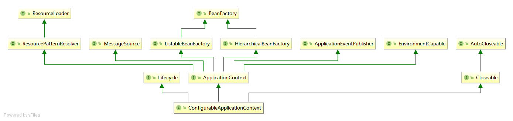
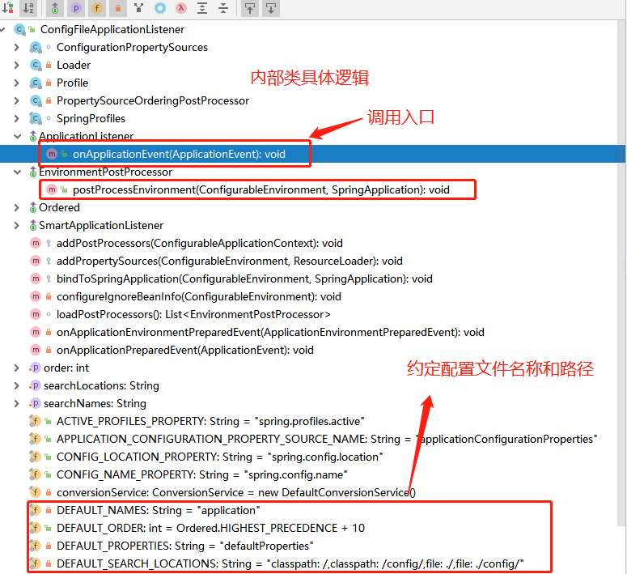

SpringBoot非Web环境启动分析-1.5.x版本
==========================

> 2019-08-15：好记性不如烂笔头。
>
> 懂底层原理是成为高手的必经之路！
>
> 越是简单的方法，包含的内容越多！

[TOC]

## 阅读本文前提示

### 前提知识回顾

#### 深入理解对象的创建过程

* jvm类加载的过程

  > 类加载过程大致有三个过程：加载--验证--准备、解析和初始化（开始执行类中定义的静态代码）

  虚拟机遇到一条new指令时，首先将去检查这个指令的参数是否能在常量池中定位到一个类的符号引用，并且检查这个符号引用代表的类是否已经执行过相应的类加载过程。 

  可以通过Class.forName(String className)来加载类，此时没有实例化类。但这个时候会执行类的静态代码块，class装载成功就表示执行了类的静态代码，如果有父类，先执行父类的静态代码块。而且以后不会再走这段静态代码了。

  ==类加载的过程，初始化了静态成员变量--(static成员可以直接用类名调用，无需创建对象)和执行静态代码块。==  执行顺序：按它们在java类的行数的先后顺序执行初始化。

* 对象的创建过程

  >  为对象分配内存 （堆内存）-- 设置对象头(实例字段初始化，初始化零值) -- 构造方法

  为对象分配内存的方式：1.指针碰撞（Java堆的内存绝对规整） 2.空闲列表（ Java堆中的内存并不是规整的）

  Java虚拟机对象在内存中存储的布局可以分为3块区域：**对象头**、**实例字段数据**和**对齐填充**

  - 对象头包括两部分信息： 
    1.第一部分用于存储对象自身的运行时数据。如哈希码、==GC分代年龄==、锁状态标志等。 
    2.第二部分是**类型指针**，即对象指向它的类元数据的指针，虚拟机通向这个指针来确定这个对象是哪个类的实例。 (栈内存)

  - 实例字段数据：对象真正存储的有效信息。 ==实例字段包括从所有父类继承来的==

    优先初始化父类的实例字段。

  - 对齐填充：占位的作用。

  调用构造方法，创建对象。优先调用父类的构造方法。

##### 对象创建总结如下：

如果是new一个对象，那么合并执行下面两步骤

* jvm对类加载阶段(Class.forName)：静态成员变量和静态代码块都是存在方法区，生命周期跟随类。

  类加载阶段

  准备阶段：类变量（静态变量）分配内存，放在方法区（静态区），此时只是分配内存，并没有初始化（一切皆为null或0）

  开始初始化：类变量初始化 ： 

  **父类静态成员变量和父类静态代码块-->子类的静态成员变量和静态代码块**

* 对象实例化(Class.newInstance)

  （普通成员变量是跟随着类的实例存放在堆当中，生命周期跟随对象）
  
  **父类普通成员初始化和父类代码块-->父类构造函数（初始化父类对象）-->子类普通成员初始化和子类类代码块-->子类构造函数（初始化子类对象）**
  
  
  
  ==类的静态成员变量初始化和静态代码块的执行先后顺序按照其在类中的位置，从上到下执行==
  
  ==类的普通成员变量初始化和普通代码块的执行先后顺序按照其在类中的位置，从上到下执行==
##### Class文件格式

  class文件是二进制文件流，记录类相关信息，可以被JVM解析。class文件内容并不复杂，结构如下

  ```properties
  使用命令：`javap -v XXX.class` 查看Class信息
  magic : 魔法数，4bytes，固定的cafebabe，简单校验
  minor_version : 次版本号
  major_version : 主版本号 #Java主版本
  constant_pool_count : 常量池表项的数目
  constatnt_pool : 常量池表 
  access_flags : 类访问标识
  this_class : 本类全限定名索引-指向常量池表-[Constant-class-info]
  super_class : 父类全限定名索引-指向常量池表-[Constant-class-info]
  interfaces_count : 接口的数目
  interfaces : 接口全限定名索引-指向常量池表-[Constant-class-info]
  fields_count : 字段表的数目
  fields : 字段表
  methods_count : 方法表的数目
  methods : 方法表
  attributes_count : 属性表的数目
  attributes : 属性表
  ```

  

#### Java反射

```java
 String className = "cn.selinx.app.beanfactory.BeanVo";
 Class<?> beanClass = Class.forName(className);
 // 类创建实例
 Object obj = beanClass.newInstance();
 
 // 构造方法创建实例
 Constructor<?> constructor = beanClass.getConstructor();
 Object obj = constructor.newInstance();
```

#### Spring常用类和方法

```properties
BeanDefinitionReaderUtils
AnnotatedElementUtils
StringUtils
AnnotationUtils
ClassUtils : isPresent,类判断对象是否存在
# Spring工具类判断对象是否存在
# ClassUtils.isPresent("groovy.lang.MetaClass", null);
BeanUtils 

# Spring注入Bean定义
registerBeanDefinition(beanName, definition);

# 工厂模式：是用工厂方法代替new操作的一种模式。
# spring框架的工厂加载方法：spring.factories文件配置key对应的value类，反射
SpringFactoriesLoader.loadFactories(AutoConfigurationImportFilter.class,this.beanClassLoader);

# getBeanPostProcessors
```


#### Java注解

> 注解是Java 5的一个新特性。注解是一种可以写到代码中的注释或者元数据。这些注解可以在编译时由预编译工具进行处理，或者在运行时通过Java反射处理，注解如同一张标签。

```properties
@Retention(RetentionPolicy.RUNTIME) : 表示该注解可以在运行时通过Java反射访问,如果你没有设置该指令，该注解在运行时就不会被保存，那么也就不能通过Java反射来使用。
@Target(ElementType.TYPE) : 表示该注解只能被用于类型上（如类、接口）。你也可以指定METHOD或者FIELD，或者你也可以省略不写，即该注解可以被用在类、方法和字段上
```

##### 元注解

元注解是可以注解到注解上的注解，或者说元注解是一种基本注解，但是它能够应用到其它的注解上面

* **@Retention**

  ```properties
  # 解释这个注解的存活时间
  RetentionPolicy.SOURCE : 只在源码阶段保留，在编译器进行编译时它将被丢弃忽视。
  RetentionPolicy.CLASS : 注解只被保留到编译进行的时候，它并不会被加载到 JVM 中。
  RetentionPolicy.RUNTIME : 注解可以保留到程序运行的时候，它会被加载进入到 JVM 中，在程序运行时可以获取到它们。最常用的方式。
  ```

* **@Documented**

  ```properties
  @Documented : 顾名思义，这个元注解跟doc文档有关。它的作用是能够将注解中的元素包含到Javadoc中。
  ```

* **@Target**

  ```properties
  # 当一个注解被 @Target 注解时，这个注解就被限定了运用的场景，类，方法，字段
  ElementType.TYPE : 可以给一个类型进行注解，比如类、接口、枚举
  ElementType.METHOD : 可以给方法进行注解
  ElementType.FIELD : 可以给属性进行注解
  ElementType.ANNOTATION_TYPE : 可以给一个注解进行注解
  ElementType.PARAMETER : 可以给一个方法内的参数进行注解
  ElementType.CONSTRUCTOR : 可以给构造方法进行注解
  ```

* **@Inherited**

  ```properties
  # 如果一个超类被 @Inherited 注解过的注解进行注解的话，那么如果它的子类没有被任何注解应用的话，那么这个子类就继承了超类的注解
  ```

* **@Repeatable**

  ```properties
  # Repeatable 自然是可重复的意思。@Repeatable 是 Java 1.8 才加进来的
  ```


#### Spring和SpringBoot注解

注解有许多用处，主要如下：

1. 提供信息给编译器： 编译器可以利用注解来探测错误和警告信息
2. 编译阶段时的处理： 可以用来利用注解信息来生成代码、Html文档或者做其它相应处理。
3. 运行时的处理： 某些注解可以在程序运行的时候接受代码的提取

```properties
# org.springframework.beans.factory.annotation
@Autowired :
@Qualifier :
@Value :
@Configurable :
@Lookup : 

# org.springframework.context.annotation
@Bean : 
@ComponentScan :
@ComponentScans :
@Condition :
@Conditional :
@Configuration :
@Import :
@ImportSelector : 

@Lazy :
@Profile :
@Scope :
@Role :
@Primary : 

# org.springframework.stereotype -- 模式注解

@Component : 
@Repository
@Service
@Controller

# org.springframework.web.bind.annotation  -- web mvc ， Rest 相关注解
@PathVariable :
@RequestParam : 
@RequestAttribute
@RequestPart : 
@RequestHeader : 
@RequestBody :
@CookieValue : 
@SessionAttribute :
@SessionAttributes :
@ModelAttribute : 

@ResponseBody :
@RestController :
@ResponseStatus :

@Mapping
@RequestMapping :
@GetMapping :
@PostMapping :
@DeleteMapping :
@PutMapping : 
@PatchMapping :

@ControllerAdvice :
@RestControllerAdvice :
@ExceptionHandler :

@InitBinder : 

@CrossOrigin : 
```


## 一、非Web环境下启动分析

pom.xml

```xml
<dependencies>
    <dependency>
        <groupId>org.springframework.boot</groupId>
        <artifactId>spring-boot-starter</artifactId>
    </dependency>
</dependencies>
```

java

```java
@SpringBootApplication
public class BootApplication {
    public static void main(String[] args) {
        // 简单的入口，实际包含非常多内容
        SpringApplication.run(BootApplication.class, args);
    }
}
```

### @SpringBootApplication注解

```java
/**
 * 组合注解：方便简写
 * 
 * @SpringBootConfiguration @Configuration配置类
 * @EnableAutoConfiguration 自动化配置
 * @ComponentScan 扫描组件
 * @since 1.2.0
 */
@Target(ElementType.TYPE)
@Retention(RetentionPolicy.RUNTIME)
@Documented
@Inherited
@SpringBootConfiguration
@EnableAutoConfiguration
@ComponentScan(excludeFilters = { @Filter(type = FilterType.CUSTOM, classes = TypeExcludeFilter.class),
		@Filter(type = FilterType.CUSTOM, classes = AutoConfigurationExcludeFilter.class) })
public @interface SpringBootApplication {


	@AliasFor(annotation = EnableAutoConfiguration.class, attribute = "exclude")
	Class<?>[] exclude() default {};

	/**
	 * @since 1.3.0
	 */
	@AliasFor(annotation = EnableAutoConfiguration.class, attribute = "excludeName")
	String[] excludeName() default {};

	/**
	 * @since 1.3.0
	 */
	@AliasFor(annotation = ComponentScan.class, attribute = "basePackages")
	String[] scanBasePackages() default {};

	/**
	 * Type-safe alternative to {@link #scanBasePackages} for specifying the packages to
	 * @since 1.3.0
	 */
	@AliasFor(annotation = ComponentScan.class, attribute = "basePackageClasses")
	Class<?>[] scanBasePackageClasses() default {};

}
```

@SpringBootConfiguration是一个Configuration注解

```java
/**
 * @since 1.4.0
 */
@Target(ElementType.TYPE)
@Retention(RetentionPolicy.RUNTIME)
@Documented
@Configuration
public @interface SpringBootConfiguration {

}
```

### SpringApplication执行方法

SpringApplication#run静态公有方法，参数：对象或对象数组，一个可变String

```java
public static ConfigurableApplicationContext run(Object source, String... args) {
	return run(new Object[] { source }, args);
}

public static ConfigurableApplicationContext run(Object[] sources, String[] args) {
	// 先执行构造SpringApplication对象再执行run方法
	return new SpringApplication(sources).run(args);
}
```

#### 构造SpringApplication对象

构造阶段：推断了web类型，实例化了`spring.factories`配置文件的`ApplicationContextInitializer`和`ApplicationListener` 两个接口的实现类，推断了主类。

```java
public SpringApplication(Object... sources) {
	initialize(sources);
}
public SpringApplication(ResourceLoader resourceLoader, Object... sources) {
	this.resourceLoader = resourceLoader;
	initialize(sources);
}
@SuppressWarnings({ "unchecked", "rawtypes" })
private void initialize(Object[] sources) {
	// 1. 加载资源，一般是注解了@SpringBootApplication的类
	if (sources != null && sources.length > 0) {
		// Set<Object> 对象
		this.sources.addAll(Arrays.asList(sources));
	}
	// 2. 推断是否web环境：false 或 true
	this.webEnvironment = deduceWebEnvironment();
	// 3. 实例化 spring.factories 下的 ApplicationContextInitializer 的实现类对象，赋值给SpringApplication的 initializers属性，列表集合.
	setInitializers((Collection) getSpringFactoriesInstances(ApplicationContextInitializer.class));
	// 4. 实例化 spring.factories 下的 ApplicationListener 的实现类对象,赋值给SpringApplication的 listeners属性，列表集合，在运行阶段被调用！！！
	setListeners((Collection) getSpringFactoriesInstances(ApplicationListener.class));
	// 5. 根据当前堆栈StackTraceElement推断主类，注解了@SpringBootApplication的类，赋值给SpringApplication的 mainApplicationClass属性，程序主类。
	this.mainApplicationClass = deduceMainApplicationClass();
}
```

##### deduceWebEnvironment

根据当前环境是否存在某些类，返回true和false

```java
// 推断是否web类型：是否同时存在下面两个类: 
// 1.javax.servlet.Servlet
// 2.org.springframework.web.context.ConfigurableWebApplicationContext

private boolean deduceWebEnvironment() {
	for (String className : WEB_ENVIRONMENT_CLASSES) {
		if (!ClassUtils.isPresent(className, null)) {
			return false;
		}
	}
	return true;
}

// ClassUtils#isPresent---》 这个方法很有用，判断当前环境是否存在某个类
public static boolean isPresent(String className, ClassLoader classLoader) {
	try {
		forName(className, classLoader);
		return true;
	}
	catch (Throwable ex) {
		// Class or one of its dependencies is not present...
		return false;
	}
}
```

##### ApplicationContextInitializer

目前类如下，共6个。在这里初始化，在[applyInitializers调用](#3.applyInitializers调用) 被调用initialize方法

```properties
# /spring-boot/1.5.21.RELEASE/spring-boot-1.5.21.RELEASE.jar!/META-INF/spring.factories
# Application Context Initializers
org.springframework.context.ApplicationContextInitializer=\
org.springframework.boot.context.ConfigurationWarningsApplicationContextInitializer,\
org.springframework.boot.context.ContextIdApplicationContextInitializer,\
org.springframework.boot.context.config.DelegatingApplicationContextInitializer,\
org.springframework.boot.context.embedded.ServerPortInfoApplicationContextInitializer

// # spring-boot-autoconfigure-1.5.22.RELEASE.jar!\META-INF\spring.factories
# Initializers
org.springframework.context.ApplicationContextInitializer=\
org.springframework.boot.autoconfigure.SharedMetadataReaderFactoryContextInitializer,\
org.springframework.boot.autoconfigure.logging.AutoConfigurationReportLoggingInitializer
```

利用Spring工厂机制，实例化`ApplicationContextInitializer`实现类，并排序对象集合。常用于web应用中注册属性源。

```java
// Spring实例化Bean的工厂方法
private <T> Collection<? extends T> getSpringFactoriesInstances(Class<T> type) {
	return getSpringFactoriesInstances(type, new Class<?>[] {});
}

private <T> Collection<? extends T> getSpringFactoriesInstances(Class<T> type, Class<?>[] parameterTypes,
		Object... args) {
	// 1.Java类加载器：获取当前线程的加载器，安全起见采用该方式
	ClassLoader classLoader = Thread.currentThread().getContextClassLoader();
	// Use names and ensure unique to protect against duplicates
	// 加载每个jar包下：META-INF/spring.factories配置文件中：type对应值（类名全路径）
	Set<String> names = new LinkedHashSet<String>(SpringFactoriesLoader.loadFactoryNames(type, classLoader));
	// 采用反射机制实例化对象的实例
	List<T> instances = createSpringFactoriesInstances(type, parameterTypes, classLoader, args, names);
	// AnnotationAwareOrderComparator排序器，升序排雷,order值越小优先级越高。
	AnnotationAwareOrderComparator.sort(instances);
	return instances;
}
```

* 实现方式

  * 实现类：org.springframework.core.io.support.SpringFactoriesLoader

  * 配置资源：META-INF/spring.factories

  * 排序：AnnotationAwareOrderComparator#sort

##### ApplicationListener

利用Spring工厂加载机制，实例化`ApplicationListener`实现类，并排序对象集合，同上。

实现了SpringBoot的事件：`SpringApplicationEvent`

* 日志监听器：LoggingApplicationListener

* 配置文件关注：`ConfigFileApplicationListener`
* 线程中触发早期初始化：`BackgroundPreinitializer`
* 字符编码监听器：`FileEncodingApplicationListener`
* Liquibase数据库结构管理监听：LiquibaseServiceLocatorApplicationListener，当类存在是`liquibase.servicelocator.CustomResolverServiceLocator`

```properties
# 工厂配置文件
# /spring-boot-autoconfigure/1.5.21.RELEASE/spring-boot-autoconfigure-1.5.21.RELEASE.jar!/META-INF/spring.factories

# Application Listeners,这个类在初始化时
org.springframework.context.ApplicationListener=\
org.springframework.boot.autoconfigure.BackgroundPreinitializer

# /spring-boot/1.5.21.RELEASE/spring-boot-1.5.21.RELEASE.jar!/META-INF/spring.factories
org.springframework.context.ApplicationListener=\
org.springframework.boot.ClearCachesApplicationListener,\
org.springframework.boot.builder.ParentContextCloserApplicationListener,\
org.springframework.boot.context.FileEncodingApplicationListener,\
org.springframework.boot.context.config.AnsiOutputApplicationListener,\
org.springframework.boot.context.config.ConfigFileApplicationListener,\
org.springframework.boot.context.config.DelegatingApplicationListener,\
org.springframework.boot.liquibase.LiquibaseServiceLocatorApplicationListener,\
org.springframework.boot.logging.ClasspathLoggingApplicationListener,\
org.springframework.boot.logging.LoggingApplicationListener
```


##### deduceMainApplicationClass

```java
// 根据当前堆栈信息，比对方法名是否等于"main",然后反射生成类信息
private Class<?> deduceMainApplicationClass() {
	try {
		StackTraceElement[] stackTrace = new RuntimeException().getStackTrace();
		for (StackTraceElement stackTraceElement : stackTrace) {
			if ("main".equals(stackTraceElement.getMethodName())) {
				return Class.forName(stackTraceElement.getClassName());
			}
		}
	}
	catch (ClassNotFoundException ex) {
		// Swallow and continue
	}
	return null;
}
```

**1、什么是StackTrace**

StackTrace(堆栈轨迹)存放的就是方法调用栈的信息，每次调用一个方法会产生一个方法栈，当前方法调用另外一个方法时会使用栈将当前方法的现场信息保存在此方法栈当中，获取这个栈就可以得到方法调用的详细过程。例如：异常处理中常用的e.printStackTrace()实质就是打印异常调用的堆栈信息。

```
Thread.currentThread().getStackTrace()
new RuntimeException().getStackTrace()
```

**2、什么是StackTraceElement**

StackTraceElement表示StackTrace(堆栈轨迹)中的一个方法对象，通过这个对象可以获取调用栈当中的调用过程信息，包括方法的类名、方法名、文件名以及调用的行数。查看StackTraceElement 类的源代码，我们可以获取方法所在行、所在类等的信息；


#### 运行SpringApplication方法

SpringApplication#run：非静态公有方法，参数：一个可变String。run方法实现了方法的重载。

返回`ConfigurableApplicationContext`对象实例



```java
/**
 * Run the Spring application, creating and refreshing a new
 * {@link ApplicationContext}.
 * 
 * 运行Spring应用，创建并刷新一个新的ApplicationContext上下文。
 * 注意：ConfigurableApplicationContext是一个接口
 * 
 * @param args the application arguments (usually passed from a Java main method)
 * @return a running {@link ApplicationContext}
 */
public ConfigurableApplicationContext run(String... args) {
	StopWatch stopWatch = new StopWatch();
    // spring计时器启动
	stopWatch.start();
    // 上下文赋值null
	ConfigurableApplicationContext context = null;
    // 错误分析赋值null
	FailureAnalyzers analyzers = null;
    // 配置java.awt.headless属性true，headless工具包就会被使用
    // Headless模式是在缺少显示屏、键盘或者鼠标时的系统配置
	configureHeadlessProperty();
    // new 一个SpringApplicationRunListeners，包含了spring.factories下的SpringApplicationRunListener实例集合
	SpringApplicationRunListeners listeners = getRunListeners(args);
    /* 1. 事件监听器开启，采用了组合模式，for循环开启每一个。EventPublishingRunListener
     * SpringApplicationRunListener触发所有的ApplicationListener调用starting
     */
	listeners.starting();
	try {
        // new DefaultApplicationArguments，参数为空，source是commandLineArgs。命令行参数
		ApplicationArguments applicationArguments = new DefaultApplicationArguments(
				args);
        // 2. 准备环境变量:StandardServletEnvironment或StandardEnvironment
		ConfigurableEnvironment environment = prepareEnvironment(listeners,
				applicationArguments);
        // 3. Banner打印
		Banner printedBanner = printBanner(environment);
        // 4. 创建ApplicationContext上下文：加载了内部定义和主类Bean定义
		context = createApplicationContext();
        // 5. 错误分析
		analyzers = new FailureAnalyzers(context);
        // 6. 准备ApplicationContext上下文
		prepareContext(context, environment, listeners, applicationArguments,
				printedBanner);
        // 7. 刷新上下文，真正的核心了
		refreshContext(context);
		afterRefresh(context, applicationArguments);
		listeners.finished(context, null);
		stopWatch.stop();
		if (this.logStartupInfo) {
			new StartupInfoLogger(this.mainApplicationClass)
					.logStarted(getApplicationLog(), stopWatch);
		}
		return context;
	}
	catch (Throwable ex) {
		handleRunFailure(context, listeners, analyzers, ex);
		throw new IllegalStateException(ex);
	}
}
```

参考： [java.awt.headless系统设定](https://www.cnblogs.com/wudi-dudu/p/7871405.html)


##### 1.listeners.starting

触发ApplicationStartedEvent的事件，主要是Logback日志事件

```properties
1. LoggingApplicationListener #  LogbackLoggingSystem.beforeInitialize()
2. BackgroundPreinitializer # 无操作
3. DelegatingApplicationListener # 无操作
4. LiquibaseServiceLocatorApplicationListener # 判断类存在，否则无操作
```

LoggingApplicationListener具体执行内容

```java
// LogbackLoggingSystem
@Override
public void beforeInitialize() {
	LoggerContext loggerContext = getLoggerContext();
	// starting时，没有初始化
	if (isAlreadyInitialized(loggerContext)) {
		return;
	}
	// 调用父类
	super.beforeInitialize();
	// Logback使用TurboFilter实现日志级别等内容的动态修改
	loggerContext.getTurboFilterList().add(FILTER);
	// 配置Jboss采用slf4j
	configureJBossLoggingToUseSlf4j();
}

// Slf4JLoggingSystem类
@Override
public void beforeInitialize() {
	super.beforeInitialize();
	configureJdkLoggingBridgeHandler();
}
// 配置日志桥接处理器：采用SLF4JBridgeHandler
private void configureJdkLoggingBridgeHandler() {
	try {
		// org.slf4j.bridge.SLF4JBridgeHandler类存在，那么就是桥接模式
		if (isBridgeHandlerAvailable()) {
			removeJdkLoggingBridgeHandler();
			SLF4JBridgeHandler.install();
		}
	}
	catch (Throwable ex) {
		// Ignore. No java.util.logging bridge is installed.
	}
}
```

参考文章： [Logback中使用TurboFilter实现日志级别等内容的动态修改](https://segmentfault.com/a/1190000017108234)


##### 2. 准备环境变量

listeners.environmentPrepared 触发了：ApplicationEnvironmentPreparedEvent，从而触发了以下事件的对相应调用。

```properties
1. ConfigFileApplicationListener  #  读取配置文件
2. AnsiOutputApplicationListener # 判断spring.output.ansi.enabled配置，默认：无操作
3. LoggingApplicationListener # 根据环境配置，初始化日志，详情查看initialize()方法
4. ClasspathLoggingApplicationListener # 
5. BackgroundPreinitializer
6. DelegatingApplicationListener
7. FileEncodingApplicationListener
```

调用`ConfigFileApplicationListener` 应用事件，读取resource目录下的application.properties。

源码如下：

```java
// 准备环境变量，读取命令行参数到environment
private ConfigurableEnvironment prepareEnvironment(
			SpringApplicationRunListeners listeners,
			ApplicationArguments applicationArguments) {
	// 1. 根据应用类型，创建对应的环境变量：web和非web，读取系统变量配置信息，defaultProfiles=default
	ConfigurableEnvironment environment = getOrCreateEnvironment();
    // 2. 配置环境：读取commandLineArgs参数 和 赋值activeProfiles属性
	configureEnvironment(environment, applicationArguments.getSourceArgs());
    // 3. 监听environment环境配置准备事件，ApplicationEnvironmentPreparedEvent
	listeners.environmentPrepared(environment);
	if (!this.webEnvironment) {
		environment = new EnvironmentConverter(getClassLoader())
				.convertToStandardEnvironmentIfNecessary(environment);
	}
	return environment;
}
```

* 第一步：getOrCreateEnvironment 得到 StandardEnvironment

初始化时获取，系统环境变量和JVM系统环境变量，defaultProfiles=default

```java
public class StandardEnvironment extends AbstractEnvironment {

	/** System environment property source name: {@value} */
	public static final String SYSTEM_ENVIRONMENT_PROPERTY_SOURCE_NAME = "systemEnvironment";

	/** JVM system properties property source name: {@value} */
	public static final String SYSTEM_PROPERTIES_PROPERTY_SOURCE_NAME = "systemProperties";


	/**
	 * @see AbstractEnvironment#customizePropertySources(MutablePropertySources)
	 * @see #getSystemProperties()
	 * @see #getSystemEnvironment()
	 */
	@Override
	protected void customizePropertySources(MutablePropertySources propertySources) {
		propertySources.addLast(new MapPropertySource(SYSTEM_PROPERTIES_PROPERTY_SOURCE_NAME, getSystemProperties()));
		propertySources.addLast(new SystemEnvironmentPropertySource(SYSTEM_ENVIRONMENT_PROPERTY_SOURCE_NAME, getSystemEnvironment()));
	}

}
```

* 第一步： 配置命令行属性和activeProfiles属性

* 第三步：根据事件监听机制，读取application.properties的内容：[获取application.properties环境变量](#Environment)

  this.initialMulticaster也是采用组合模式，获取所有的ApplicationListener实例。

```java
// EventPublishingRunListener得到ApplicationEnvironmentPreparedEvent
@Override
public void environmentPrepared(ConfigurableEnvironment environment) {
	this.initialMulticaster.multicastEvent(new ApplicationEnvironmentPreparedEvent(
			this.application, this.args, environment));
}
```

###### ApplicationEnvironmentPreparedEvent

```java
/**
 * Event published when a {@link SpringApplication} is starting up and the
 * {@link Environment} is first available for inspection and modification.
 *
 * @author Dave Syer
 */
@SuppressWarnings("serial")
public class ApplicationEnvironmentPreparedEvent extends SpringApplicationEvent {

	private final ConfigurableEnvironment environment;

	/**
	 * Create a new {@link ApplicationEnvironmentPreparedEvent} instance.
	 * @param application the current application
	 * @param args the arguments the application is running with
	 * @param environment the environment that was just created
	 */
	public ApplicationEnvironmentPreparedEvent(SpringApplication application,
			String[] args, ConfigurableEnvironment environment) {
		super(application, args);
		this.environment = environment;
	}

	public ConfigurableEnvironment getEnvironment() {
		return this.environment;
	}

}

```

SpringApplicationEvent的所有子类：


###### ConfigFileApplicationListener

* 读取外部化配置
  addPropertySources(environment, application.getResourceLoader());
* 配置spring.beaninfo.ignore的bean信息
  configureIgnoreBeanInfo(environment);
* 绑定环境到SpringApplication,核心宽松绑定
  bindToSpringApplication(environment, application);

- 类结构分析



- 源码分析

```java
public class ConfigFileApplicationListener
		implements EnvironmentPostProcessor, SmartApplicationListener, Ordered {

	private static final String DEFAULT_PROPERTIES = "defaultProperties";

	private static final String DEFAULT_SEARCH_LOCATIONS = "classpath:/,classpath:/config/,file:./,file:./config/";

	private static final String DEFAULT_NAMES = "application";

	public static final String ACTIVE_PROFILES_PROPERTY = "spring.profiles.active";

	public static final String INCLUDE_PROFILES_PROPERTY = "spring.profiles.include";

	public static final String CONFIG_NAME_PROPERTY = "spring.config.name";

	public static final String CONFIG_LOCATION_PROPERTY = "spring.config.location";

	public static final int DEFAULT_ORDER = Ordered.HIGHEST_PRECEDENCE + 10;
	
	@Override
	public void onApplicationEvent(ApplicationEvent event) {
		if (event instanceof ApplicationEnvironmentPreparedEvent) {
			onApplicationEnvironmentPreparedEvent(
					(ApplicationEnvironmentPreparedEvent) event);
		}
		if (event instanceof ApplicationPreparedEvent) {
			onApplicationPreparedEvent(event);
		}
	}
	
	// 在应用环境变量准备事件
	private void onApplicationEnvironmentPreparedEvent(
			ApplicationEnvironmentPreparedEvent event) {
		// spring.factories加载另外两个：1.SpringApplicationJsonEnvironmentPostProcessor，2.CloudFoundryVcapEnvironmentPostProcessor
		List<EnvironmentPostProcessor> postProcessors = loadPostProcessors();
		postProcessors.add(this);
		// 排序后，3.ConfigFileApplicationListener 最后处理
		AnnotationAwareOrderComparator.sort(postProcessors);
		for (EnvironmentPostProcessor postProcessor : postProcessors) {
			postProcessor.postProcessEnvironment(event.getEnvironment(),
					event.getSpringApplication());
		}
	}
	
	// ConfigFileApplicationListener 处理环境变量
    // 第一个和第三个方法，非常重要，尤其是第三个，实现了宽松绑定
	@Override
	public void postProcessEnvironment(ConfigurableEnvironment environment,
			SpringApplication application) {
		// 核心方法：读取外部化配置
		addPropertySources(environment, application.getResourceLoader());
        // 配置spring.beaninfo.ignore的bean信息
		configureIgnoreBeanInfo(environment);
        // 绑定环境到SpringApplication,核心宽松绑定
        // PropertiesConfigurationFactory调用bindPropertiesToTarget()方法
		bindToSpringApplication(environment, application);
	}
	
	/**
	 * Add config file property sources to the specified environment.
	 * 添加配置文件属性到这个指定的environment里面
	 * @param environment the environment to add source to
	 * @param resourceLoader the resource loader
	 * @see #addPostProcessors(ConfigurableApplicationContext)
	 */
	protected void addPropertySources(ConfigurableEnvironment environment,
			ResourceLoader resourceLoader) {
		// 随机属性值是：random=随机Long数字，如143257735242783
		RandomValuePropertySource.addToEnvironment(environment);
		// Loader内部类加载，并且有Profile内部类
        // 属性值是：applicationConfigurationProperties，路径是application.properties,application.yml
		new Loader(environment, resourceLoader).load();
	}
	
	// Loader内部类加载
	private class Loader {


		Loader(ConfigurableEnvironment environment, ResourceLoader resourceLoader) {
			this.environment = environment;
			this.resourceLoader = (resourceLoader != null) ? resourceLoader
					: new DefaultResourceLoader();
		}
		// 核心加载属性方法
		public void load() {
			...
			addConfigurationProperties(this.propertiesLoader.getPropertySources());
            ...
		}

	}
}
```


###### 属性松散绑定

PropertiesConfigurationFactory 实现松散绑定：`RelaxedDataBinder`

```java
private void doBindPropertiesToTarget() throws BindException {
	RelaxedDataBinder dataBinder = (this.targetName != null)
			? new RelaxedDataBinder(this.target, this.targetName)
			: new RelaxedDataBinder(this.target);
	if (this.validator != null
			&& this.validator.supports(dataBinder.getTarget().getClass())) {
		dataBinder.setValidator(this.validator);
	}
	if (this.conversionService != null) {
		dataBinder.setConversionService(this.conversionService);
	}
	dataBinder.setAutoGrowCollectionLimit(Integer.MAX_VALUE);
	dataBinder.setIgnoreNestedProperties(this.ignoreNestedProperties);
	dataBinder.setIgnoreInvalidFields(this.ignoreInvalidFields);
	dataBinder.setIgnoreUnknownFields(this.ignoreUnknownFields);
	customizeBinder(dataBinder);
	if (this.applicationContext != null) {
		ResourceEditorRegistrar resourceEditorRegistrar = new ResourceEditorRegistrar(
				this.applicationContext, this.applicationContext.getEnvironment());
		resourceEditorRegistrar.registerCustomEditors(dataBinder);
	}
	Iterable<String> relaxedTargetNames = getRelaxedTargetNames();
	Set<String> names = getNames(relaxedTargetNames);
	PropertyValues propertyValues = getPropertySourcesPropertyValues(names,
			relaxedTargetNames);
	dataBinder.bind(propertyValues);
	if (this.validator != null) {
		dataBinder.validate();
	}
	checkForBindingErrors(dataBinder);
}
```

###### 日志系统初始化

在准备环境变量里面，日志监听才初始化

```java
// LoggingApplicationListener
protected void initialize(ConfigurableEnvironment environment,
			ClassLoader classLoader) {
	new LoggingSystemProperties(environment).apply();
	LogFile logFile = LogFile.get(environment);
	if (logFile != null) {
		logFile.applyToSystemProperties();
	}
    // 初始化日志级别：debug != false ,trace != false
	initializeEarlyLoggingLevel(environment);
    // 初始化日志系统
	initializeSystem(environment, this.loggingSystem, logFile);
    // 初始化最终日志级别：读取logging.level.属性
	initializeFinalLoggingLevels(environment, this.loggingSystem);
    // 在必要时注册停止的钩子
	registerShutdownHookIfNecessary(environment, this.loggingSystem);
}
```


##### 3.  Banner打印

实际调用：SpringApplicationBannerPrinter的print方法，默认是`SpringBootBanner`

```java
// SpringApplication#printBanner
private Banner printBanner(ConfigurableEnvironment environment) {
	if (this.bannerMode == Banner.Mode.OFF) {
		return null;
	}
	SpringApplicationBannerPrinter bannerPrinter = new SpringApplicationBannerPrinter(
			resourceLoader, this.banner);
	return bannerPrinter.print(environment, this.mainApplicationClass, System.out);
}

// SpringApplicationBannerPrinter#print
public Banner print(Environment environment, Class<?> sourceClass, PrintStream out) {
	Banner banner = getBanner(environment);
	banner.printBanner(environment, sourceClass, out);
	return new PrintedBanner(banner, sourceClass);
}

// 获取Banner，可以从图片和文字,默认是SpringBootBanner
private Banner getBanner(Environment environment) {
	Banners banners = new Banners();
	banners.addIfNotNull(getImageBanner(environment));
	banners.addIfNotNull(getTextBanner(environment));
	if (banners.hasAtLeastOneBanner()) {
		return banners;
	}
	if (this.fallbackBanner != null) {
		return this.fallbackBanner;
	}
    // new SpringBootBanner()
	return DEFAULT_BANNER;
}
```

###### SpringBootBanner

String version = SpringBootVersion.getVersion(); 获取SpringBoot版本

```java
class SpringBootBanner implements Banner {

	private static final String[] BANNER = { "",
			"  .   ____          _            __ _ _",
			" /\\\\ / ___'_ __ _ _(_)_ __  __ _ \\ \\ \\ \\",
			"( ( )\\___ | '_ | '_| | '_ \\/ _` | \\ \\ \\ \\",
			" \\\\/  ___)| |_)| | | | | || (_| |  ) ) ) )",
			"  '  |____| .__|_| |_|_| |_\\__, | / / / /",
			" =========|_|==============|___/=/_/_/_/" };

	private static final String SPRING_BOOT = " :: Spring Boot :: ";

	private static final int STRAP_LINE_SIZE = 42;

	@Override
	public void printBanner(Environment environment, Class<?> sourceClass,
			PrintStream printStream) {
		for (String line : BANNER) {
			printStream.println(line);
		}
        // 获取当前SpringBoot的版本
		String version = SpringBootVersion.getVersion();
		version = (version != null) ? " (v" + version + ")" : "";
		String padding = "";
		while (padding.length() < STRAP_LINE_SIZE
				- (version.length() + SPRING_BOOT.length())) {
			padding += " ";
		}

		printStream.println(AnsiOutput.toString(AnsiColor.GREEN, SPRING_BOOT,
				AnsiColor.DEFAULT, padding, AnsiStyle.FAINT, version));
		printStream.println();
	}

}
```

##### 4. 创建ApplicationContext

非web情况下：ConfigurableApplicationContext的实例对象是AnnotationConfigApplicationContext。

```java
/**
 * 非web：org.springframework.context.annotation.AnnotationConfigApplicationContext
 * 
 * web: org.springframework.boot.context.embedded.AnnotationConfigEmbeddedWebApplicationContext
 */
protected ConfigurableApplicationContext createApplicationContext() {
	Class<?> contextClass = this.applicationContextClass;
	if (contextClass == null) {
		try {
			contextClass = Class.forName(this.webEnvironment
					? DEFAULT_WEB_CONTEXT_CLASS : DEFAULT_CONTEXT_CLASS);
		}
		catch (ClassNotFoundException ex) {
			throw new IllegalStateException(
					"Unable create a default ApplicationContext, "
							+ "please specify an ApplicationContextClass",
					ex);
		}
	}
	// 非web调用AnnotationConfigApplicationContext的默认构造方法
	return (ConfigurableApplicationContext) BeanUtils.instantiate(contextClass);
}
```

###### AnnotationConfigApplicationContext

子类在构造初始化时：调用顺序。==抽象类是可以继承实体类，但前提是实体类必须有明确的构造函数==

```shell
1. AnnotationConfigApplicationContext extends GenericApplicationContext implements AnnotationConfigRegistry # 继承父类

2. GenericApplicationContext extends AbstractApplicationContext implements BeanDefinitionRegistry # 继承抽象类

3. AbstractApplicationContext extends DefaultResourceLoader implements ConfigurableApplicationContext, DisposableBean # 抽象类继承实体类

4. DefaultResourceLoader implements ResourceLoader # 资源加载器实现类
```

###### 上下文初始化过程分析

1、DefaultResourceLoader构造方法

```java
public DefaultResourceLoader() {
    
	// Thread.currentThread().getContextClassLoader():
	// 获取当前线程的类加载器：sun.misc.Launcher$AppClassLoader
    
	this.classLoader = ClassUtils.getDefaultClassLoader();
}
```

2、AbstractApplicationContext的属性赋值给AnnotationConfigApplicationContext对象

3、GenericApplicationContext的构造方法，核心操作是注入了：DefaultListableBeanFactory

```java
public GenericApplicationContext() {
	// 初始化：DefaultListableBeanFactory对象,整个IOC容器的核心
	this.beanFactory = new DefaultListableBeanFactory();
}
```

同样的初始化方式分析：DefaultListableBeanFactory，主要也实现了BeanDefinitionRegistry接口，并且继承了

AbstractAutowireCapableBeanFactory --> AbstractBeanFactory .

而AbstractBeanFactory 又继承了FactoryBeanRegistrySupport，且实现了：ConfigurableBeanFactory，进而实现了HierarchicalBeanFactory 和 BeanFactory 接口。

```shell
1. DefaultListableBeanFactory extends AbstractAutowireCapableBeanFactory      implements ConfigurableListableBeanFactory, 
BeanDefinitionRegistry, Serializable # 继承抽象类

2. AbstractAutowireCapableBeanFactory extends AbstractBeanFactory
implements AutowireCapableBeanFactory # 继承抽象类

3. AbstractBeanFactory extends FactoryBeanRegistrySupport implements ConfigurableBeanFactory # 继承抽象类

4. FactoryBeanRegistrySupport extends DefaultSingletonBeanRegistry # 继承抽象类

5 DefaultSingletonBeanRegistry extends SimpleAliasRegistry implements SingletonBeanRegistry # 继承抽象类

6. SimpleAliasRegistry implements AliasRegistry # 实现接口

```

4、AnnotationConfigApplicationContext 构造方法，非常核心的模式。this就是当前AnnotationConfigApplicationContext，然后循环嵌套这个对象的属性。整个围绕着这个类串联起关系

```java
public AnnotationConfigApplicationContext() {
    // 构造：注解 Bean定义读取器
    this.reader = new AnnotatedBeanDefinitionReader(this);
    // 构造：类路径 Bean定义读取器
    this.scanner = new ClassPathBeanDefinitionScanner(this);
}
```

###### AnnotatedBeanDefinitionReader

构造注解Bean定义读取器

```java
public AnnotatedBeanDefinitionReader(BeanDefinitionRegistry registry) {
    // 1. 获取或创建环境变量，2.构造方法
	this(registry, getOrCreateEnvironment(registry));
}

/**
 *  2.构造方法
 * @since 3.1
 */
public AnnotatedBeanDefinitionReader(BeanDefinitionRegistry registry, Environment environment) {
	Assert.notNull(registry, "BeanDefinitionRegistry must not be null");
	Assert.notNull(environment, "Environment must not be null");
    // 把AnnotationConfigApplicationContext注入到AnnotatedBeanDefinitionReader里面
	this.registry = registry;
    // 创建ConditionEvaluator实例,
	this.conditionEvaluator = new ConditionEvaluator(registry, environment, null);
    // 注册注解配置处理器，核心方法！！！AnnotationConfigUtils工具类
	AnnotationConfigUtils.registerAnnotationConfigProcessors(this.registry);
}

// 1. 获取或创建环境变量，跟上面：getOrCreateEnvironment类似
private static Environment getOrCreateEnvironment(BeanDefinitionRegistry registry) {
	Assert.notNull(registry, "BeanDefinitionRegistry must not be null");
	// 目前传入的是AnnotationConfigApplicationContext，所以true。
	// 直接获取AbstractApplicationContext#getEnvironment
	if (registry instanceof EnvironmentCapable) {
		return ((EnvironmentCapable) registry).getEnvironment();
	}
	return new StandardEnvironment();
}

// AbstractApplicationContext#getEnvironment
@Override
public ConfigurableEnvironment getEnvironment() {
	if (this.environment == null) {
		this.environment = createEnvironment();
	}
	return this.environment;
}
// AbstractApplicationContext#createEnvironment
protected ConfigurableEnvironment createEnvironment() {
	return new StandardEnvironment();
}


// 3. 创建ConditionEvaluator实例
public ConditionEvaluator(BeanDefinitionRegistry registry, Environment environment, ResourceLoader resourceLoader) {
	// 初始化context属性为ConditionContextImpl内部类对象
	this.context = new ConditionContextImpl(registry, environment, resourceLoader);
}
// 3-1 ConditionEvaluato内部类构造方法
public ConditionContextImpl(BeanDefinitionRegistry registry, Environment environment, ResourceLoader resourceLoader) {
	this.registry = registry;
	// 3-1-1 . 推断beanFactory类型，目前返回ConfigurableApplicationContext
	this.beanFactory = deduceBeanFactory(registry);
	this.environment = (environment != null ? environment : deduceEnvironment(registry));
    // 3-1-2 . 推断当前registry=AnnotationConfigApplicationContext是ResourceLoader的对象
	this.resourceLoader = (resourceLoader != null ? resourceLoader : deduceResourceLoader(registry));
}

// 3-1-1. 推断beanFactory类型，目前返回ConfigurableApplicationContext
private ConfigurableListableBeanFactory deduceBeanFactory(BeanDefinitionRegistry source) {
	// 可配置的ConfigurableListableBeanFactory
	if (source instanceof ConfigurableListableBeanFactory) {
		return (ConfigurableListableBeanFactory) source;
	}
	// 可配置的ConfigurableApplicationContext
	if (source instanceof ConfigurableApplicationContext) {
		return (((ConfigurableApplicationContext) source).getBeanFactory());
	}
	return null;
}

// 3-1-2 . 推断当前registry=AnnotationConfigApplicationContext是ResourceLoader的对象
private ResourceLoader deduceResourceLoader(BeanDefinitionRegistry source) {
	if (source instanceof ResourceLoader) {
		return (ResourceLoader) source;
	}
	return null;
}
```

######  注册注解配置后置处理器，核心方法！！！

AnnotationConfigUtils工具类说明

```java
/**
 * 注解配置工具类
 *
 * Utility class that allows for convenient registration of common
 * {@link org.springframework.beans.factory.config.BeanPostProcessor} and
 * {@link org.springframework.beans.factory.config.BeanFactoryPostProcessor}
 * definitions for annotation-based configuration. Also registers a common
 * {@link org.springframework.beans.factory.support.AutowireCandidateResolver}.
 *
 * @author Mark Fisher
 * @author Juergen Hoeller
 * @author Chris Beams
 * @author Phillip Webb
 * @author Stephane Nicoll
 * @since 2.5
 * @see ContextAnnotationAutowireCandidateResolver
 * @see ConfigurationClassPostProcessor
 * @see CommonAnnotationBeanPostProcessor
 * @see org.springframework.beans.factory.annotation.AutowiredAnnotationBeanPostProcessor
 * @see org.springframework.beans.factory.annotation.RequiredAnnotationBeanPostProcessor
 * @see org.springframework.orm.jpa.support.PersistenceAnnotationBeanPostProcessor
 */
public class AnnotationConfigUtils {

	/**
	 * The bean name of the internally managed Configuration annotation processor.
	 */
	public static final String CONFIGURATION_ANNOTATION_PROCESSOR_BEAN_NAME =
			"org.springframework.context.annotation.internalConfigurationAnnotationProcessor";

	/**
	 * The bean name of the internally managed BeanNameGenerator for use when processing
	 * {@link Configuration} 
	 * {@link ConfigurationClassPostProcessor}.
	 * @since 3.1.1
	 */
	public static final String CONFIGURATION_BEAN_NAME_GENERATOR =
			"org.springframework.context.annotation.internalConfigurationBeanNameGenerator";

	/**
	 * The bean name of the internally managed Autowired annotation processor.
	 */
	public static final String AUTOWIRED_ANNOTATION_PROCESSOR_BEAN_NAME =
			"org.springframework.context.annotation.internalAutowiredAnnotationProcessor";

	/**
	 * The bean name of the internally managed Required annotation processor.
	 */
	public static final String REQUIRED_ANNOTATION_PROCESSOR_BEAN_NAME =
			"org.springframework.context.annotation.internalRequiredAnnotationProcessor";

	/**
	 * The bean name of the internally managed JSR-250 annotation processor.
	 */
	public static final String COMMON_ANNOTATION_PROCESSOR_BEAN_NAME =
			"org.springframework.context.annotation.internalCommonAnnotationProcessor";

	/**
	 * The bean name of the internally managed JPA annotation processor.
	 */
	public static final String PERSISTENCE_ANNOTATION_PROCESSOR_BEAN_NAME =
			"org.springframework.context.annotation.internalPersistenceAnnotationProcessor";

	private static final String PERSISTENCE_ANNOTATION_PROCESSOR_CLASS_NAME =
			"org.springframework.orm.jpa.support.PersistenceAnnotationBeanPostProcessor";

	/**
	 * The bean name of the internally managed @EventListener annotation processor.
	 */
	public static final String EVENT_LISTENER_PROCESSOR_BEAN_NAME =
			"org.springframework.context.event.internalEventListenerProcessor";

	/**
	 * The bean name of the internally managed EventListenerFactory.
	 */
	public static final String EVENT_LISTENER_FACTORY_BEAN_NAME =
			"org.springframework.context.event.internalEventListenerFactory";

	private static final boolean jsr250Present =
			ClassUtils.isPresent("javax.annotation.Resource", AnnotationConfigUtils.class.getClassLoader());
	
	// 判断jpa存在的方法：true 或者false 
	private static final boolean jpaPresent =
			ClassUtils.isPresent("javax.persistence.EntityManagerFactory", AnnotationConfigUtils.class.getClassLoader()) &&
			ClassUtils.isPresent(PERSISTENCE_ANNOTATION_PROCESSOR_CLASS_NAME, AnnotationConfigUtils.class.getClassLoader());


	/**
	 * 给registry即AnnotationConfigApplicationContext注册所有的Bean注解后置处理器
	 * 
	 * Register all relevant annotation post processors in the given registry.
	 * @param registry the registry to operate on
	 */
	public static void registerAnnotationConfigProcessors(BeanDefinitionRegistry registry) {
		registerAnnotationConfigProcessors(registry, null);
	}

	/**
	 * 具体操作
	 * 
	 * Register all relevant annotation post processors in the given registry.
	 * @param registry the registry to operate on
	 * @param source the configuration source element (already extracted)
	 * that this registration was triggered from. May be {@code null}.
	 * @return a Set of BeanDefinitionHolders, containing all bean definitions
	 * that have actually been registered by this call
	 */
	public static Set<BeanDefinitionHolder> registerAnnotationConfigProcessors(
			BeanDefinitionRegistry registry, Object source) {
		// 将AnnotationConfigApplicationContext打开获取beanFactory属性：DefaultListableBeanFactory
		DefaultListableBeanFactory beanFactory = unwrapDefaultListableBeanFactory(registry);
		if (beanFactory != null) {
			if (!(beanFactory.getDependencyComparator() instanceof AnnotationAwareOrderComparator)) {
				// 给beanFactory赋值注解Bean依赖顺序比较器：AnnotationAwareOrderComparator
				// 实际根据Order值大小进行排序，越小优先级越高
				beanFactory.setDependencyComparator(AnnotationAwareOrderComparator.INSTANCE);
			}
			if (!(beanFactory.getAutowireCandidateResolver() instanceof ContextAnnotationAutowireCandidateResolver)) {
				// 给beanFactory赋值自动装配解析器，提供对@Lazy 延迟解析，@Qualifier，@Value
				// 在DefaultListableBeanFactory初始化就初始化为SimpleAutowireCandidateResolver。
				// 在变成ContextAnnotationAutowireCandidateResolver,并将beanFactory赋值给自动装配解析器
				// 此时关注点：BeanFactoryAware接口
				beanFactory.setAutowireCandidateResolver(new ContextAnnotationAutowireCandidateResolver());
			}
		}
		// 初始化Bean定义持有者：8个，一般注册了6个
		Set<BeanDefinitionHolder> beanDefs = new LinkedHashSet<BeanDefinitionHolder>(8);
		
		// 1. 判断beanDefinitionMap里面key值是否含有：ConfigurationClassPostProcessor
        // 最终给beanFactory的beanDefinitionMap和beanDefinitionNames赋值 internalConfigurationAnnotationProcessor
		if (!registry.containsBeanDefinition(CONFIGURATION_ANNOTATION_PROCESSOR_BEAN_NAME)) {
			// 构造RootBeanDefinition
			RootBeanDefinition def = new RootBeanDefinition(ConfigurationClassPostProcessor.class);
			// null值
			def.setSource(source);
			// 注册后置处理器：org.springframework.context.annotation.internalConfigurationAnnotationProcessor
			beanDefs.add(registerPostProcessor(registry, def, CONFIGURATION_ANNOTATION_PROCESSOR_BEAN_NAME));
		}
		// 2. 给beanFactory 注册key为：internalAutowiredAnnotationProcessor
		if (!registry.containsBeanDefinition(AUTOWIRED_ANNOTATION_PROCESSOR_BEAN_NAME)) {
			RootBeanDefinition def = new RootBeanDefinition(AutowiredAnnotationBeanPostProcessor.class);
			def.setSource(source);
			beanDefs.add(registerPostProcessor(registry, def, AUTOWIRED_ANNOTATION_PROCESSOR_BEAN_NAME));
		}
		// 3. 给beanFactory 注册key为：internalRequiredAnnotationProcessor
		if (!registry.containsBeanDefinition(REQUIRED_ANNOTATION_PROCESSOR_BEAN_NAME)) {
			RootBeanDefinition def = new RootBeanDefinition(RequiredAnnotationBeanPostProcessor.class);
			def.setSource(source);
			beanDefs.add(registerPostProcessor(registry, def, REQUIRED_ANNOTATION_PROCESSOR_BEAN_NAME));
		}
		
		// 4. 给beanFactory 注册key为：internalCommonAnnotationProcessor
		// Check for JSR-250 support, and if present add the CommonAnnotationBeanPostProcessor.
		if (jsr250Present && !registry.containsBeanDefinition(COMMON_ANNOTATION_PROCESSOR_BEAN_NAME)) {
			RootBeanDefinition def = new RootBeanDefinition(CommonAnnotationBeanPostProcessor.class);
			def.setSource(source);
			beanDefs.add(registerPostProcessor(registry, def, COMMON_ANNOTATION_PROCESSOR_BEAN_NAME));
		}
		
		// 没有JPA环境，不会注册
		// Check for JPA support, and if present add the PersistenceAnnotationBeanPostProcessor.
		if (jpaPresent && !registry.containsBeanDefinition(PERSISTENCE_ANNOTATION_PROCESSOR_BEAN_NAME)) {
			RootBeanDefinition def = new RootBeanDefinition();
			try {
				def.setBeanClass(ClassUtils.forName(PERSISTENCE_ANNOTATION_PROCESSOR_CLASS_NAME,
						AnnotationConfigUtils.class.getClassLoader()));
			}
			catch (ClassNotFoundException ex) {
				throw new IllegalStateException(
						"Cannot load optional framework class: " + PERSISTENCE_ANNOTATION_PROCESSOR_CLASS_NAME, ex);
			}
			def.setSource(source);
			beanDefs.add(registerPostProcessor(registry, def, PERSISTENCE_ANNOTATION_PROCESSOR_BEAN_NAME));
		}
		// 5. 给beanFactory 注册key为：internalEventListenerProcessor
		if (!registry.containsBeanDefinition(EVENT_LISTENER_PROCESSOR_BEAN_NAME)) {
			RootBeanDefinition def = new RootBeanDefinition(EventListenerMethodProcessor.class);
			def.setSource(source);
			beanDefs.add(registerPostProcessor(registry, def, EVENT_LISTENER_PROCESSOR_BEAN_NAME));
		}
		// 6. 给beanFactory 注册key为：internalEventListenerFactory
		if (!registry.containsBeanDefinition(EVENT_LISTENER_FACTORY_BEAN_NAME)) {
			RootBeanDefinition def = new RootBeanDefinition(DefaultEventListenerFactory.class);
			def.setSource(source);
			beanDefs.add(registerPostProcessor(registry, def, EVENT_LISTENER_FACTORY_BEAN_NAME));
		}

		return beanDefs;
	}

	// 注册后置处理器： registry=AnnotationConfigApplicationContext
	private static BeanDefinitionHolder registerPostProcessor(
			BeanDefinitionRegistry registry, RootBeanDefinition definition, String beanName) {
		// bean定义的角色为基础设施
		definition.setRole(BeanDefinition.ROLE_INFRASTRUCTURE);
		// GenericApplicationContext#registerBeanDefinition调用this.beanFactory.registerBeanDefinition
		// 实际操作是拿beanFactory给beanDefinitionMap赋值，beanDefinitionNames赋值
		registry.registerBeanDefinition(beanName, definition);
		// 生成BeanDefinitionHolder
		return new BeanDefinitionHolder(definition, beanName);
	}
	
	// 将AnnotationConfigApplicationContext打开获取beanFactory属性：DefaultListableBeanFactory
	private static DefaultListableBeanFactory unwrapDefaultListableBeanFactory(BeanDefinitionRegistry registry) {
		if (registry instanceof DefaultListableBeanFactory) {
			return (DefaultListableBeanFactory) registry;
		}
		else if (registry instanceof GenericApplicationContext) {
			return ((GenericApplicationContext) registry).getDefaultListableBeanFactory();
		}
		else {
			return null;
		}
	}

	public static void processCommonDefinitionAnnotations(AnnotatedBeanDefinition abd) {
		processCommonDefinitionAnnotations(abd, abd.getMetadata());
	}

	static void processCommonDefinitionAnnotations(AnnotatedBeanDefinition abd, AnnotatedTypeMetadata metadata) {
		if (metadata.isAnnotated(Lazy.class.getName())) {
			abd.setLazyInit(attributesFor(metadata, Lazy.class).getBoolean("value"));
		}
		else if (abd.getMetadata() != metadata && abd.getMetadata().isAnnotated(Lazy.class.getName())) {
			abd.setLazyInit(attributesFor(abd.getMetadata(), Lazy.class).getBoolean("value"));
		}

		if (metadata.isAnnotated(Primary.class.getName())) {
			abd.setPrimary(true);
		}
		if (metadata.isAnnotated(DependsOn.class.getName())) {
			abd.setDependsOn(attributesFor(metadata, DependsOn.class).getStringArray("value"));
		}

		if (abd instanceof AbstractBeanDefinition) {
			AbstractBeanDefinition absBd = (AbstractBeanDefinition) abd;
			if (metadata.isAnnotated(Role.class.getName())) {
				absBd.setRole(attributesFor(metadata, Role.class).getNumber("value").intValue());
			}
			if (metadata.isAnnotated(Description.class.getName())) {
				absBd.setDescription(attributesFor(metadata, Description.class).getString("value"));
			}
		}
	}

	static BeanDefinitionHolder applyScopedProxyMode(
			ScopeMetadata metadata, BeanDefinitionHolder definition, BeanDefinitionRegistry registry) {

		ScopedProxyMode scopedProxyMode = metadata.getScopedProxyMode();
		if (scopedProxyMode.equals(ScopedProxyMode.NO)) {
			return definition;
		}
		boolean proxyTargetClass = scopedProxyMode.equals(ScopedProxyMode.TARGET_CLASS);
		return ScopedProxyCreator.createScopedProxy(definition, registry, proxyTargetClass);
	}

	static AnnotationAttributes attributesFor(AnnotatedTypeMetadata metadata, Class<?> annotationClass) {
		return attributesFor(metadata, annotationClass.getName());
	}

	static AnnotationAttributes attributesFor(AnnotatedTypeMetadata metadata, String annotationClassName) {
		return AnnotationAttributes.fromMap(metadata.getAnnotationAttributes(annotationClassName, false));
	}

	static Set<AnnotationAttributes> attributesForRepeatable(AnnotationMetadata metadata,
			Class<?> containerClass, Class<?> annotationClass) {

		return attributesForRepeatable(metadata, containerClass.getName(), annotationClass.getName());
	}

	@SuppressWarnings("unchecked")
	static Set<AnnotationAttributes> attributesForRepeatable(
			AnnotationMetadata metadata, String containerClassName, String annotationClassName) {

		Set<AnnotationAttributes> result = new LinkedHashSet<AnnotationAttributes>();

		// Direct annotation present?
		addAttributesIfNotNull(result, metadata.getAnnotationAttributes(annotationClassName, false));

		// Container annotation present?
		Map<String, Object> container = metadata.getAnnotationAttributes(containerClassName, false);
		if (container != null && container.containsKey("value")) {
			for (Map<String, Object> containedAttributes : (Map<String, Object>[]) container.get("value")) {
				addAttributesIfNotNull(result, containedAttributes);
			}
		}

		// Return merged result
		return Collections.unmodifiableSet(result);
	}

	private static void addAttributesIfNotNull(Set<AnnotationAttributes> result, Map<String, Object> attributes) {
		if (attributes != null) {
			result.add(AnnotationAttributes.fromMap(attributes));
		}
	}

}
```

###### ClassPathBeanDefinitionScanner

注入：registry，AnnotationTypeFilter，resourcePattern =**/*.class ，环境变量StandardEnvironment，resourcePatternResolver到 ClassPathBeanDefinitionScanner里面。其中registry和resourcePatternResolver，CachingMetadataReaderFactory的resourceLoader都是AnnotationConfigApplicationContext上下文

```java
public ClassPathBeanDefinitionScanner(BeanDefinitionRegistry registry) {
	this(registry, true);
}

public ClassPathBeanDefinitionScanner(BeanDefinitionRegistry registry, boolean useDefaultFilters) {
	// getOrCreateEnvironment 跟上面一致
	this(registry, useDefaultFilters, getOrCreateEnvironment(registry));
}

 
/**
 * @since 3.1
 */
public ClassPathBeanDefinitionScanner(BeanDefinitionRegistry registry, boolean useDefaultFilters,
			Environment environment) {

	this(registry, useDefaultFilters, environment,
			(registry instanceof ResourceLoader ? (ResourceLoader) registry : null));
}

/**
 * @since 4.3.6
 */
public ClassPathBeanDefinitionScanner(BeanDefinitionRegistry registry, boolean useDefaultFilters,
		Environment environment, ResourceLoader resourceLoader) {

	Assert.notNull(registry, "BeanDefinitionRegistry must not be null");
	// 把AnnotationConfigApplicationContext注入到ClassPathBeanDefinitionScanner里面
	this.registry = registry;
	
	// 注册默认过滤器，调用父类方法ClassPathScanningCandidateComponentProvider
	if (useDefaultFilters) {
		registerDefaultFilters();
	}
    // 环境变量赋值
	setEnvironment(environment);
    // 把AnnotationConfigApplicationContext注入到resourceLoader
	setResourceLoader(resourceLoader);
}

// 调用ClassPathScanningCandidateComponentProvider#registerDefaultFilters方法注入过滤
// @Component , @ManagedBean , javax.inject.Named
protected void registerDefaultFilters() {
	this.includeFilters.add(new AnnotationTypeFilter(Component.class));
	ClassLoader cl = ClassPathScanningCandidateComponentProvider.class.getClassLoader();
	try {
		this.includeFilters.add(new AnnotationTypeFilter(
				((Class<? extends Annotation>) ClassUtils.forName("javax.annotation.ManagedBean", cl)), false));
		logger.debug("JSR-250 'javax.annotation.ManagedBean' found and supported for component scanning");
	}
	catch (ClassNotFoundException ex) {
		// JSR-250 1.1 API (as included in Java EE 6) not available - simply skip.
	}
	try {
		this.includeFilters.add(new AnnotationTypeFilter(
				((Class<? extends Annotation>) ClassUtils.forName("javax.inject.Named", cl)), false));
		logger.debug("JSR-330 'javax.inject.Named' annotation found and supported for component scanning");
	}
	catch (ClassNotFoundException ex) {
		// JSR-330 API not available - simply skip.
	}
}
```

##### 5.错误分析：FailureAnalyzers

核心实例化,以下Bean，11个。注意BeanFactoryAware的子类：

* `NoSuchBeanDefinitionFailureAnalyzer`：SpringBoot自动装配的，Bean不存在错误。

  包含对象：beanFactory = DefaultListableBeanFactory ，metadataReaderFactory = CachingMetadataReaderFactory，report = ConditionEvaluationReport

  ```java
  // 给BeanFactory的属性registeredSingletons添加BeanName = autoConfigurationReport
  // 给singletonObjects里面也添加了BeanName = autoConfigurationReport，value  = ConditionEvaluationReport
  
  protected void addSingleton(String beanName, Object singletonObject) {
  	synchronized (this.singletonObjects) {
  		this.singletonObjects.put(beanName, (singletonObject != null ? singletonObject : NULL_OBJECT));
  		this.singletonFactories.remove(beanName);
  		this.earlySingletonObjects.remove(beanName);
  		this.registeredSingletons.add(beanName);
  	}
  }
  ```

* `NoUniqueBeanDefinitionFailureAnalyzer`：SpringBoot自带的，不是唯一Bean。

  包含对象：beanFactory = DefaultListableBeanFactory 

```properties
#\spring-boot-1.5.22.RELEASE.jar!\META-INF\spring.factories
# Failure Analyzers
org.springframework.boot.diagnostics.FailureAnalyzer=\
org.springframework.boot.diagnostics.analyzer.BeanCurrentlyInCreationFailureAnalyzer,\
org.springframework.boot.diagnostics.analyzer.BeanNotOfRequiredTypeFailureAnalyzer,\
org.springframework.boot.diagnostics.analyzer.BindFailureAnalyzer,\
org.springframework.boot.diagnostics.analyzer.ConnectorStartFailureAnalyzer,\
org.springframework.boot.diagnostics.analyzer.NoSuchMethodFailureAnalyzer,\
org.springframework.boot.diagnostics.analyzer.NoUniqueBeanDefinitionFailureAnalyzer,\
org.springframework.boot.diagnostics.analyzer.PortInUseFailureAnalyzer,\
org.springframework.boot.diagnostics.analyzer.ValidationExceptionFailureAnalyzer

# spring-boot-autoconfigure-1.5.22.RELEASE.jar!\META-INF\spring.factories
# Failure analyzers
org.springframework.boot.diagnostics.FailureAnalyzer=\
org.springframework.boot.autoconfigure.diagnostics.analyzer.NoSuchBeanDefinitionFailureAnalyzer,\
org.springframework.boot.autoconfigure.jdbc.DataSourceBeanCreationFailureAnalyzer,\
org.springframework.boot.autoconfigure.jdbc.HikariDriverConfigurationFailureAnalyzer
```

源码如下:

```java
/**
 * Create a new {@link FailureAnalyzers} instance.
 * 从SpringBoot 1.4.1开始支持错误分析
 * @param context the source application context
 * @since 1.4.1
 */
public FailureAnalyzers(ConfigurableApplicationContext context) {
	this(context, null);
}

// context即是AnnotationConfigApplicationContext
FailureAnalyzers(ConfigurableApplicationContext context, ClassLoader classLoader) {
	Assert.notNull(context, "Context must not be null");
	// AppClassLoader$ClassLoader
	this.classLoader = (classLoader != null) ? classLoader : context.getClassLoader();
	// 加载错误分析器，采用工厂方法
	this.analyzers = loadFailureAnalyzers(this.classLoader);
	// 将当前context赋值给每个错误分析器，前提当前analyzers是BeanFactoryAware子类。
	prepareFailureAnalyzers(this.analyzers, context);
}

/**
 * 加载错误分析器，采用工厂方法。读取spring.factories下的FailureAnalyzer属性配置value，并排序
 */
private List<FailureAnalyzer> loadFailureAnalyzers(ClassLoader classLoader) {
	List<String> analyzerNames = SpringFactoriesLoader.loadFactoryNames(FailureAnalyzer.class, classLoader);
	List<FailureAnalyzer> analyzers = new ArrayList<FailureAnalyzer>();
	for (String analyzerName : analyzerNames) {
		try {
			Constructor<?> constructor = ClassUtils.forName(analyzerName, classLoader).getDeclaredConstructor();
			ReflectionUtils.makeAccessible(constructor);
			analyzers.add((FailureAnalyzer) constructor.newInstance());
		}
		catch (Throwable ex) {
			logger.trace("Failed to load " + analyzerName, ex);
		}
	}
	AnnotationAwareOrderComparator.sort(analyzers);
	return analyzers;
}

// 给当前错误分析器，注入BeanFactory
private void prepareAnalyzer(ConfigurableApplicationContext context, FailureAnalyzer analyzer) {
	if (analyzer instanceof BeanFactoryAware) {
		((BeanFactoryAware) analyzer).setBeanFactory(context.getBeanFactory());
	}
}
```

##### 6.准备上下文：prepareContext

```java
// 准备上下文，入参：context，前面读取的environment，监听器，程序参数，banner
prepareContext(context, environment, listeners, applicationArguments, printedBanner);
```

具体如下：

```java
private void prepareContext(ConfigurableApplicationContext context, ConfigurableEnvironment environment,
		SpringApplicationRunListeners listeners, ApplicationArguments applicationArguments, Banner printedBanner) {
	// 1. 将SpringApplication读取的环境变量，赋值给上下文	
	context.setEnvironment(environment);
	// 2. ApplicationContext上下文后置处理器
	postProcessApplicationContext(context);
	// 3. 循环调用所有的ApplicationContextInitializer处理上下文
	applyInitializers(context);
	// 4. 广播contextPrepared事件，循环调用
	listeners.contextPrepared(context);
	// 5. 输出启动profile日志
	if (this.logStartupInfo) {
		logStartupInfo(context.getParent() == null);
		logStartupProfileInfo(context);
	}

	// 6. Add boot specific singleton beans，添加指定的单例Bean
	context.getBeanFactory().registerSingleton("springApplicationArguments", applicationArguments);
    // 同上
	if (printedBanner != null) {
		context.getBeanFactory().registerSingleton("springBootBanner", printedBanner);
	}

	// sources当前是SpringBoot主类
	Set<Object> sources = getSources();
	Assert.notEmpty(sources, "Sources must not be empty");
	// 7. 加载bean到Spring上下文：Load beans into the application context.
	load(context, sources.toArray(new Object[sources.size()]));
	// 8. 广播contextPrepared事件，循环调用
	listeners.contextLoaded(context);
}
```

###### 1.context环境变量赋值

```java
/**
 * AnnotationConfigApplicationContext方法setEnvironment
 * 这个上下文是在SpringApplication读取了用户自定义配置文件的，包含了application.properties,yml内容
 */
@Override
public void setEnvironment(ConfigurableEnvironment environment) {
	// 调用父类AbstractApplicationContext#setEnvironment方法
	super.setEnvironment(environment);
	// 给AnnotatedBeanDefinitionReader赋予环境变量，实际重新构造他的ConditionEvaluator属性
	this.reader.setEnvironment(environment);
	// 给AnnotatedBeanDefinitionReader赋予环境变量
	this.scanner.setEnvironment(environment);
}
```

###### 2.postProcessApplicationContext

目前无任何操作

```java
protected void postProcessApplicationContext(ConfigurableApplicationContext context) {
	// 当前为null,无操作
	if (this.beanNameGenerator != null) {
		context.getBeanFactory().registerSingleton(AnnotationConfigUtils.CONFIGURATION_BEAN_NAME_GENERATOR,
				this.beanNameGenerator);
	}
	// 当前为null，无操作
	if (this.resourceLoader != null) {
		if (context instanceof GenericApplicationContext) {
			((GenericApplicationContext) context).setResourceLoader(this.resourceLoader);
		}
		if (context instanceof DefaultResourceLoader) {
			((DefaultResourceLoader) context).setClassLoader(this.resourceLoader.getClassLoader());
		}
	}
}
```

###### 3.applyInitializers调用

触发前面生成的ApplicationContextInitializer对象集合循环调用initialize方法。

最终给AnnotationConfigApplicationContext赋值了id值，两个BeanFactoryPostProcessor，两个ApplicationListener。

```java
// SpringApplication#applyInitializers方法
protected void applyInitializers(ConfigurableApplicationContext context) {
	// 循环获取initializer，排序得到LinkedHashSet，然后调用initialize方法
	for (ApplicationContextInitializer initializer : getInitializers()) {
		// 调用resolveTypeArgument方法，最终得到当前Listener继承的接口类指定类型
		// 如：DelegatingApplicationContextInitializer得到ConfigurableApplicationContext
		Class<?> requiredType = GenericTypeResolver.resolveTypeArgument(initializer.getClass(),
				ApplicationContextInitializer.class);
		// 校验得到的Listener继承接口参数类型不是AnnotationConfigApplicationContext类
		Assert.isInstanceOf(requiredType, context, "Unable to call initializer.");
		
		// 核心调用方法：初始化当前ApplicationContextInitializer
		initializer.initialize(context);
	}
}
```

出现了一个获取继承接口数组常用的方法：

```java
/**
 * SerializableTypeWrapper类获取GenericInterfaces，继承的接口
 * Return a {@link Serializable} variant of {@link Class#getGenericInterfaces()}.
 */
@SuppressWarnings("serial")
public static Type[] forGenericInterfaces(final Class<?> type) {
	Type[] result = new Type[type.getGenericInterfaces().length];
	for (int i = 0; i < result.length; i++) {
		final int index = i;
		result[i] = forTypeProvider(new SimpleTypeProvider() {
			@Override
			public Type getType() {
				return type.getGenericInterfaces()[index];
			}
		});
	}
	return result;
}
```

核心方法initializer.initialize(context)

1. DelegatingApplicationContextInitializer  无处理

2. ContextIdApplicationContextInitializer

   给application赋值ID,默认application

```
@Override
public void initialize(ConfigurableApplicationContext applicationContext) {
	// 给上下文赋予ID
	applicationContext.setId(getApplicationId(applicationContext.getEnvironment()));
}

private String getApplicationId(ConfigurableEnvironment environment) {
	// 默认：application，因为下面的表达式最后写了
	// ${spring.application.name:${vcap.application.name:${spring.config.name:application}}}
	String name = environment.resolvePlaceholders(this.name);
	// 默认：null，因为下面的表达式最后写了
	// ${vcap.application.instance_index:${spring.application.index:${server.port:${PORT:null}}}}"
	String index = environment.resolvePlaceholders(INDEX_PATTERN);
	// 激活的profile值，default标识没有
	String profiles = StringUtils.arrayToCommaDelimitedString(environment.getActiveProfiles());
	if (StringUtils.hasText(profiles)) {
		name = name + ":" + profiles;
	}
	if (!"null".equals(index)) {
		name = name + ":" + index;
	}
	return name;
}
```

3. ConfigurationWarningsApplicationContextInitializer # 上下文添加BeanFactoryPostProcessor

   创建ComponentScanPackageCheck对象，赋值给ConfigurationWarningsPostProcessor。

```java
// 配置警告的后置处理器
@Override
public void initialize(ConfigurableApplicationContext context) {
// 往AnnotationConfigApplicationContext添加了beanFactoryPostProcessors = 
//ConfigurationWarningsApplicationContextInitializer#ConfigurationWarningsPostProcessor
	context.addBeanFactoryPostProcessor(new ConfigurationWarningsPostProcessor(getChecks()));
}
```

3. ServerPortInfoApplicationContextInitializer # 上下文添加ApplicationListener

  往上下文添加ServerPortInfoApplicationContextInitializer监听器

   ```java
   @Override
   public void initialize(ConfigurableApplicationContext applicationContext) {
   	// 将嵌入式Servlet容器初始化
   	applicationContext.addApplicationListener(new ApplicationListener<EmbeddedServletContainerInitializedEvent>() {
   @Override
   public void onApplicationEvent(EmbeddedServletContainerInitializedEvent event) {
   			ServerPortInfoApplicationContextInitializer.this.onApplicationEvent(event);
   	}
   });
   }
   ```

  4. SharedMetadataReaderFactoryContextInitializer # 上下文添加BeanFactoryPostProcessor

  ```java 
   /**
    * 添加CachingMetadataReaderFactoryPostProcessor 缓存元数据读取的工厂后置处理区
    */ 
   @Override
   public void initialize(ConfigurableApplicationContext applicationContext) {
   	applicationContext.addBeanFactoryPostProcessor(new CachingMetadataReaderFactoryPostProcessor());
   }
  ```

5. AutoConfigurationReportLoggingInitializer # 上下文添加ApplicationListener

```java
public void initialize(ConfigurableApplicationContext applicationContext) {
    // 将上下文赋值给applicationContext
	this.applicationContext = applicationContext;
	applicationContext.addApplicationListener(new AutoConfigurationReportListener());
	if (applicationContext instanceof GenericApplicationContext) {
		// Get the report early in case the context fails to load
    // 从Bean工厂获取name=autoConfigurationReport,value=ConditionEvaluationReport的Bean
		this.report = ConditionEvaluationReport.get(this.applicationContext.getBeanFactory());
	}
}
```

###### 4.contextPrepared事件

目前EventPublishingRunListener无任何处理

###### 5.输出启动日志profile

日志内容

```shell
Starting BootApplication on thinkpad-cjp with PID 18364 (D:\Workspace\Idea_2019\cjp1016\springboot-examples\springboot-1.x-examples\springboot-1.5.x-project\target\classes started by cjp in D:\Workspace\Idea_2019\cjp1016\springboot-examples)

No active profile set, falling back to default profiles: default
```

源码如下

```java
if (this.logStartupInfo) {
	// 1. 输出主类启动日志信息
	logStartupInfo(context.getParent() == null);
	// 2. 输出profile日志信息
	logStartupProfileInfo(context);
}

// 1. 创建StartupInfoLogger对象，运行logStarting方法
protected void logStartupInfo(boolean isRoot) {
	if (isRoot) {
		new StartupInfoLogger(this.mainApplicationClass).logStarting(getApplicationLog());
	}
}

// SpringApplication内的方法，获取SLF4JLocationAwareLog
protected Log getApplicationLog() {
	if (this.mainApplicationClass == null) {
		return logger;
	}
	return LogFactory.getLog(this.mainApplicationClass);
}

// StartupInfoLogger内的方法，入参是SLF4JLocationAwareLog
public void logStarting(Log log) {
	Assert.notNull(log, "Log must not be null");
	if (log.isInfoEnabled()) {
		log.info(getStartupMessage());
	}
	if (log.isDebugEnabled()) {
		log.debug(getRunningMessage());
	}
}

// StartupInfoLogger内的方法，获取启动信息
private String getStartupMessage() {
	StringBuilder message = new StringBuilder();
	message.append("Starting ");
    // ClassUtils.getShortName,主类的短名称
	message.append(getApplicationName());
	message.append(getVersion(this.sourceClass));
    // InetAddress.getLocalHost().getHostName()
	message.append(getOn());
    // 进程id：System.getProperty("PID")
	message.append(getPid());
    // ApplicationHome home = new ApplicationHome(this.sourceClass)
    // home.getSource().getAbsolutePath()
    // System.getProperty("user.name")和System.getProperty("user.dir")
	message.append(getContext());
	return message.toString();
}

/**
 * 2. 输出激活的profile信息，默认没有激活default
 * SpringApplication内的方法
 * Called to log active profile information.
 * @param context the application context
 */
protected void logStartupProfileInfo(ConfigurableApplicationContext context) {
	Log log = getApplicationLog();
	if (log.isInfoEnabled()) {
		String[] activeProfiles = context.getEnvironment().getActiveProfiles();
        // 没有激活profile
		if (ObjectUtils.isEmpty(activeProfiles)) {
			String[] defaultProfiles = context.getEnvironment().getDefaultProfiles();
			log.info("No active profile set, falling back to default profiles: "
					+ StringUtils.arrayToCommaDelimitedString(defaultProfiles));
		}
        // 激活profile
		else {
			log.info("The following profiles are active: "
					+ StringUtils.arrayToCommaDelimitedString(activeProfiles));
		}
	}
}
```

###### 6.registerSingleton注册单例

注册名称为：`springApplicationArguments` 值为：DefaultApplicationArguments类 的Bean

来源是commandLineArgs。

注册名称为：`springBootBanner` 值为：PrintedBanner#PrintedBanner内部类 的Bean

```java
// DefaultListableBeanFactory#registerSingleton 注册单例Bean
@Override
public void registerSingleton(String beanName, Object singletonObject) throws IllegalStateException {
	super.registerSingleton(beanName, singletonObject);

	if (hasBeanCreationStarted()) {
		// Cannot modify startup-time collection elements anymore (for stable iteration)
		synchronized (this.beanDefinitionMap) {
			if (!this.beanDefinitionMap.containsKey(beanName)) {
				Set<String> updatedSingletons = new LinkedHashSet<String>(this.manualSingletonNames.size() + 1);
				updatedSingletons.addAll(this.manualSingletonNames);
				updatedSingletons.add(beanName);
				this.manualSingletonNames = updatedSingletons;
			}
		}
	}
	else {
		// Still in startup registration phase
		if (!this.beanDefinitionMap.containsKey(beanName)) {
			this.manualSingletonNames.add(beanName);
		}
	}

	clearByTypeCache();
}
```


###### 7.Load the sources

加载主类信息:load，有个注解工具类AnnotationUtils，在注册后置处理器时，就已经注入一部分bean定义到map中。

```java


/**
 * 加载主要资源
 * context=AnnotationConfigApplicationContext
 * sources=主类
 */
protected void load(ApplicationContext context, Object[] sources) {
	if (logger.isDebugEnabled()) {
		logger.debug("Loading source " + StringUtils.arrayToCommaDelimitedString(sources));
	}
	// 1. 创建BeanDefinitionLoader，
	BeanDefinitionLoader loader = createBeanDefinitionLoader(getBeanDefinitionRegistry(context), sources);
	// 2. 当前为null
	if (this.beanNameGenerator != null) {
		loader.setBeanNameGenerator(this.beanNameGenerator);
	}
	// 3. 当前为null
	if (this.resourceLoader != null) {
		loader.setResourceLoader(this.resourceLoader);
	}
	// 4. 环境变量
	if (this.environment != null) {
		loader.setEnvironment(this.environment);
	}
	// 5. 执行BeanDefinitionLoader的load方法
	loader.load();
}


/**
 * 1. BeanDefinitionLoader的构造方法
 * registry=AnnotationConfigApplicationContext
 * sources=主类
 */
BeanDefinitionLoader(BeanDefinitionRegistry registry, Object... sources) {
	Assert.notNull(registry, "Registry must not be null");
	Assert.notEmpty(sources, "Sources must not be empty");
	this.sources = sources;
	// 注入AnnotatedBeanDefinitionReader 又创建了一次
	this.annotatedReader = new AnnotatedBeanDefinitionReader(registry);
	// 注入XmlBeanDefinitionReader
	this.xmlReader = new XmlBeanDefinitionReader(registry);
	// 如果groovy存在，那么创建GroovyBeanDefinitionReader
	if (isGroovyPresent()) {
		this.groovyReader = new GroovyBeanDefinitionReader(registry);
	}
	// 注入ClassPathBeanDefinitionScanner，又创建了一次
	this.scanner = new ClassPathBeanDefinitionScanner(registry);
	// 注入ClassExcludeFilter：
	this.scanner.addExcludeFilter(new ClassExcludeFilter(sources));
}


public int load() {
	int count = 0;
	for (Object source : this.sources) {
		count += load(source);
	}
	return count;
}

private int load(Object source) {
	Assert.notNull(source, "Source must not be null");
	// 常用类作为source启动
	if (source instanceof Class<?>) {
		return load((Class<?>) source);
	}
	if (source instanceof Resource) {
		return load((Resource) source);
	}
	if (source instanceof Package) {
		return load((Package) source);
	}
	if (source instanceof CharSequence) {
		return load((CharSequence) source);
	}
	throw new IllegalArgumentException("Invalid source type " + source.getClass());
}

private int load(Class<?> source) {
	if (isGroovyPresent()) {
		// Any GroovyLoaders added in beans{} DSL can contribute beans here
		if (GroovyBeanDefinitionSource.class.isAssignableFrom(source)) {
			GroovyBeanDefinitionSource loader = BeanUtils.instantiateClass(source,
					GroovyBeanDefinitionSource.class);
			load(loader);
		}
	}
	// 
	if (isComponent(source)) {
		// 核心方法AnnotatedBeanDefinitionReader注册source
		this.annotatedReader.register(source);
		return 1;
	}
	return 0;
}

// 判断主类是否是@Component注解，@SpringBootApplication是的，返回true
private boolean isComponent(Class<?> type) {
	// This has to be a bit of a guess. The only way to be sure that this type is
	// eligible is to make a bean definition out of it and try to instantiate it.
	if (AnnotationUtils.findAnnotation(type, Component.class) != null) {
		return true;
	}
	// Nested anonymous classes are not eligible for registration, nor are groovy
	// closures
	if (type.getName().matches(".*\\$_.*closure.*") || type.isAnonymousClass() || type.getConstructors() == null
			|| type.getConstructors().length == 0) {
		return false;
	}
	return true;
}
```

AnnotatedBeanDefinitionReader注册source

BeanDefinitionReaderUtils.registerBeanDefinition核心方法，注册当前主类Bean。

```java
/**
 * 当前annotatedClass，是程序主类，其他参数null
 */
public void registerBean(Class<?> annotatedClass, String name, Class<? extends Annotation>... qualifiers) {
	// 含有StandardAnnotationMetadata，当前是@SpringBootApplication
	AnnotatedGenericBeanDefinition abd = new AnnotatedGenericBeanDefinition(annotatedClass);
	// 是否该忽视，当前否
	if (this.conditionEvaluator.shouldSkip(abd.getMetadata())) {
		return;
	}
	// ScopeMetadata元信息: singleton ,ScopedProxyMode.NO
	ScopeMetadata scopeMetadata = this.scopeMetadataResolver.resolveScopeMetadata(abd);
	// scope = singleton
	abd.setScope(scopeMetadata.getScopeName());
	// 见AnnotationBeanNameGenerator#determineBeanNameFromAnnotation，默认：decapitalize方法
	String beanName = (name != null ? name : this.beanNameGenerator.generateBeanName(abd, this.registry));
	// 处理公共的定义注解，见AnnotatedTypeMetadata#isAnnotated方法
	AnnotationConfigUtils.processCommonDefinitionAnnotations(abd);
	// 默认为null
	if (qualifiers != null) {
		for (Class<? extends Annotation> qualifier : qualifiers) {
			if (Primary.class == qualifier) {
				abd.setPrimary(true);
			}
			else if (Lazy.class == qualifier) {
				abd.setLazyInit(true);
			}
			else {
				abd.addQualifier(new AutowireCandidateQualifier(qualifier));
			}
		}
	}
	// 创建BeanDefinitionHolder对象，没有别名
	BeanDefinitionHolder definitionHolder = new BeanDefinitionHolder(abd, beanName);
	// 工具类处理scopeProxy模式，默认NO，是Generic bean！！否则采用CGLIB代理类
	definitionHolder = AnnotationConfigUtils.applyScopedProxyMode(scopeMetadata, definitionHolder, this.registry);
	/**
     * 注册definitionHolder到当前的AnnotationConfigApplication的BeanFactory里面
	 * 实际调用this.beanFactory.registerBeanDefinition(beanName, beanDefinition);
	 * 最终存放到beanDefinitionMap里面，之前已经存放了6个。
     */	 
	BeanDefinitionReaderUtils.registerBeanDefinition(definitionHolder, this.registry);
}


/**
 * Bean 名称的生成规则。name是类名
 * <p>
 * Thus "FooBah" becomes "fooBah" and "X" becomes "x", but "URL" stays
 * as "URL".
 *
 * @param  name The string to be decapitalized.
 * @return  The decapitalized version of the string.
 */
public static String decapitalize(String name) {
	if (name == null || name.length() == 0) {
		return name;
	}
	if (name.length() > 1 && Character.isUpperCase(name.charAt(1)) &&
					Character.isUpperCase(name.charAt(0))){
		return name;
	}
	char chars[] = name.toCharArray();
	chars[0] = Character.toLowerCase(chars[0]);
	return new String(chars);
}
```

###### 8.contextLoaded加载	ApplicationPreparedEvent

```java
// contextLoaded上下文加载
@Override
public void contextLoaded(ConfigurableApplicationContext context) {
	for (ApplicationListener<?> listener : this.application.getListeners()) {
		if (listener instanceof ApplicationContextAware) {
			((ApplicationContextAware) listener).setApplicationContext(context);
		}
		context.addApplicationListener(listener);
	}
	// 组播ApplicationPreparedEvent上下文准备事件
	this.initialMulticaster.multicastEvent(new ApplicationPreparedEvent(this.application, this.args, context));
}
```

引发下面ApplicationListener的application准备事件，循环调用。

```properties
# contextLoaded引发下面listener调用ApplicationPreparedEvent事件
1.ServerPortInfoApplicationContextInitializer
2.AutoConfigurationReportLoggingInitializer
# 执行 context.addBeanFactoryPostProcessor(new PropertySourceOrderingPostProcessor(context));
3.ConfigFileApplicationListener 
4.AnsiOutputApplicationListener
# 执行beanFactory.registerSingleton(LOGGING_SYSTEM_BEAN_NAME, this.loggingSystem);
# 注册beanName = springBootLoggingSystem日志类
5.LoggingApplicationListener
6.ClasspathLoggingApplicationListener
# 执行：无任何操作
7.BackgroundPreinitializer
# 执行：无任何操作
8.DelegatingApplicationListener
9.ParentContextCloserApplicationListener
10.ClearCachesApplicationListener
11.FileEncodingApplicationListener
12.LiquibaseServiceLocatorApplicationListener
```

调用逻辑：SimpleApplicationEventMulticaster#multicastEvent

```java
// SimpleApplicationEventMulticaster事件广播器处理
@Override
public void multicastEvent(ApplicationEvent event) {
	multicastEvent(event, resolveDefaultEventType(event));
}

// 广播事件
@Override
public void multicastEvent(final ApplicationEvent event, ResolvableType eventType) {
	ResolvableType type = (eventType != null ? eventType : resolveDefaultEventType(event));
    // getApplicationListeners(event, type),筛选出当前事件对应的listener
	for (final ApplicationListener<?> listener : getApplicationListeners(event, type)) {
		// 多线程执行
		Executor executor = getTaskExecutor();
		if (executor != null) {
			executor.execute(new Runnable() {
				@Override
				public void run() {
					invokeListener(listener, event);
				}
			});
		}
		else {
			// 调用listener和相应的event
			invokeListener(listener, event);
		}
	}
}

/*
 * @since 4.1
 */
protected void invokeListener(ApplicationListener<?> listener, ApplicationEvent event) {
	// 获取错误处理器
	ErrorHandler errorHandler = getErrorHandler();
	if (errorHandler != null) {
		try {
			doInvokeListener(listener, event);
		}
		catch (Throwable err) {
			errorHandler.handleError(err);
		}
	}
	else {
		// 执行调用
		doInvokeListener(listener, event);
	}
}

@SuppressWarnings({"unchecked", "rawtypes"})
private void doInvokeListener(ApplicationListener listener, ApplicationEvent event) {
	try {
		// 调用listener的方法，执行对应事件
		listener.onApplicationEvent(event);
	}
	catch (ClassCastException ex) {
		String msg = ex.getMessage();
		if (msg == null || matchesClassCastMessage(msg, event.getClass())) {
			Log logger = LogFactory.getLog(getClass());
			if (logger.isDebugEnabled()) {
				logger.debug("Non-matching event type for listener: " + listener, ex);
			}
		}
		else {
			throw ex;
		}
	}
}
```

筛选Applicationlistener

```java
/**
 * AbstractApplicationEventMulticaster#getApplicationListeners(ApplicationEvent,ResolvableType)
 * 筛选出当前事件对应的listener。eventType对象包含了AnnotationConfigApplicationContext和SpringApplication
 */
protected Collection<ApplicationListener<?>> getApplicationListeners(
		ApplicationEvent event, ResolvableType eventType) {
	
	// 获取来源，SpringApplication
	Object source = event.getSource();
	Class<?> sourceType = (source != null ? source.getClass() : null);
	ListenerCacheKey cacheKey = new ListenerCacheKey(eventType, sourceType);

	// Quick check for existing entry on ConcurrentHashMap...
	ListenerRetriever retriever = this.retrieverCache.get(cacheKey);
	if (retriever != null) {
		return retriever.getApplicationListeners();
	}

	if (this.beanClassLoader == null ||
			(ClassUtils.isCacheSafe(event.getClass(), this.beanClassLoader) &&
					(sourceType == null || ClassUtils.isCacheSafe(sourceType, this.beanClassLoader)))) {
		// Fully synchronized building and caching of a ListenerRetriever
		synchronized (this.retrievalMutex) {
			retriever = this.retrieverCache.get(cacheKey);
			if (retriever != null) {
				return retriever.getApplicationListeners();
			}
			retriever = new ListenerRetriever(true);
			// 核心方法：获取事件对应的ApplicationListener
			Collection<ApplicationListener<?>> listeners =
					retrieveApplicationListeners(eventType, sourceType, retriever);
			this.retrieverCache.put(cacheKey, retriever);
			return listeners;
		}
	}
	else {
		// No ListenerRetriever caching -> no synchronization necessary
		return retrieveApplicationListeners(eventType, sourceType, null);
	}
}

// retrieveApplicationListeners 检索上下文Listener
private Collection<ApplicationListener<?>> retrieveApplicationListeners(
			ResolvableType eventType, Class<?> sourceType, ListenerRetriever retriever) {

	List<ApplicationListener<?>> allListeners = new ArrayList<ApplicationListener<?>>();
	Set<ApplicationListener<?>> listeners;
	Set<String> listenerBeans;
	synchronized (this.retrievalMutex) {
		listeners = new LinkedHashSet<ApplicationListener<?>>(this.defaultRetriever.applicationListeners);
		listenerBeans = new LinkedHashSet<String>(this.defaultRetriever.applicationListenerBeans);
	}
	for (ApplicationListener<?> listener : listeners) {
		// 当前listener是否支持当前事件
		if (supportsEvent(listener, eventType, sourceType)) {
			if (retriever != null) {
				retriever.applicationListeners.add(listener);
			}
			allListeners.add(listener);
		}
	}
	if (!listenerBeans.isEmpty()) {
		BeanFactory beanFactory = getBeanFactory();
		for (String listenerBeanName : listenerBeans) {
			try {
				Class<?> listenerType = beanFactory.getType(listenerBeanName);
				if (listenerType == null || supportsEvent(listenerType, eventType)) {
					ApplicationListener<?> listener =
							beanFactory.getBean(listenerBeanName, ApplicationListener.class);
					if (!allListeners.contains(listener) && supportsEvent(listener, eventType, sourceType)) {
						if (retriever != null) {
							retriever.applicationListenerBeans.add(listenerBeanName);
						}
						allListeners.add(listener);
					}
				}
			}
			catch (NoSuchBeanDefinitionException ex) {
				// Singleton listener instance (without backing bean definition) disappeared -
				// probably in the middle of the destruction phase
			}
		}
	}
	AnnotationAwareOrderComparator.sort(allListeners);
	return allListeners;
}

// 当前监听器是否支持当前事件
protected boolean supportsEvent(ApplicationListener<?> listener, ResolvableType eventType, Class<?> sourceType) {
	// 一般创建GenericApplicationListenerAdapter对象
	GenericApplicationListener smartListener = (listener instanceof GenericApplicationListener ?
			(GenericApplicationListener) listener : new GenericApplicationListenerAdapter(listener));
	// 最终调用listener的supportsSourceType方法
	return (smartListener.supportsEventType(eventType) && smartListener.supportsSourceType(sourceType));
}
```

原理采用适配器模式：GenericApplicationListenerAdapter，找到对应的ApplicationListener 调用

##### 7.刷新上下文：refreshContext

###### 1. SpringApplication#refreshContext

```java
// 刷新上下文
private void refreshContext(ConfigurableApplicationContext context) {
	refresh(context);
	if (this.registerShutdownHook) {
		try {
			context.registerShutdownHook();
		}
		catch (AccessControlException ex) {
			// Not allowed in some environments.
		}
	}
}

// Spring上下文刷新，判断是AbstractApplicationContext的子类
protected void refresh(ApplicationContext applicationContext) {
	Assert.isInstanceOf(AbstractApplicationContext.class, applicationContext);
	// 向上转型执行抽象上下文的刷新方法
	((AbstractApplicationContext) applicationContext).refresh();
}
```


###### 2.AbstractApplicationContext#refresh

```java
// AbstractApplicationContext,这里的this指的是AnnotationConfigApplicationContext这个子类
@Override
public void refresh() throws BeansException, IllegalStateException {
    // 局部对象锁，final Object startupShutdownMonitor = new Object()
	synchronized (this.startupShutdownMonitor) {
		// 1.Prepare this context for refreshing.
		prepareRefresh();

		// 2.Tell the subclass to refresh the internal bean factory.
		ConfigurableListableBeanFactory beanFactory = obtainFreshBeanFactory();

		// 3.Prepare the bean factory for use in this context.
		prepareBeanFactory(beanFactory);

		try {
			// Allows post-processing of the bean factory in context subclasses.
			postProcessBeanFactory(beanFactory);

			// Invoke factory processors registered as beans in the context.
			invokeBeanFactoryPostProcessors(beanFactory);

			// Register bean processors that intercept bean creation.
			registerBeanPostProcessors(beanFactory);

			// Initialize message source for this context.
			initMessageSource();

			// Initialize event multicaster for this context.
			initApplicationEventMulticaster();

			// Initialize other special beans in specific context subclasses.
			onRefresh();

			// Check for listener beans and register them.
			registerListeners();

			// Instantiate all remaining (non-lazy-init) singletons.
			finishBeanFactoryInitialization(beanFactory);

			// Last step: publish corresponding event.
			finishRefresh();
		}

		catch (BeansException ex) {
			if (logger.isWarnEnabled()) {
				logger.warn("Exception encountered during context initialization - " +
						"cancelling refresh attempt: " + ex);
			}

			// Destroy already created singletons to avoid dangling resources.
			destroyBeans();

			// Reset 'active' flag.
			cancelRefresh(ex);

			// Propagate exception to caller.
			throw ex;
		}

		finally {
			// Reset common introspection caches in Spring's core, since we
			// might not ever need metadata for singleton beans anymore...
			resetCommonCaches();
		}
	}
}
```

###### prepareRefresh

输出了启动时间日志和初始化earlyApplicationEvents，没做太多事情

```java

// AnnotationConfigApplicationContext类
@Override
protected void prepareRefresh() {
	// ClassPathBeanDefinitionScanner#metadataReaderFactory 清空缓存
	this.scanner.clearCache();
	// 调用父类刷新方法
	super.prepareRefresh();
}

/**
 * AbstractApplicationContext#prepareRefresh
 * 准备刷新上下文
 */
protected void prepareRefresh() {
	// Switch to active.
	this.startupDate = System.currentTimeMillis();
	this.closed.set(false);
	this.active.set(true);

	if (logger.isInfoEnabled()) {
		// 日志输出当前对象信息
		logger.info("Refreshing " + this);
	}

	// Initialize any placeholder property sources in the context environment.
	// 子类实现，初始化PropertySources
	initPropertySources();

	// Validate that all properties marked as required are resolvable:
	// see ConfigurablePropertyResolver#setRequiredProperties
	// 校验必须得Properties
	getEnvironment().validateRequiredProperties();

	// Allow for the collection of early ApplicationEvents,
	// to be published once the multicaster is available...
	// 初始化early ApplicationEvents
	this.earlyApplicationEvents = new LinkedHashSet<ApplicationEvent>();
}

/**
 * Return information about this context.
 */
@Override
public String toString() {
	// 获取上下文显示名称：#AnnotationConfigApplicationContext@2af004b
	StringBuilder sb = new StringBuilder(getDisplayName());
	// 启动时间
	sb.append(": startup date [").append(new Date(getStartupDate()));
	sb.append("]; ");
	// 父级，目前为null
	ApplicationContext parent = getParent();
	if (parent == null) {
		sb.append("root of context hierarchy");
	}
	else {
		sb.append("parent: ").append(parent.getDisplayName());
	}
	return sb.toString();
}

// AbstractEnvironment#validateRequiredProperties
@Override
public void validateRequiredProperties() throws MissingRequiredPropertiesException {
	// 实际是PropertySourcesPropertyResolver，调用父类的AbstractPropertyResolver#validateRequiredProperties
	// 目前requiredProperties属性为空
	this.propertyResolver.validateRequiredProperties();
}
```


###### obtainFreshBeanFactory

获取和刷新BeanFactory。基于注解的上下文，比较简单

赋值了序列化id和获取BeanFactory = DefaultListableBeanFactory

```java
/**
 * 先刷新BeanFactory再获取BeanFactory
 */
protected ConfigurableListableBeanFactory obtainFreshBeanFactory() {
	// 子类必须实现这个方法，当前注解调用GenericApplicationContext#refreshBeanFactory
	// 如果是XML方式，采用AbstractRefreshableApplicationContext#refreshBeanFactory
	refreshBeanFactory();
	// 获取BeanFactory: this.beanFactory
	ConfigurableListableBeanFactory beanFactory = getBeanFactory();
	if (logger.isDebugEnabled()) {
		logger.debug("Bean factory for " + getDisplayName() + ": " + beanFactory);
	}
	return beanFactory;
}

/**
 * GenericApplicationContext#refreshBeanFactory,设置序列化id
 */
@Override
protected final void refreshBeanFactory() throws IllegalStateException {
	if (!this.refreshed.compareAndSet(false, true)) {
		throw new IllegalStateException(
				"GenericApplicationContext does not support multiple refresh attempts: just call 'refresh' once");
	}
	this.beanFactory.setSerializationId(getId());
}

```


###### prepareBeanFactory

准备BeanFactory，表达式处理器，ApplicationContextAwareProcessor作为Bean回调处理器，resolvableDependencies依赖处理，注册Environment作为单例Bean：`environment`，`systemProperties`，`systemEnvironment`。

```java
/**
 * Configure the factory's standard context characteristics,
 * such as the context's ClassLoader and post-processors.
 * @param beanFactory the BeanFactory to configure
 */
protected void prepareBeanFactory(ConfigurableListableBeanFactory beanFactory) {
	// Tell the internal bean factory to use the context's class loader etc.
	beanFactory.setBeanClassLoader(getClassLoader());
	// Bean表达式处理器
	beanFactory.setBeanExpressionResolver(new StandardBeanExpressionResolver(beanFactory.getBeanClassLoader()));
	// 资源编辑注册器
	beanFactory.addPropertyEditorRegistrar(new ResourceEditorRegistrar(this, getEnvironment()));

	// Configure the bean factory with context callbacks.
	// 上下文回调配置，通过回调来通知
	beanFactory.addBeanPostProcessor(new ApplicationContextAwareProcessor(this));
	// 忽略依赖接口：Aware
	beanFactory.ignoreDependencyInterface(EnvironmentAware.class);
	beanFactory.ignoreDependencyInterface(EmbeddedValueResolverAware.class);
	beanFactory.ignoreDependencyInterface(ResourceLoaderAware.class);
	beanFactory.ignoreDependencyInterface(ApplicationEventPublisherAware.class);
	beanFactory.ignoreDependencyInterface(MessageSourceAware.class);
	beanFactory.ignoreDependencyInterface(ApplicationContextAware.class);
	
	// resolvableDependencies：注册依赖项。
	// 注意this = AnnotationConfigApplicationContext是以下接口实现类
	// BeanFactory interface not registered as resolvable type in a plain factory.
	// MessageSource registered (and found for autowiring) as a bean.
	beanFactory.registerResolvableDependency(BeanFactory.class, beanFactory);
	beanFactory.registerResolvableDependency(ResourceLoader.class, this);
	beanFactory.registerResolvableDependency(ApplicationEventPublisher.class, this);
	beanFactory.registerResolvableDependency(ApplicationContext.class, this);

	// ApplicationListenerDetector注册
	// Register early post-processor for detecting inner beans as ApplicationListeners.
	beanFactory.addBeanPostProcessor(new ApplicationListenerDetector(this));

	// Detect a LoadTimeWeaver and prepare for weaving, if found.
	if (beanFactory.containsBean(LOAD_TIME_WEAVER_BEAN_NAME)) {
		beanFactory.addBeanPostProcessor(new LoadTimeWeaverAwareProcessor(beanFactory));
		// Set a temporary ClassLoader for type matching.
		beanFactory.setTempClassLoader(new ContextTypeMatchClassLoader(beanFactory.getBeanClassLoader()));
	}

	// Register default environment beans.注册Environment作为单例Bean
	if (!beanFactory.containsLocalBean(ENVIRONMENT_BEAN_NAME)) {
		beanFactory.registerSingleton(ENVIRONMENT_BEAN_NAME, getEnvironment());
	}
	if (!beanFactory.containsLocalBean(SYSTEM_PROPERTIES_BEAN_NAME)) {
		beanFactory.registerSingleton(SYSTEM_PROPERTIES_BEAN_NAME, getEnvironment().getSystemProperties());
	}
	if (!beanFactory.containsLocalBean(SYSTEM_ENVIRONMENT_BEAN_NAME)) {
		beanFactory.registerSingleton(SYSTEM_ENVIRONMENT_BEAN_NAME, getEnvironment().getSystemEnvironment());
	}
}

// Bean表达式处理器
public class StandardBeanExpressionResolver implements BeanExpressionResolver {

	/** Default expression prefix: "#{" */
	public static final String DEFAULT_EXPRESSION_PREFIX = "#{";

	/** Default expression suffix: "}" */
	public static final String DEFAULT_EXPRESSION_SUFFIX = "}";

	// 构造方法
	public StandardBeanExpressionResolver(ClassLoader beanClassLoader) {
		this.expressionParser = new SpelExpressionParser(new SpelParserConfiguration(null, beanClassLoader));
	}
}	

/**
 * 资源编辑注册器
 * resourceLoader=AnnotationConfigApplicationContext,
 * propertyResolver = StandardEnvironment	
 */ 
public ResourceEditorRegistrar(ResourceLoader resourceLoader, PropertyResolver propertyResolver) {
	this.resourceLoader = resourceLoader;
	this.propertyResolver = propertyResolver;
}

// 应用上下文回调处理器
public ApplicationContextAwareProcessor(ConfigurableApplicationContext applicationContext) {
	this.applicationContext = applicationContext;
	this.embeddedValueResolver = new EmbeddedValueResolver(applicationContext.getBeanFactory());
}

// DefaultListableBeanFactory#registerResolvableDependency,注册依赖项
@Override
public void registerResolvableDependency(Class<?> dependencyType, Object autowiredValue) {
	Assert.notNull(dependencyType, "Dependency type must not be null");
	if (autowiredValue != null) {
		if (!(autowiredValue instanceof ObjectFactory || dependencyType.isInstance(autowiredValue))) {
			throw new IllegalArgumentException("Value [" + autowiredValue +
					"] does not implement specified dependency type [" + dependencyType.getName() + "]");
		}
		this.resolvableDependencies.put(dependencyType, autowiredValue);
	}
}

// 添加Bean后置处理器
@Override
public void addBeanPostProcessor(BeanPostProcessor beanPostProcessor) {
	Assert.notNull(beanPostProcessor, "BeanPostProcessor must not be null");
	this.beanPostProcessors.remove(beanPostProcessor);
	this.beanPostProcessors.add(beanPostProcessor);
	// 实例化
	if (beanPostProcessor instanceof InstantiationAwareBeanPostProcessor) {
		this.hasInstantiationAwareBeanPostProcessors = true;
	}
	// 具有销毁性
	if (beanPostProcessor instanceof DestructionAwareBeanPostProcessor) {
		this.hasDestructionAwareBeanPostProcessors = true;
	}
}

// DefaultListableBeanFactory#registerSingleton:注册单例Bean
@Override
public void registerSingleton(String beanName, Object singletonObject) throws IllegalStateException {
	// 调用父类:DefaultSingletonBeanRegistry
	super.registerSingleton(beanName, singletonObject);

	if (hasBeanCreationStarted()) {
		// Cannot modify startup-time collection elements anymore (for stable iteration)
		synchronized (this.beanDefinitionMap) {
			if (!this.beanDefinitionMap.containsKey(beanName)) {
				Set<String> updatedSingletons = new LinkedHashSet<String>(this.manualSingletonNames.size() + 1);
				updatedSingletons.addAll(this.manualSingletonNames);
				updatedSingletons.add(beanName);
				this.manualSingletonNames = updatedSingletons;
			}
		}
	}
	else {
		// Still in startup registration phase
		if (!this.beanDefinitionMap.containsKey(beanName)) {
			this.manualSingletonNames.add(beanName);
		}
	}

	clearByTypeCache();
}

// DefaultSingletonBeanRegistry#registerSingleton
@Override
public void registerSingleton(String beanName, Object singletonObject) throws IllegalStateException {
	Assert.notNull(beanName, "'beanName' must not be null");
	synchronized (this.singletonObjects) {
		Object oldObject = this.singletonObjects.get(beanName);
		if (oldObject != null) {
			throw new IllegalStateException("Could not register object [" + singletonObject +
					"] under bean name '" + beanName + "': there is already object [" + oldObject + "] bound");
		}
		addSingleton(beanName, singletonObject);
	}
}

// DefaultSingletonBeanRegistry#addSingleton
protected void addSingleton(String beanName, Object singletonObject) {
	synchronized (this.singletonObjects) {
		this.singletonObjects.put(beanName, (singletonObject != null ? singletonObject : NULL_OBJECT));
		this.singletonFactories.remove(beanName);
		this.earlySingletonObjects.remove(beanName);
		this.registeredSingletons.add(beanName);
	}
}

```


###### postProcessBeanFactory

在特定的上下文，注册一些指定的BeanPostProcessors，由子类实现，目前非web，无任何操作。

`BeanFactoryPostProcessor`后置处理，用于加载`BeanDefinition`。

###### invokeBeanFactoryPostProcessors

> PostProcessorRegistrationDelegate#invokeBeanFactoryPostProcessors

==非常重要的核心方法!!!==

调用BeanFactory后置处理器，实例化并且调用所有的BeanFactoryPostProcessor。

* ConfigurationClassParser解析`@Configuration`类：具体查看parse方法，存在循环处理。
* ClassPathBeanDefinitionScanner解析Bean定义：找到自动装配的`@import`
* ConfigurationClassPostProcessor#processConfigBeanDefinitions：处理配置类定义
  - ConfigurationClassBeanDefinitionReader#loadBeanDefinitionsFromImportedResources
  - ConfigurationClassBeanDefinitionReader#loadBeanDefinitionsFromRegistrars

```java
// Instantiate and invoke all registered BeanFactoryPostProcessor beans,respecting explicit order if given
protected void invokeBeanFactoryPostProcessors(ConfigurableListableBeanFactory beanFactory) {
	// 代理类执行
	PostProcessorRegistrationDelegate.invokeBeanFactoryPostProcessors(beanFactory, getBeanFactoryPostProcessors());

	// Detect a LoadTimeWeaver and prepare for weaving, if found in the meantime
	// (e.g. through an @Bean method registered by ConfigurationClassPostProcessor)
	if (beanFactory.getTempClassLoader() == null && beanFactory.containsBean(LOAD_TIME_WEAVER_BEAN_NAME)) {
		beanFactory.addBeanPostProcessor(new LoadTimeWeaverAwareProcessor(beanFactory));
		beanFactory.setTempClassLoader(new ContextTypeMatchClassLoader(beanFactory.getBeanClassLoader()));
	}
}

// 代理类执行调用BeanFactory后置处理器
class PostProcessorRegistrationDelegate {

	// beanFactoryPostProcessors来自ApplicationContext定义，目前3个
    // 非常复杂的方法，简直用恐怖形容，嵌套，递归
	public static void invokeBeanFactoryPostProcessors(
			ConfigurableListableBeanFactory beanFactory, List<BeanFactoryPostProcessor> beanFactoryPostProcessors) {

		Set<String> processedBeans = new HashSet<String>();
		
		// 当前true
		if (beanFactory instanceof BeanDefinitionRegistry) {
			// DefaultListableBeanFactory类型转换为BeanDefinitionRegistry
			BeanDefinitionRegistry registry = (BeanDefinitionRegistry) beanFactory;
			List<BeanFactoryPostProcessor> regularPostProcessors = new LinkedList<BeanFactoryPostProcessor>();
			List<BeanDefinitionRegistryPostProcessor> registryProcessors = new LinkedList<BeanDefinitionRegistryPostProcessor>();
			
			// 循环beanFactoryPostProcessors，然后分类添加到不同的集合
			for (BeanFactoryPostProcessor postProcessor : beanFactoryPostProcessors) {
				if (postProcessor instanceof BeanDefinitionRegistryPostProcessor) {
					// 类型转换为BeanDefinitionRegistryPostProcessor
					BeanDefinitionRegistryPostProcessor registryProcessor =
							(BeanDefinitionRegistryPostProcessor) postProcessor;
					// 处理当前registryProcessor
					registryProcessor.postProcessBeanDefinitionRegistry(registry);
					registryProcessors.add(registryProcessor);
				}
				else {
					regularPostProcessors.add(postProcessor);
				}
			}

			// Do not initialize FactoryBeans here: We need to leave all regular beans
			// uninitialized to let the bean factory post-processors apply to them!
			// Separate between BeanDefinitionRegistryPostProcessors that implement
			// PriorityOrdered, Ordered, and the rest.
			List<BeanDefinitionRegistryPostProcessor> currentRegistryProcessors = new ArrayList<BeanDefinitionRegistryPostProcessor>();

			// 第二步：
			// First, invoke the BeanDefinitionRegistryPostProcessors that implement PriorityOrdered.
			// 获取Bean类型为BeanDefinitionRegistryPostProcessors的集合，目前只有internalConfigurationAnnotationProcessor。
			String[] postProcessorNames =
					beanFactory.getBeanNamesForType(BeanDefinitionRegistryPostProcessor.class, true, false);
			for (String ppName : postProcessorNames) {
				// ppName = internalConfigurationAnnotationProcessor
				if (beanFactory.isTypeMatch(ppName, PriorityOrdered.class)) {
					// 实例化Bean： org.springframework.context.annotation.internalConfigurationAnnotationProcessor = BeanDefinitionRegistryPostProcessor
					// org.springframework.boot.autoconfigure.internalCachingMetadataReaderFactory = SharedMetadataReaderFactoryContextInitializer.SharedMetadataReaderFactoryBean
					currentRegistryProcessors.add(beanFactory.getBean(ppName, BeanDefinitionRegistryPostProcessor.class));
					processedBeans.add(ppName);
				}
			}
			sortPostProcessors(currentRegistryProcessors, beanFactory);
			registryProcessors.addAll(currentRegistryProcessors);
			// 执行Bean定义后置处理器
			invokeBeanDefinitionRegistryPostProcessors(currentRegistryProcessors, registry);
			currentRegistryProcessors.clear();

			// 第二步：获取Bean核心是AbstractAutowireCapableBeanFactory#doCreateBean(beanName, mbdToUse, args);
			// Next, invoke the BeanDefinitionRegistryPostProcessors that implement Ordered.
			postProcessorNames = beanFactory.getBeanNamesForType(BeanDefinitionRegistryPostProcessor.class, true, false);
			for (String ppName : postProcessorNames) {
				if (!processedBeans.contains(ppName) && beanFactory.isTypeMatch(ppName, Ordered.class)) {
					// 类：ConfigurationClassPostProcessor
					currentRegistryProcessors.add(beanFactory.getBean(ppName, BeanDefinitionRegistryPostProcessor.class));
					processedBeans.add(ppName);
				}
			}
			sortPostProcessors(currentRegistryProcessors, beanFactory);
			registryProcessors.addAll(currentRegistryProcessors);
			// 执行Bean定义后置处理器：ConfigurationClassPostProcessor#postProcessBeanDefinitionRegistry
			// 核心方法查看：ConfigurationClassPostProcessor类的postProcessBeanFactory具体操作
			invokeBeanDefinitionRegistryPostProcessors(currentRegistryProcessors, registry);
			currentRegistryProcessors.clear();
		
			// 最后一步
			// Finally, invoke all other BeanDefinitionRegistryPostProcessors until no further ones appear.
			boolean reiterate = true;
			while (reiterate) {
				reiterate = false;
				postProcessorNames = beanFactory.getBeanNamesForType(BeanDefinitionRegistryPostProcessor.class, true, false);
				for (String ppName : postProcessorNames) {
					if (!processedBeans.contains(ppName)) {
						currentRegistryProcessors.add(beanFactory.getBean(ppName, BeanDefinitionRegistryPostProcessor.class));
						processedBeans.add(ppName);
						reiterate = true;
					}
				}
				sortPostProcessors(currentRegistryProcessors, beanFactory);
				registryProcessors.addAll(currentRegistryProcessors);
				invokeBeanDefinitionRegistryPostProcessors(currentRegistryProcessors, registry);
				currentRegistryProcessors.clear();
			}

			// Now, invoke the postProcessBeanFactory callback of all processors handled so far.
			invokeBeanFactoryPostProcessors(registryProcessors, beanFactory);
			invokeBeanFactoryPostProcessors(regularPostProcessors, beanFactory);
		}

		else {
			// Invoke factory processors registered with the context instance.
			invokeBeanFactoryPostProcessors(beanFactoryPostProcessors, beanFactory);
		}

		// Do not initialize FactoryBeans here: We need to leave all regular beans
		// uninitialized to let the bean factory post-processors apply to them!
		String[] postProcessorNames =
				beanFactory.getBeanNamesForType(BeanFactoryPostProcessor.class, true, false);

		// Separate between BeanFactoryPostProcessors that implement PriorityOrdered,
		// Ordered, and the rest.
		List<BeanFactoryPostProcessor> priorityOrderedPostProcessors = new ArrayList<BeanFactoryPostProcessor>();
		List<String> orderedPostProcessorNames = new ArrayList<String>();
		List<String> nonOrderedPostProcessorNames = new ArrayList<String>();
		// postProcessorNames等于
		// 1. org.springframework.context.annotation.internalConfigurationAnnotationProcessor，忽略
		// 2. propertySourcesPlaceholderConfigurer
		// 3. org.springframework.boot.context.properties.ConfigurationPropertiesBindingPostProcessor.store
		for (String ppName : postProcessorNames) {
			if (processedBeans.contains(ppName)) {
				// skip - already processed in first phase above
			}
			else if (beanFactory.isTypeMatch(ppName, PriorityOrdered.class)) {
				priorityOrderedPostProcessors.add(beanFactory.getBean(ppName, BeanFactoryPostProcessor.class));
			}
			else if (beanFactory.isTypeMatch(ppName, Ordered.class)) {
				orderedPostProcessorNames.add(ppName);
			}
			else {
				nonOrderedPostProcessorNames.add(ppName);
			}
		}
		
		// 继续执行priorityOrderedPostProcessors，1,2,3步骤
		// First, invoke the BeanFactoryPostProcessors that implement PriorityOrdered.
		sortPostProcessors(priorityOrderedPostProcessors, beanFactory);
		// 执行最优先的：propertySourcesPlaceholderConfigurer
		// 实际执行PlaceholderConfigurerSupport#doProcessProperties方法
		invokeBeanFactoryPostProcessors(priorityOrderedPostProcessors, beanFactory);

		// Next, invoke the BeanFactoryPostProcessors that implement Ordered.
		List<BeanFactoryPostProcessor> orderedPostProcessors = new ArrayList<BeanFactoryPostProcessor>();
		// 无操作
		for (String postProcessorName : orderedPostProcessorNames) {
			orderedPostProcessors.add(beanFactory.getBean(postProcessorName, BeanFactoryPostProcessor.class));
		}
		sortPostProcessors(orderedPostProcessors, beanFactory);
		invokeBeanFactoryPostProcessors(orderedPostProcessors, beanFactory);

		// Finally, invoke all other BeanFactoryPostProcessors.
		// 处理ConfigurationBeanFactoryMetaData
		List<BeanFactoryPostProcessor> nonOrderedPostProcessors = new ArrayList<BeanFactoryPostProcessor>();
		for (String postProcessorName : nonOrderedPostProcessorNames) {
			nonOrderedPostProcessors.add(beanFactory.getBean(postProcessorName, BeanFactoryPostProcessor.class));
		}
		invokeBeanFactoryPostProcessors(nonOrderedPostProcessors, beanFactory);

		// Clear cached merged bean definitions since the post-processors might have
		// modified the original metadata, e.g. replacing placeholders in values...
		// 最后清空所有的元数据缓存
		beanFactory.clearMetadataCache();
	}
}
```


* 第一步：循环beanFactoryPostProcessors，然后分类添加到不同的集合

  1. `ConfigurationWarningsApplicationContextInitializer$ConfigurationWarningsPostProcessor`内部类处理，输出警告信息。
  
  ```java
  // 警告信息处理，调用内部的ComponentScanPackageCheck
  @Override
  public void postProcessBeanDefinitionRegistry(BeanDefinitionRegistry registry) throws BeansException {
  	for (Check check : this.checks) {
  		String message = check.getWarning(registry);
  		if (StringUtils.hasLength(message)) {
  			warn(message);
  		}
  	}
  }
  
  @Override
  public String getWarning(BeanDefinitionRegistry registry) {
  	// 目前得到主类所在的包
  	Set<String> scannedPackages = getComponentScanningPackages(registry);
  	// 当前包路径是否存在问题
  	List<String> problematicPackages = getProblematicPackages(scannedPackages);
  	// 目前为空
  	if (problematicPackages.isEmpty()) {
  		return null;
  	}
  	return "Your ApplicationContext is unlikely to " + "start due to a @ComponentScan of "
  			+ StringUtils.collectionToDelimitedString(problematicPackages, ", ") + ".";
  }
  
  //问题包路径
  private static final Set<String> PROBLEM_PACKAGES;
  	static {
  		Set<String> packages = new HashSet<String>();
  		packages.add("org.springframework");
  		packages.add("org");
  		PROBLEM_PACKAGES = Collections.unmodifiableSet(packages);
  	}
  }
  
  protected Set<String> getComponentScanningPackages(BeanDefinitionRegistry registry) {
  		Set<String> packages = new LinkedHashSet<String>();
  		String[] names = registry.getBeanDefinitionNames();
  		for (String name : names) {
  			//从DefaultListableBeanFactory的beanDefinitionMap获取注册的Bean定义
  			// internal*的类不会进入，只有@SpringBootApplication的类会进入
  			BeanDefinition definition = registry.getBeanDefinition(name);
  			if (definition instanceof AnnotatedBeanDefinition) {
  				//目前主类是AnnotatedGenericBeanDefinition
  				AnnotatedBeanDefinition annotatedDefinition = (AnnotatedBeanDefinition) definition;
  				// 添加扫描包路径
  				addComponentScanningPackages(packages, annotatedDefinition.getMetadata());
  			}
  		}
  		return packages;
  	}
  
  // 添加扫描包路径
  private void addComponentScanningPackages(Set<String> packages, AnnotationMetadata metadata) {
  	AnnotationAttributes attributes = AnnotationAttributes
  			.fromMap(metadata.getAnnotationAttributes(ComponentScan.class.getName(), true));
  	//目前属性为11个
  	if (attributes != null) {
  		addPackages(packages, attributes.getStringArray("value"));
  		addPackages(packages, attributes.getStringArray("basePackages"));
  		addClasses(packages, attributes.getStringArray("basePackageClasses"));
  		// 如果packages为空，
  		if (packages.isEmpty()) {
  			// 获取当前主类的包名，这样也就是扫描当前包和子包的原因
  			packages.add(ClassUtils.getPackageName(metadata.getClassName()));
  		}
  	}
  }
  ```
  
  2. SharedMetadataReaderFactoryContextInitializer$CachingMetadataReaderFactoryPostProcessor内部类
     处理，注册CachingMetadataReaderFactory的Bean定义，修改ConfigurationAnnotationProcessor的metadataReaderFactory
  
  ```java
  @Override
  public void postProcessBeanDefinitionRegistry(BeanDefinitionRegistry registry) throws BeansException {
  	// 注册internalConfigurationAnnotationProcessor=SharedMetadataReaderFactoryBean
  	register(registry);
  	// 配置ConfigurationAnnotationProcessor
  	configureConfigurationClassPostProcessor(registry);
  }
  
  private void register(BeanDefinitionRegistry registry) {
  	RootBeanDefinition definition = new RootBeanDefinition(SharedMetadataReaderFactoryBean.class);
  	// 注册internalCachingMetadataReaderFactory这个Bean定义
  	registry.registerBeanDefinition(BEAN_NAME, definition);
  }
  private void configureConfigurationClassPostProcessor(BeanDefinitionRegistry registry) {
  	try {
  		// 获取internalConfigurationAnnotationProcessor=ConfigurationClassPostProcessor
  		BeanDefinition definition = registry
  				.getBeanDefinition(AnnotationConfigUtils.CONFIGURATION_ANNOTATION_PROCESSOR_BEAN_NAME);
  		// 给ConfigurationClassPostProcessor的PropertyValues赋值metadataReaderFactory
  		definition.getPropertyValues().add("metadataReaderFactory", new RuntimeBeanReference(BEAN_NAME));
  	}
  	catch (NoSuchBeanDefinitionException ex) {
  	}
  }
  ```
  
  3.  ConfigFileApplicationListener$PropertySourceOrderingPostProcessor内类处理，不是BeanDefinitionRegistryPostProcessor，所以直接添加到regularPostProcessors

* 第二步：循环beanFactoryPostProcessors，然后分类添加到不同的集合

  ```java
  // 核心方法：ConfigurationClassPostProcessor
  invokeBeanDefinitionRegistryPostProcessors(currentRegistryProcessors, registry)
  // 具体操作：@PropertySource，@ComponentScan，@Import，@ImportResource， @Bean
     org.springframework.context.annotation.ConfigurationClassParser#doProcessConfigurationClass
  
  // 递归查找import：ConfigurationClassParser#collectImports
  // 找到：@EnableAutoConfiguration ，得到上级 @AutoConfigurationPackage的@Import(AutoConfigurationPackages.Registrar.class)和自身的@Import(EnableAutoConfigurationImportSelector.class)
  ```

  最终得到下面两个import，并且实例化。`ParserStrategyUtils.invokeAwareMethods`

  ```properties
  1.org.springframework.boot.autoconfigure.AutoConfigurationPackages$Registrar : ImportBeanDefinitionRegistrar,
  
  2.org.springframework.boot.autoconfigure.EnableAutoConfigurationImportSelector:ImportSelector ,deferredImportSelectors 
  ```

  处理自动装配核心代码

  ```java
  // ConfigurationClassParser#parse
  public void parse(Set<BeanDefinitionHolder> configCandidates) {
  	this.deferredImportSelectors = new LinkedList<DeferredImportSelectorHolder>();
  	
  	// 目前configCandidates是@SpringBootApplication注解主类
  	for (BeanDefinitionHolder holder : configCandidates) {
  		BeanDefinition bd = holder.getBeanDefinition();
  		try {
  			if (bd instanceof AnnotatedBeanDefinition) {
  				parse(((AnnotatedBeanDefinition) bd).getMetadata(), holder.getBeanName());
  			}
  			else if (bd instanceof AbstractBeanDefinition && ((AbstractBeanDefinition) bd).hasBeanClass()) {
  				parse(((AbstractBeanDefinition) bd).getBeanClass(), holder.getBeanName());
  			}
  			else {
  				parse(bd.getBeanClassName(), holder.getBeanName());
  			}
  		}
  		catch (BeanDefinitionStoreException ex) {
  			throw ex;
  		}
  		catch (Throwable ex) {
  			throw new BeanDefinitionStoreException(
  					"Failed to parse configuration class [" + bd.getBeanClassName() + "]", ex);
  		}
  	}
  	
  	// 核心方法处理ImportSelectors
  	processDeferredImportSelectors();
  }
  
  // 处理自动装配的核心代码
  private void processDeferredImportSelectors() {
  	List<DeferredImportSelectorHolder> deferredImports = this.deferredImportSelectors;
  	this.deferredImportSelectors = null;
  	Collections.sort(deferredImports, DEFERRED_IMPORT_COMPARATOR);
  
  	for (DeferredImportSelectorHolder deferredImport : deferredImports) {
  		ConfigurationClass configClass = deferredImport.getConfigurationClass();
  		try {
  			// 调用EnableAutoConfigurationImportSelector#selectImports
  			// 读取META-INF/spring.factories下的key为org.springframework.boot.autoconfigure.EnableAutoConfiguration对应的值。
  			String[] imports = deferredImport.getImportSelector().selectImports(configClass.getMetadata());
  			// 处理imports，目前这些都是自动装配类，实现递归处理
  			processImports(configClass, asSourceClass(configClass), asSourceClasses(imports), false);
  		}
  		catch (BeanDefinitionStoreException ex) {
  			throw ex;
  		}
  		catch (Throwable ex) {
  			throw new BeanDefinitionStoreException(
  					"Failed to process import candidates for configuration class [" +
  					configClass.getMetadata().getClassName() + "]", ex);
  		}
  	}
  }
  
  // 递归处理Imports
  private void processImports(ConfigurationClass configClass, SourceClass currentSourceClass,
  			Collection<SourceClass> importCandidates, boolean checkForCircularImports) {
  
  	if (importCandidates.isEmpty()) {
  		return;
  	}
  
  	if (checkForCircularImports && isChainedImportOnStack(configClass)) {
  		this.problemReporter.error(new CircularImportProblem(configClass, this.importStack));
  	}
  	else {
          // 采用栈数据：栈顶存放
  		this.importStack.push(configClass);
  		try {
  			for (SourceClass candidate : importCandidates) {
  				if (candidate.isAssignable(ImportSelector.class)) {
  					// Candidate class is an ImportSelector -> delegate to it to determine imports
  					Class<?> candidateClass = candidate.loadClass();
  					ImportSelector selector = BeanUtils.instantiateClass(candidateClass, ImportSelector.class);
  					ParserStrategyUtils.invokeAwareMethods(
  							selector, this.environment, this.resourceLoader, this.registry);
  					if (this.deferredImportSelectors != null && selector instanceof DeferredImportSelector) {
  						this.deferredImportSelectors.add(
  								new DeferredImportSelectorHolder(configClass, (DeferredImportSelector) selector));
  					}
  					else {
  						String[] importClassNames = selector.selectImports(currentSourceClass.getMetadata());
  						Collection<SourceClass> importSourceClasses = asSourceClasses(importClassNames);
  						processImports(configClass, currentSourceClass, importSourceClasses, false);
  					}
  				}
  				else if (candidate.isAssignable(ImportBeanDefinitionRegistrar.class)) {
  					// Candidate class is an ImportBeanDefinitionRegistrar ->
  					// delegate to it to register additional bean definitions
  					Class<?> candidateClass = candidate.loadClass();
  					ImportBeanDefinitionRegistrar registrar =
  							BeanUtils.instantiateClass(candidateClass, ImportBeanDefinitionRegistrar.class);
  					ParserStrategyUtils.invokeAwareMethods(
  							registrar, this.environment, this.resourceLoader, this.registry);
  					configClass.addImportBeanDefinitionRegistrar(registrar, currentSourceClass.getMetadata());
  				}
  				else {
  					// Candidate class not an ImportSelector or ImportBeanDefinitionRegistrar ->
  					// process it as an @Configuration class
  					this.importStack.registerImport(
  							currentSourceClass.getMetadata(), candidate.getMetadata().getClassName());
  // 处理当前配置类,Conditional条件判断
                     processConfigurationClass(candidate.asConfigClass(configClass));
  				}
  			}
  		}
  		catch (BeanDefinitionStoreException ex) {
  			throw ex;
  		}
  		catch (Throwable ex) {
  			throw new BeanDefinitionStoreException(
  					"Failed to process import candidates for configuration class [" +
  					configClass.getMetadata().getClassName() + "]", ex);
  		}
  		finally {
              // 弹出，后进先出
  			this.importStack.pop();
  		}
  	}
  }
  
  // 处理当前配置类
  protected void processConfigurationClass(ConfigurationClass configClass) throws IOException {
  	// Conditional条件判断，是否忽略
  	if (this.conditionEvaluator.shouldSkip(configClass.getMetadata(), ConfigurationPhase.PARSE_CONFIGURATION)) {
  		return;
  	}
  
  	ConfigurationClass existingClass = this.configurationClasses.get(configClass);
  	if (existingClass != null) {
  		if (configClass.isImported()) {
  			if (existingClass.isImported()) {
  				existingClass.mergeImportedBy(configClass);
  			}
  			// Otherwise ignore new imported config class; existing non-imported class overrides it.
  			return;
  		}
  		else {
  			// Explicit bean definition found, probably replacing an import.
  			// Let's remove the old one and go with the new one.
  			this.configurationClasses.remove(configClass);
  			for (Iterator<ConfigurationClass> it = this.knownSuperclasses.values().iterator(); it.hasNext();) {
  				if (configClass.equals(it.next())) {
  					it.remove();
  				}
  			}
  		}
  	}
  
  	// Recursively process the configuration class and its superclass hierarchy.
  	SourceClass sourceClass = asSourceClass(configClass);
  	do {
  		// 又开始最初的执行处理配置类
  		sourceClass = doProcessConfigurationClass(configClass, sourceClass);
  	}
  	while (sourceClass != null);
  
  	this.configurationClasses.put(configClass, configClass);
  }
  ```

  得到如下自动装配类，然后解析每个类的注解，得到ImportSelector，再次执行相关联的配置selectImports， 如果当前配置类条件满足，parse解析当前配置类，循环递归。

  ```properties
  # ConditionEvaluator#shouldSkip(AnnotatedTypeMetadata metadata, ConfigurationPhase phase)
  # 调用SpringBootCondition去判断Conditional条件,然后循环每个配置类的@import，递归。
  1:org.springframework.boot.autoconfigure.context.MessageSourceAutoConfiguration
  2:org.springframework.boot.autoconfigure.context.PropertyPlaceholderAutoConfiguration
  # web
  3:org.springframework.boot.autoconfigure.web.EmbeddedServletContainerAutoConfiguration
  4:org.springframework.boot.autoconfigure.jmx.JmxAutoConfiguration
  5:org.springframework.boot.autoconfigure.admin.SpringApplicationAdminJmxAutoConfiguration
  # 缓存配置
  6:org.springframework.boot.autoconfigure.cache.CacheAutoConfiguration
  7:org.springframework.boot.autoconfigure.context.ConfigurationPropertiesAutoConfiguration
  # projectInfo信息
  8:org.springframework.boot.autoconfigure.info.ProjectInfoAutoConfiguration
  # 邮件
  9:org.springframework.boot.autoconfigure.mail.MailSenderValidatorAutoConfiguration
  # web
  10:org.springframework.boot.autoconfigure.web.ServerPropertiesAutoConfiguration 
  # web
  11:org.springframework.boot.autoconfigure.web.WebClientAutoConfiguration
  ```

  如缓存自动装配

  ```java
  // CacheAutoConfiguration,导入@Import(CacheConfigurationImportSelector.class)
  static {
  	Map<CacheType, Class<?>> mappings = new HashMap<CacheType, Class<?>>();
  	mappings.put(CacheType.GENERIC, GenericCacheConfiguration.class);
  	mappings.put(CacheType.EHCACHE, EhCacheCacheConfiguration.class);
  	mappings.put(CacheType.HAZELCAST, HazelcastCacheConfiguration.class);
  	mappings.put(CacheType.INFINISPAN, InfinispanCacheConfiguration.class);
  	mappings.put(CacheType.JCACHE, JCacheCacheConfiguration.class);
  	mappings.put(CacheType.COUCHBASE, CouchbaseCacheConfiguration.class);
  	mappings.put(CacheType.REDIS, RedisCacheConfiguration.class);
  	mappings.put(CacheType.CAFFEINE, CaffeineCacheConfiguration.class);
  	addGuavaMapping(mappings);
  	mappings.put(CacheType.SIMPLE, SimpleCacheConfiguration.class);
  	mappings.put(CacheType.NONE, NoOpCacheConfiguration.class);
  	MAPPINGS = Collections.unmodifiableMap(mappings);
  }
  ```

  

###### registerBeanPostProcessors

> PostProcessorRegistrationDelegate#registerBeanPostProcessors

在此时，DefaultListableBeanFactory里面的单例Bean多了一些类，BeanDefinitionMap也多了，一些自动装配配置类。

这个方法的主要目的是新增5个，然后按照优先级排序，将ApplicationListenerDetector排在最后处理。

```java
public static void registerBeanPostProcessors(ConfigurableListableBeanFactory beanFactory, AbstractApplicationContext applicationContext) {
		
	// org.springframework.context.annotation.internalAutowiredAnnotationProcessor
	// org.springframework.context.annotation.internalRequiredAnnotationProcessor
	// org.springframework.context.annotation.internalCommonAnnotationProcessor
	// org.springframework.boot.context.properties.ConfigurationPropertiesBindingPostProcessor
    // 目前4个，原先3个
	String[] postProcessorNames = beanFactory.getBeanNamesForType(BeanPostProcessor.class, true, false);

	// Register BeanPostProcessorChecker that logs an info message when
	// a bean is created during BeanPostProcessor instantiation, i.e. when
	// a bean is not eligible for getting processed by all BeanPostProcessors.
	int beanProcessorTargetCount = beanFactory.getBeanPostProcessorCount() + 1 + postProcessorNames.length; // 所以8个
    // 添加一个BeanPostProcessorChecker
	beanFactory.addBeanPostProcessor(new BeanPostProcessorChecker(beanFactory, beanProcessorTargetCount));
	
    // 按优先级和顺序分类
	// Separate between BeanPostProcessors that implement PriorityOrdered,
	// Ordered, and the rest.
	List<BeanPostProcessor> priorityOrderedPostProcessors = new ArrayList<BeanPostProcessor>();
	List<BeanPostProcessor> internalPostProcessors = new ArrayList<BeanPostProcessor>();
	List<String> orderedPostProcessorNames = new ArrayList<String>();
	List<String> nonOrderedPostProcessorNames = new ArrayList<String>();
	for (String ppName : postProcessorNames) {
		if (beanFactory.isTypeMatch(ppName, PriorityOrdered.class)) {
			BeanPostProcessor pp = beanFactory.getBean(ppName, BeanPostProcessor.class);
			priorityOrderedPostProcessors.add(pp);
			if (pp instanceof MergedBeanDefinitionPostProcessor) {
				internalPostProcessors.add(pp);
			}
		}
		else if (beanFactory.isTypeMatch(ppName, Ordered.class)) {
			orderedPostProcessorNames.add(ppName);
		}
		else {
			nonOrderedPostProcessorNames.add(ppName);
		}
	}

	// First, register the BeanPostProcessors that implement PriorityOrdered.
	sortPostProcessors(priorityOrderedPostProcessors, beanFactory);
    // 注册，原先已经存在3个，
	registerBeanPostProcessors(beanFactory, priorityOrderedPostProcessors);

	// Next, register the BeanPostProcessors that implement Ordered.
	List<BeanPostProcessor> orderedPostProcessors = new ArrayList<BeanPostProcessor>();
	for (String ppName : orderedPostProcessorNames) {
		BeanPostProcessor pp = beanFactory.getBean(ppName, BeanPostProcessor.class);
		orderedPostProcessors.add(pp);
		if (pp instanceof MergedBeanDefinitionPostProcessor) {
			internalPostProcessors.add(pp);
		}
	}
	sortPostProcessors(orderedPostProcessors, beanFactory);
	registerBeanPostProcessors(beanFactory, orderedPostProcessors);

	// Now, register all regular BeanPostProcessors.
	List<BeanPostProcessor> nonOrderedPostProcessors = new ArrayList<BeanPostProcessor>();
	for (String ppName : nonOrderedPostProcessorNames) {
		BeanPostProcessor pp = beanFactory.getBean(ppName, BeanPostProcessor.class);
		nonOrderedPostProcessors.add(pp);
		if (pp instanceof MergedBeanDefinitionPostProcessor) {
			internalPostProcessors.add(pp);
		}
	}
	registerBeanPostProcessors(beanFactory, nonOrderedPostProcessors);

	// Finally, re-register all internal BeanPostProcessors.
	sortPostProcessors(internalPostProcessors, beanFactory);
    // 注册所有的内部后置处理，3个
	registerBeanPostProcessors(beanFactory, internalPostProcessors);

	// Re-register post-processor for detecting inner beans as ApplicationListeners,
	// moving it to the end of the processor chain (for picking up proxies etc).
    // 讲ApplicationListenerDetector移动到列表的最后
	beanFactory.addBeanPostProcessor(new ApplicationListenerDetector(applicationContext));
}
```

BeanFactory得到的`beanPostProcessors`，排序如下：

```properties
1:ApplicationContextAwareProcessor
8:ApplicationListenerDetector
2:ConfigurationClassPostProcessor$ImportAwareBeanPostProcessor
3:PostProcessorRegistrationDelegate$BeanPostProcessorChecker
4:ConfigurationPropertiesBindingPostProcessor
# internalPostProcessors
5:CommonAnnotationBeanPostProcessor
# internalPostProcessors
6:AutowiredAnnotationBeanPostProcessor
# internalPostProcessors
7:RequiredAnnotationBeanPostProcessor
```


###### initMessageSource

实例化messageSource这个单例Bean，对象是DelegatingMessageSource。

```java
protected void initMessageSource() {
	ConfigurableListableBeanFactory beanFactory = getBeanFactory();
	if (beanFactory.containsLocalBean(MESSAGE_SOURCE_BEAN_NAME)) {
		this.messageSource = beanFactory.getBean(MESSAGE_SOURCE_BEAN_NAME, MessageSource.class);
		// Make MessageSource aware of parent MessageSource.
		if (this.parent != null && this.messageSource instanceof HierarchicalMessageSource) {
			HierarchicalMessageSource hms = (HierarchicalMessageSource) this.messageSource;
			if (hms.getParentMessageSource() == null) {
				// Only set parent context as parent MessageSource if no parent MessageSource
				// registered already.
				hms.setParentMessageSource(getInternalParentMessageSource());
			}
		}
		if (logger.isDebugEnabled()) {
			logger.debug("Using MessageSource [" + this.messageSource + "]");
		}
	}
	else {
		// Use empty MessageSource to be able to accept getMessage calls.
		DelegatingMessageSource dms = new DelegatingMessageSource();
		dms.setParentMessageSource(getInternalParentMessageSource());
		this.messageSource = dms;
        // 注册单例Bean：messageSource
		beanFactory.registerSingleton(MESSAGE_SOURCE_BEAN_NAME, this.messageSource);
		if (logger.isDebugEnabled()) {
			logger.debug("Unable to locate MessageSource with name '" + MESSAGE_SOURCE_BEAN_NAME +
					"': using default [" + this.messageSource + "]");
		}
	}
}
```


###### initApplicationEventMulticaster

实例化applicationEventMulticaster单例对象，接口是ApplicationEventMulticaster，对象是SimpleApplicationEventMulticaster

```java
protected void initApplicationEventMulticaster() {
	ConfigurableListableBeanFactory beanFactory = getBeanFactory();
	if (beanFactory.containsLocalBean(APPLICATION_EVENT_MULTICASTER_BEAN_NAME)) {
		this.applicationEventMulticaster =
				beanFactory.getBean(APPLICATION_EVENT_MULTICASTER_BEAN_NAME, ApplicationEventMulticaster.class);
		if (logger.isDebugEnabled()) {
			logger.debug("Using ApplicationEventMulticaster [" + this.applicationEventMulticaster + "]");
		}
	}
	else {
		// 实例化SimpleApplicationEventMulticaster对象，bean名称是applicationEventMulticaster
		this.applicationEventMulticaster = new SimpleApplicationEventMulticaster(beanFactory);
		beanFactory.registerSingleton(APPLICATION_EVENT_MULTICASTER_BEAN_NAME, this.applicationEventMulticaster);
		if (logger.isDebugEnabled()) {
			logger.debug("Unable to locate ApplicationEventMulticaster with name '" +
					APPLICATION_EVENT_MULTICASTER_BEAN_NAME +
					"': using default [" + this.applicationEventMulticaster + "]");
		}
	}
}
```


###### onRefresh

在特定的上下文，实例化指定的Bean，由子类实现，目前非web，无任何操作

###### registerListeners

 注册所有的ApplicationListener

```java
protected void registerListeners() {
	// Register statically specified listeners first.
	// 目前14个，
	for (ApplicationListener<?> listener : getApplicationListeners()) {
		getApplicationEventMulticaster().addApplicationListener(listener);
	}

	// Do not initialize FactoryBeans here: We need to leave all regular beans
	// uninitialized to let post-processors apply to them!
	// 添加新的applicationListener，3个
	String[] listenerBeanNames = getBeanNamesForType(ApplicationListener.class, true, false);
	for (String listenerBeanName : listenerBeanNames) {
		getApplicationEventMulticaster().addApplicationListenerBean(listenerBeanName);
	}

	// Publish early application events now that we finally have a multicaster...
	Set<ApplicationEvent> earlyEventsToProcess = this.earlyApplicationEvents;
	this.earlyApplicationEvents = null;
	// 早期事件处理，目前为空
	if (earlyEventsToProcess != null) {
		for (ApplicationEvent earlyEvent : earlyEventsToProcess) {
			getApplicationEventMulticaster().multicastEvent(earlyEvent);
		}
	}
}

// AbstractApplicationEventMulticaster#addApplicationListener
public void addApplicationListener(ApplicationListener<?> listener) {
	synchronized (this.retrievalMutex) {
		// Explicitly remove target for a proxy, if registered already,
		// in order to avoid double invocations of the same listener.
		Object singletonTarget = AopProxyUtils.getSingletonTarget(listener);
		if (singletonTarget instanceof ApplicationListener) {
			this.defaultRetriever.applicationListeners.remove(singletonTarget);
		}
		this.defaultRetriever.applicationListeners.add(listener);
		this.retrieverCache.clear();
	}
}
```


###### finishBeanFactoryInitialization

实例化BeanFactory所有剩余的(非惰性初始化)单例，具体是从beanDefinitionNames，找到所有Bean进行实例化

```java
/**
 * Finish the initialization of this context's bean factory,
 * initializing all remaining singleton beans.
 */
protected void finishBeanFactoryInitialization(ConfigurableListableBeanFactory beanFactory) {
	// 目前无操作 Initialize conversion service for this context. 
	if (beanFactory.containsBean(CONVERSION_SERVICE_BEAN_NAME) &&
			beanFactory.isTypeMatch(CONVERSION_SERVICE_BEAN_NAME, ConversionService.class)) {
		beanFactory.setConversionService(
				beanFactory.getBean(CONVERSION_SERVICE_BEAN_NAME, ConversionService.class));
	}

	// 目前无操作 Register a default embedded value resolver if no bean post-processor
	// (such as a PropertyPlaceholderConfigurer bean) registered any before:
	// at this point, primarily for resolution in annotation attribute values.
	if (!beanFactory.hasEmbeddedValueResolver()) {
		beanFactory.addEmbeddedValueResolver(new StringValueResolver() {
			@Override
			public String resolveStringValue(String strVal) {
				return getEnvironment().resolvePlaceholders(strVal);
			}
		});
	}

	// 目前无操作 Initialize LoadTimeWeaverAware beans early to allow for registering their transformers early.
	String[] weaverAwareNames = beanFactory.getBeanNamesForType(LoadTimeWeaverAware.class, false, false);
	for (String weaverAwareName : weaverAwareNames) {
		getBean(weaverAwareName);
	}

	// Stop using the temporary ClassLoader for type matching.
	beanFactory.setTempClassLoader(null);

	// Allow for caching all bean definition metadata, not expecting further changes.
	// 将beanDefinitionNames赋值给frozenBeanDefinitionNames。configurationFrozen = true
	beanFactory.freezeConfiguration();

	// Instantiate all remaining (non-lazy-init) singletons.
	// 实例化所有剩下的单例bean，非懒加载方式。
	beanFactory.preInstantiateSingletons();
}

// DefaultListableBeanFactory#preInstantiateSingletons
@Override
public void preInstantiateSingletons() throws BeansException {
	if (logger.isDebugEnabled()) {
		logger.debug("Pre-instantiating singletons in " + this);
	}

	// Iterate over a copy to allow for init methods which in turn register new bean definitions.
	// While this may not be part of the regular factory bootstrap, it does otherwise work fine.
	List<String> beanNames = new ArrayList<String>(this.beanDefinitionNames);

	// Trigger initialization of all non-lazy singleton beans...
	for (String beanName : beanNames) {
		RootBeanDefinition bd = getMergedLocalBeanDefinition(beanName);
		if (!bd.isAbstract() && bd.isSingleton() && !bd.isLazyInit()) {
			if (isFactoryBean(beanName)) {
				final FactoryBean<?> factory = (FactoryBean<?>) getBean(FACTORY_BEAN_PREFIX + beanName);
				boolean isEagerInit;
				if (System.getSecurityManager() != null && factory instanceof SmartFactoryBean) {
					isEagerInit = AccessController.doPrivileged(new PrivilegedAction<Boolean>() {
						@Override
						public Boolean run() {
							return ((SmartFactoryBean<?>) factory).isEagerInit();
						}
					}, getAccessControlContext());
				}
				else {
					isEagerInit = (factory instanceof SmartFactoryBean &&
							((SmartFactoryBean<?>) factory).isEagerInit());
				}
				if (isEagerInit) {
					getBean(beanName);
				}
			}
			else {
				getBean(beanName);
			}
		}
	}

	// Trigger post-initialization callback for all applicable beans...
	for (String beanName : beanNames) {
		Object singletonInstance = getSingleton(beanName);
		if (singletonInstance instanceof SmartInitializingSingleton) {
			final SmartInitializingSingleton smartSingleton = (SmartInitializingSingleton) singletonInstance;
			if (System.getSecurityManager() != null) {
				AccessController.doPrivileged(new PrivilegedAction<Object>() {
					@Override
					public Object run() {
						smartSingleton.afterSingletonsInstantiated();
						return null;
					}
				}, getAccessControlContext());
			}
			else {
				smartSingleton.afterSingletonsInstantiated();
			}
		}
	}
}
```

当实例化bean是，如`MBeanExporter`，会执行afterSingletonsInstantiated方法，输出日志

```java
@Override
public void afterSingletonsInstantiated() {
	try {
		logger.info("Registering beans for JMX exposure on startup");
		registerBeans();
		registerNotificationListeners();
	}
	catch (RuntimeException ex) {
		// Unregister beans already registered by this exporter.
		unregisterNotificationListeners();
		unregisterBeans();
		throw ex;
	}
}
```

###### finishRefresh

```java
protected void finishRefresh() {
	// Initialize lifecycle processor for this context.
	// 实例化lifecycleProcessor单例bean为DefaultLifecycleProcessor
	initLifecycleProcessor();

	// Propagate refresh to lifecycle processor first.
	// 调用DefaultLifecycleProcessor#onRefresh方法
	getLifecycleProcessor().onRefresh();

	// Publish the final event.
	// 发送最后一次事件：ContextRefreshedEvent
	publishEvent(new ContextRefreshedEvent(this));

	// Participate in LiveBeansView MBean, if active.
    // LiveBeansView采用JMX查看Bean
	LiveBeansView.registerApplicationContext(this);
}

@Override
	public void publishEvent(ApplicationEvent event) {
		publishEvent(event, null);
	}

	/**
	 * Publish the given event to all listeners.
	 * <p>Note: Listeners get initialized after the MessageSource, to be able
	 * to access it within listener implementations. Thus, MessageSource
	 * implementations cannot publish events.
	 * @param event the event to publish (may be an {@link ApplicationEvent}
	 * or a payload object to be turned into a {@link PayloadApplicationEvent})
	 */
	@Override
	public void publishEvent(Object event) {
		publishEvent(event, null);
	}

	/**
	 * Publish the given event to all listeners.
	 * @param event the event to publish (may be an {@link ApplicationEvent}
	 * or a payload object to be turned into a {@link PayloadApplicationEvent})
	 * @param eventType the resolved event type, if known
	 * @since 4.2
	 */
	protected void publishEvent(Object event, ResolvableType eventType) {
		Assert.notNull(event, "Event must not be null");
		if (logger.isTraceEnabled()) {
			logger.trace("Publishing event in " + getDisplayName() + ": " + event);
		}

		// Decorate event as an ApplicationEvent if necessary
		ApplicationEvent applicationEvent;
		if (event instanceof ApplicationEvent) {
			applicationEvent = (ApplicationEvent) event;
		}
		else {
			applicationEvent = new PayloadApplicationEvent<Object>(this, event);
			if (eventType == null) {
				eventType = ((PayloadApplicationEvent<?>) applicationEvent).getResolvableType();
			}
		}

		// Multicast right now if possible - or lazily once the multicaster is initialized
		if (this.earlyApplicationEvents != null) {
			this.earlyApplicationEvents.add(applicationEvent);
		}
		else {
			// 调用事件广播处理器，发送事件
			getApplicationEventMulticaster().multicastEvent(applicationEvent, eventType);
		}

		// Publish event via parent context as well...
		if (this.parent != null) {
			if (this.parent instanceof AbstractApplicationContext) {
				((AbstractApplicationContext) this.parent).publishEvent(event, eventType);
			}
			else {
				this.parent.publishEvent(event);
			}
		}
	}
```

事件广播器,处理ContextRefreshedEvent

```java
// 1. ConfigurationPropertiesBindingPostProcessor#freeLocalValidator,无操作
// 2. DelegatingApplicationListener 无操作
// 3. AutoConfigurationReportLoggingInitializer#onApplicationEvent,debug模式输出
private void logAutoConfigurationReport() {
	logAutoConfigurationReport(!this.applicationContext.isActive());
}
// 4. ClearCachesApplicationListener 清空缓存
@Override
public void onApplicationEvent(ContextRefreshedEvent event) {
	// 反射工具类declaredMethodsCache.clear();declaredFieldsCache.clear();
	ReflectionUtils.clearCache();
	clearClassLoaderCaches(Thread.currentThread().getContextClassLoader());
}
// 5. SharedMetadataReaderFactoryContextInitializer.SharedMetadataReaderFactoryBean 清空缓存
@Override
public void onApplicationEvent(ContextRefreshedEvent event) {
	this.metadataReaderFactory.clearCache();
}
```


###### resetCommonCaches

重置通用缓存

```
protected void resetCommonCaches() {
	ReflectionUtils.clearCache();
	ResolvableType.clearCache();
	CachedIntrospectionResults.clearClassLoader(getClassLoader());
}
```

##### 8.刷新上下文后：afterRefresh

调用Runner：`ApplicationRunner` , `CommandLineRunner`

```java
// 回调runner
protected void afterRefresh(ConfigurableApplicationContext context, ApplicationArguments args) {
	callRunners(context, args);
}

// 回调ApplicationRunner或者CommandLineRunner
private void callRunners(ApplicationContext context, ApplicationArguments args) {
	List<Object> runners = new ArrayList<Object>();
	// 获取ApplicationRunner对象
	runners.addAll(context.getBeansOfType(ApplicationRunner.class).values());
	// 获取CommandLineRunner对象
	runners.addAll(context.getBeansOfType(CommandLineRunner.class).values());
	AnnotationAwareOrderComparator.sort(runners);
	for (Object runner : new LinkedHashSet<Object>(runners)) {
		if (runner instanceof ApplicationRunner) {
			callRunner((ApplicationRunner) runner, args);
		}
		if (runner instanceof CommandLineRunner) {
			callRunner((CommandLineRunner) runner, args);
		}
	}
}

private void callRunner(ApplicationRunner runner, ApplicationArguments args) {
	try {
		(runner).run(args);
	}
	catch (Exception ex) {
		throw new IllegalStateException("Failed to execute ApplicationRunner", ex);
	}
}

private void callRunner(CommandLineRunner runner, ApplicationArguments args) {
	try {
		(runner).run(args.getSourceArgs());
	}
	catch (Exception ex) {
		throw new IllegalStateException("Failed to execute CommandLineRunner", ex);
	}
}
```

##### 9.监听完成：listeners.finished

调用上下文准备事件，或者失败事件

```java
// 调用EventPublishingRunListener#finished(ConfigurableApplicationContext context, Throwable exception)
// 获取完成事件，分为ApplicationFailedEvent和ApplicationReadyEvent
private SpringApplicationEvent getFinishedEvent(ConfigurableApplicationContext context, Throwable exception) {
	if (exception != null) {
		return new ApplicationFailedEvent(this.application, this.args, context, exception);
	}
	return new ApplicationReadyEvent(this.application, this.args, context);
}
// 1.BackgroundPreinitializer:执行preinitializationComplete.await()方法，计数器
// 2. DelegatingApplicationListener 无操作
// 3.SpringApplicationAdminMXBeanRegistrar 赋值this.ready = true;
```

##### 10.停止计时器：stopWatch.stop

采用StartupInfoLogger#logStarted输出启动信息

##### 11.成功：打印启动信息，返回上下文

```java
// 输出SpringBoot启动信息
private StringBuilder getStartedMessage(StopWatch stopWatch) {
	StringBuilder message = new StringBuilder();
	message.append("Started ");
	message.append(getApplicationName());
	message.append(" in ");
	message.append(stopWatch.getTotalTimeSeconds());
	try {
		double uptime = ManagementFactory.getRuntimeMXBean().getUptime() / 1000.0;
		message.append(" seconds (JVM running for " + uptime + ")");
	}
	catch (Throwable ex) {
		// No JVM time available
	}
	return message;
}
```

##### 11.失败：输出失败分析内容

##### 12.上下文关闭

调用AbstractApplicationContext#doClose，执行上下文关闭事件

```java
// AbstractApplicationContext#doClose
protected void doClose() {
	// Check whether an actual close attempt is necessary...
	if (this.active.get() && this.closed.compareAndSet(false, true)) {
		if (logger.isInfoEnabled()) {
			logger.info("Closing " + this);
		}

		LiveBeansView.unregisterApplicationContext(this);

		try {
			// Publish shutdown event.
			publishEvent(new ContextClosedEvent(this));
		}
		catch (Throwable ex) {
			logger.warn("Exception thrown from ApplicationListener handling ContextClosedEvent", ex);
		}

		// Stop all Lifecycle beans, to avoid delays during individual destruction.
		if (this.lifecycleProcessor != null) {
			try {
				this.lifecycleProcessor.onClose();
			}
			catch (Throwable ex) {
				logger.warn("Exception thrown from LifecycleProcessor on context close", ex);
			}
		}

		// Destroy all cached singletons in the context's BeanFactory.
		destroyBeans();

		// Close the state of this context itself.
		closeBeanFactory();

		// Let subclasses do some final clean-up if they wish...
		onClose();

		// Switch to inactive.
		this.active.set(false);
	}
}

// 上下文关闭事件
// 1. LoggingApplicationListener
@Override
public void onApplicationEvent(ApplicationEvent event) {
	if (event instanceof ApplicationStartingEvent) {
		onApplicationStartingEvent((ApplicationStartingEvent) event);
	}
	else if (event instanceof ApplicationEnvironmentPreparedEvent) {
		onApplicationEnvironmentPreparedEvent((ApplicationEnvironmentPreparedEvent) event);
	}
	else if (event instanceof ApplicationPreparedEvent) {
		onApplicationPreparedEvent((ApplicationPreparedEvent) event);
	}
	else if (event instanceof ContextClosedEvent
			&& ((ContextClosedEvent) event).getApplicationContext().getParent() == null) {
		// 上下文关闭事件
		onContextClosedEvent();
	}
	else if (event instanceof ApplicationFailedEvent) {
		onApplicationFailedEvent();
	}
}
// 2. DelegatingApplicationListener 无操作
```

### SpringFramework获取Bean

Spring获取一个Bean的流程

```java
@Override
public Object getBean(String name) throws BeansException {
	return doGetBean(name, null, null, false);
}

@Override
public <T> T getBean(String name, Class<T> requiredType) throws BeansException {
	return doGetBean(name, requiredType, null, false);
}

@Override
public Object getBean(String name, Object... args) throws BeansException {
	return doGetBean(name, null, args, false);
}

// AbstractBeanFactory#getBean
public <T> T getBean(String name, Class<T> requiredType, Object... args) throws BeansException {
	return doGetBean(name, requiredType, args, false);
}

// 1. AbstractBeanFactory#doGetBean
protected <T> T doGetBean(final String name, final Class<T> requiredType, final Object[] args, boolean typeCheckOnly)
	throws BeansException {

	final String beanName = transformedBeanName(name);
	Object bean;

	// Eagerly check singleton cache for manually registered singletons.
	Object sharedInstance = getSingleton(beanName);
	if (sharedInstance != null && args == null) {
		if (logger.isDebugEnabled()) {
			if (isSingletonCurrentlyInCreation(beanName)) {
				logger.debug("Returning eagerly cached instance of singleton bean '" + beanName +
						"' that is not fully initialized yet - a consequence of a circular reference");
			}
			else {
				logger.debug("Returning cached instance of singleton bean '" + beanName + "'");
			}
		}
		bean = getObjectForBeanInstance(sharedInstance, name, beanName, null);
	}

	else {
		// Fail if we're already creating this bean instance:
		// We're assumably within a circular reference.
		if (isPrototypeCurrentlyInCreation(beanName)) {
			throw new BeanCurrentlyInCreationException(beanName);
		}

		// Check if bean definition exists in this factory.
		BeanFactory parentBeanFactory = getParentBeanFactory();
		if (parentBeanFactory != null && !containsBeanDefinition(beanName)) {
			// Not found -> check parent.
			String nameToLookup = originalBeanName(name);
			if (args != null) {
				// Delegation to parent with explicit args.
				return (T) parentBeanFactory.getBean(nameToLookup, args);
			}
			else {
				// No args -> delegate to standard getBean method.
				return parentBeanFactory.getBean(nameToLookup, requiredType);
			}
		}

		if (!typeCheckOnly) {
			markBeanAsCreated(beanName);
		}

		try {
			final RootBeanDefinition mbd = getMergedLocalBeanDefinition(beanName);
			checkMergedBeanDefinition(mbd, beanName, args);

			// Guarantee initialization of beans that the current bean depends on.
			String[] dependsOn = mbd.getDependsOn();
			if (dependsOn != null) {
				for (String dep : dependsOn) {
					if (isDependent(beanName, dep)) {
						throw new BeanCreationException(mbd.getResourceDescription(), beanName,
								"Circular depends-on relationship between '" + beanName + "' and '" + dep + "'");
					}
					registerDependentBean(dep, beanName);
					try {
						getBean(dep);
					}
					catch (NoSuchBeanDefinitionException ex) {
						throw new BeanCreationException(mbd.getResourceDescription(), beanName,
								"'" + beanName + "' depends on missing bean '" + dep + "'", ex);
					}
				}
			}

			// Create bean instance.
			if (mbd.isSingleton()) {
				sharedInstance = getSingleton(beanName, new ObjectFactory<Object>() {
					@Override
					public Object getObject() throws BeansException {
						try {
							return createBean(beanName, mbd, args);
						}
						catch (BeansException ex) {
							// Explicitly remove instance from singleton cache: It might have been put there
							// eagerly by the creation process, to allow for circular reference resolution.
							// Also remove any beans that received a temporary reference to the bean.
							destroySingleton(beanName);
							throw ex;
						}
					}
				});
				bean = getObjectForBeanInstance(sharedInstance, name, beanName, mbd);
			}

			else if (mbd.isPrototype()) {
				// It's a prototype -> create a new instance.
				Object prototypeInstance = null;
				try {
					beforePrototypeCreation(beanName);
					prototypeInstance = createBean(beanName, mbd, args);
				}
				finally {
					afterPrototypeCreation(beanName);
				}
				bean = getObjectForBeanInstance(prototypeInstance, name, beanName, mbd);
			}

			else {
				String scopeName = mbd.getScope();
				final Scope scope = this.scopes.get(scopeName);
				if (scope == null) {
					throw new IllegalStateException("No Scope registered for scope name '" + scopeName + "'");
				}
				try {
					Object scopedInstance = scope.get(beanName, new ObjectFactory<Object>() {
						@Override
						public Object getObject() throws BeansException {
							beforePrototypeCreation(beanName);
							try {
								return createBean(beanName, mbd, args);
							}
							finally {
								afterPrototypeCreation(beanName);
							}
						}
					});
					bean = getObjectForBeanInstance(scopedInstance, name, beanName, mbd);
				}
				catch (IllegalStateException ex) {
					throw new BeanCreationException(beanName,
							"Scope '" + scopeName + "' is not active for the current thread; consider " +
							"defining a scoped proxy for this bean if you intend to refer to it from a singleton",
							ex);
				}
			}
		}
		catch (BeansException ex) {
			cleanupAfterBeanCreationFailure(beanName);
			throw ex;
		}
	}

	// Check if required type matches the type of the actual bean instance.
	if (requiredType != null && bean != null && !requiredType.isInstance(bean)) {
		try {
			return getTypeConverter().convertIfNecessary(bean, requiredType);
		}
		catch (TypeMismatchException ex) {
			if (logger.isDebugEnabled()) {
				logger.debug("Failed to convert bean '" + name + "' to required type '" +
						ClassUtils.getQualifiedName(requiredType) + "'", ex);
			}
			throw new BeanNotOfRequiredTypeException(name, requiredType, bean.getClass());
		}
	}
	return (T) bean;
}

// 2. AbstractAutowireCapableBeanFactory#createBean
protected Object createBean(String beanName, RootBeanDefinition mbd, Object[] args) throws BeanCreationException {
	if (logger.isDebugEnabled()) {
		logger.debug("Creating instance of bean '" + beanName + "'");
	}
	RootBeanDefinition mbdToUse = mbd;

	// Make sure bean class is actually resolved at this point, and
	// clone the bean definition in case of a dynamically resolved Class
	// which cannot be stored in the shared merged bean definition.
	Class<?> resolvedClass = resolveBeanClass(mbd, beanName);
	if (resolvedClass != null && !mbd.hasBeanClass() && mbd.getBeanClassName() != null) {
		mbdToUse = new RootBeanDefinition(mbd);
		mbdToUse.setBeanClass(resolvedClass);
	}

	// Prepare method overrides.
	try {
		mbdToUse.prepareMethodOverrides();
	}
	catch (BeanDefinitionValidationException ex) {
		throw new BeanDefinitionStoreException(mbdToUse.getResourceDescription(),
				beanName, "Validation of method overrides failed", ex);
	}

	try {
		// Give BeanPostProcessors a chance to return a proxy instead of the target bean instance.
		Object bean = resolveBeforeInstantiation(beanName, mbdToUse);
		if (bean != null) {
			return bean;
		}
	}
	catch (Throwable ex) {
		throw new BeanCreationException(mbdToUse.getResourceDescription(), beanName,
				"BeanPostProcessor before instantiation of bean failed", ex);
	}

	Object beanInstance = doCreateBean(beanName, mbdToUse, args);
	if (logger.isDebugEnabled()) {
		logger.debug("Finished creating instance of bean '" + beanName + "'");
	}
	return beanInstance;
}

// 3. AbstractAutowireCapableBeanFactory#doCreateBean
protected Object doCreateBean(final String beanName, final RootBeanDefinition mbd, final Object[] args)
			throws BeanCreationException {

	// Instantiate the bean.
	BeanWrapper instanceWrapper = null;
	if (mbd.isSingleton()) {
		instanceWrapper = this.factoryBeanInstanceCache.remove(beanName);
	}
	if (instanceWrapper == null) {
		instanceWrapper = createBeanInstance(beanName, mbd, args);
	}
    // 包装Bean处理
	final Object bean = (instanceWrapper != null ? instanceWrapper.getWrappedInstance() : null);
	Class<?> beanType = (instanceWrapper != null ? instanceWrapper.getWrappedClass() : null);
	mbd.resolvedTargetType = beanType;

	// Allow post-processors to modify the merged bean definition.
	synchronized (mbd.postProcessingLock) {
		if (!mbd.postProcessed) {
			try {
                // 执行Bean定义后置处理器
				applyMergedBeanDefinitionPostProcessors(mbd, beanType, beanName);
			}
			catch (Throwable ex) {
				throw new BeanCreationException(mbd.getResourceDescription(), beanName,
						"Post-processing of merged bean definition failed", ex);
			}
			mbd.postProcessed = true;
		}
	}

	// Eagerly cache singletons to be able to resolve circular references
	// even when triggered by lifecycle interfaces like BeanFactoryAware.
	boolean earlySingletonExposure = (mbd.isSingleton() && this.allowCircularReferences &&
			isSingletonCurrentlyInCreation(beanName));
	if (earlySingletonExposure) {
		if (logger.isDebugEnabled()) {
			logger.debug("Eagerly caching bean '" + beanName +
					"' to allow for resolving potential circular references");
		}
		addSingletonFactory(beanName, new ObjectFactory<Object>() {
			@Override
			public Object getObject() throws BeansException {
				return getEarlyBeanReference(beanName, mbd, bean);
			}
		});
	}

	// Initialize the bean instance.
	Object exposedObject = bean;
	try {
		populateBean(beanName, mbd, instanceWrapper);
		if (exposedObject != null) {
			exposedObject = initializeBean(beanName, exposedObject, mbd);
		}
	}
	catch (Throwable ex) {
		if (ex instanceof BeanCreationException && beanName.equals(((BeanCreationException) ex).getBeanName())) {
			throw (BeanCreationException) ex;
		}
		else {
			throw new BeanCreationException(
					mbd.getResourceDescription(), beanName, "Initialization of bean failed", ex);
		}
	}

	if (earlySingletonExposure) {
		Object earlySingletonReference = getSingleton(beanName, false);
		if (earlySingletonReference != null) {
			if (exposedObject == bean) {
				exposedObject = earlySingletonReference;
			}
			else if (!this.allowRawInjectionDespiteWrapping && hasDependentBean(beanName)) {
				String[] dependentBeans = getDependentBeans(beanName);
				Set<String> actualDependentBeans = new LinkedHashSet<String>(dependentBeans.length);
				for (String dependentBean : dependentBeans) {
					if (!removeSingletonIfCreatedForTypeCheckOnly(dependentBean)) {
						actualDependentBeans.add(dependentBean);
					}
				}
				if (!actualDependentBeans.isEmpty()) {
					throw new BeanCurrentlyInCreationException(beanName,
							"Bean with name '" + beanName + "' has been injected into other beans [" +
							StringUtils.collectionToCommaDelimitedString(actualDependentBeans) +
							"] in its raw version as part of a circular reference, but has eventually been " +
							"wrapped. This means that said other beans do not use the final version of the " +
							"bean. This is often the result of over-eager type matching - consider using " +
							"'getBeanNamesOfType' with the 'allowEagerInit' flag turned off, for example.");
				}
			}
		}
	}

	// Register bean as disposable.
	try {
		registerDisposableBeanIfNecessary(beanName, bean, mbd);
	}
	catch (BeanDefinitionValidationException ex) {
		throw new BeanCreationException(
				mbd.getResourceDescription(), beanName, "Invalid destruction signature", ex);
	}

	return exposedObject;
}

// 4. AbstractAutowireCapableBeanFactory#createBeanInstance
protected BeanWrapper createBeanInstance(String beanName, RootBeanDefinition mbd, Object[] args) {
	// Make sure bean class is actually resolved at this point.
	Class<?> beanClass = resolveBeanClass(mbd, beanName);

	if (beanClass != null && !Modifier.isPublic(beanClass.getModifiers()) && !mbd.isNonPublicAccessAllowed()) {
		throw new BeanCreationException(mbd.getResourceDescription(), beanName,
				"Bean class isn't public, and non-public access not allowed: " + beanClass.getName());
	}

	if (mbd.getFactoryMethodName() != null) {
		return instantiateUsingFactoryMethod(beanName, mbd, args);
	}

	// Shortcut when re-creating the same bean...
	boolean resolved = false;
	boolean autowireNecessary = false;
	if (args == null) {
		synchronized (mbd.constructorArgumentLock) {
			if (mbd.resolvedConstructorOrFactoryMethod != null) {
				resolved = true;
				autowireNecessary = mbd.constructorArgumentsResolved;
			}
		}
	}
	if (resolved) {
		if (autowireNecessary) {
			return autowireConstructor(beanName, mbd, null, null);
		}
		else {
			return instantiateBean(beanName, mbd);
		}
	}

	// Candidate constructors for autowiring?
	Constructor<?>[] ctors = determineConstructorsFromBeanPostProcessors(beanClass, beanName);
	if (ctors != null || mbd.getResolvedAutowireMode() == AUTOWIRE_CONSTRUCTOR ||
			mbd.hasConstructorArgumentValues() || !ObjectUtils.isEmpty(args)) {
		return autowireConstructor(beanName, mbd, ctors, args);
	}

	// No special handling: simply use no-arg constructor.
	return instantiateBean(beanName, mbd);
}
// 5. AbstractAutowireCapableBeanFactory#instantiateBean方法
protected BeanWrapper instantiateBean(final String beanName, final RootBeanDefinition mbd) {
	try {
		Object beanInstance;
		final BeanFactory parent = this;
		if (System.getSecurityManager() != null) {
			beanInstance = AccessController.doPrivileged(new PrivilegedAction<Object>() {
				@Override
				public Object run() {
					return getInstantiationStrategy().instantiate(mbd, beanName, parent);
				}
			}, getAccessControlContext());
		}
		else {
			beanInstance = getInstantiationStrategy().instantiate(mbd, beanName, parent);
		}
		BeanWrapper bw = new BeanWrapperImpl(beanInstance);
		initBeanWrapper(bw);
		return bw;
	}
	catch (Throwable ex) {
		throw new BeanCreationException(
				mbd.getResourceDescription(), beanName, "Instantiation of bean failed", ex);
	}
}
	
	
// 6. SimpleInstantiationStrategy#instantiate方法
@Override
public Object instantiate(RootBeanDefinition bd, String beanName, BeanFactory owner) {
	// Don't override the class with CGLIB if no overrides.
	if (bd.getMethodOverrides().isEmpty()) {
		Constructor<?> constructorToUse;
		synchronized (bd.constructorArgumentLock) {
			constructorToUse = (Constructor<?>) bd.resolvedConstructorOrFactoryMethod;
			if (constructorToUse == null) {
				final Class<?> clazz = bd.getBeanClass();
				if (clazz.isInterface()) {
					throw new BeanInstantiationException(clazz, "Specified class is an interface");
				}
				try {
					if (System.getSecurityManager() != null) {
						constructorToUse = AccessController.doPrivileged(new PrivilegedExceptionAction<Constructor<?>>() {
							@Override
							public Constructor<?> run() throws Exception {
								return clazz.getDeclaredConstructor((Class[]) null);
							}
						});
					}
					else {
						constructorToUse =	clazz.getDeclaredConstructor((Class[]) null);
					}
					bd.resolvedConstructorOrFactoryMethod = constructorToUse;
				}
				catch (Throwable ex) {
					throw new BeanInstantiationException(clazz, "No default constructor found", ex);
				}
			}
		}
		return BeanUtils.instantiateClass(constructorToUse);
	}
	else {
		// Must generate CGLIB subclass.
		return instantiateWithMethodInjection(bd, beanName, owner);
	}
}


// 7. BeanUtils.instantiateClass(constructorToUse)

public static <T> T instantiateClass(Constructor<T> ctor, Object... args) throws BeanInstantiationException {
		Assert.notNull(ctor, "Constructor must not be null");
	try {
		ReflectionUtils.makeAccessible(ctor);
		return ctor.newInstance(args);
	}
	catch (InstantiationException ex) {
		throw new BeanInstantiationException(ctor, "Is it an abstract class?", ex);
	}
	catch (IllegalAccessException ex) {
		throw new BeanInstantiationException(ctor, "Is the constructor accessible?", ex);
	}
	catch (IllegalArgumentException ex) {
		throw new BeanInstantiationException(ctor, "Illegal arguments for constructor", ex);
	}
	catch (InvocationTargetException ex) {
		throw new BeanInstantiationException(ctor, "Constructor threw exception", ex.getTargetException());
	}
}
```


### spring初始化bean处理

> afterPropertiesSet 先执行，init-method 后执行

* init-method方法，初始化bean的时候执行，可以针对某个具体的bean进行配置。init-method需要在applicationContext.xml配置文档中bean的定义里头写明。例如：<bean id="TestBean" class="nju.software.xkxt.util.TestBean" init-method="init"></bean>
  这样，当TestBean在初始化的时候会执行TestBean中定义的init方法。


* afterPropertiesSet方法，初始化bean的时候执行，可以针对某个具体的bean进行配置。afterPropertiesSet 必须实现 InitializingBean接口。实现 InitializingBean接口必须实现afterPropertiesSet方法。

  

* BeanPostProcessor，针对所有Spring上下文中所有的bean，可以在配置文档applicationContext.xml中配置一个BeanPostProcessor，然后对所有的bean进行一个初始化之前和之后的代理。BeanPostProcessor接口中有两个方法： postProcessBeforeInitialization和postProcessAfterInitialization。 postProcessBeforeInitialization方法在bean初始化之前执行， postProcessAfterInitialization方法在bean初始化之后执行。

从BeanPostProcessor的作用，可以看出最先执行的是postProcessBeforeInitialization，然后是afterPropertiesSet，然后是init-method，然后是postProcessAfterInitialization。

#### doCreateBean

参考源码：

* org.springframework.beans.factory.support.AbstractAutowireCapableBeanFactory#doCreateBean

```java
protected Object doCreateBean(final String beanName, final RootBeanDefinition mbd, final Object[] args)
			throws BeanCreationException {
	...
	// Initialize the bean instance.
	Object exposedObject = bean;
	try {
		populateBean(beanName, mbd, instanceWrapper);
		if (exposedObject != null) {
			// 初始化Bean实例
			exposedObject = initializeBean(beanName, exposedObject, mbd);
		}
	}
	...
	return exposedObject;
}
```

* org.springframework.beans.factory.support.AbstractAutowireCapableBeanFactory#initializeBean

```java
protected Object initializeBean(final String beanName, final Object bean, RootBeanDefinition mbd) {
    // Instantiate the bean.
    BeanWrapper instanceWrapper = null;
    if (instanceWrapper == null) {
        instanceWrapper = createBeanInstance(beanName, mbd, args);
    }
    final Object bean = (instanceWrapper != null ? instanceWrapper.getWrappedInstance() : null);
	...
	Object wrappedBean = bean;
	// 1.初始化前置方法
	if (mbd == null || !mbd.isSynthetic()) {
		wrappedBean = applyBeanPostProcessorsBeforeInitialization(wrappedBean, beanName);
	}

	try {
        // 2.调用初始方法
		invokeInitMethods(beanName, wrappedBean, mbd);
	}
	catch (Throwable ex) {
		throw new BeanCreationException(
				(mbd != null ? mbd.getResourceDescription() : null),
				beanName, "Invocation of init method failed", ex);
	}
	// 3.初始化后置方法
	if (mbd == null || !mbd.isSynthetic()) {
		wrappedBean = applyBeanPostProcessorsAfterInitialization(wrappedBean, beanName);
	}
	return wrappedBean;
}
```

#### createBeanInstance

创建bean实例，最终采用反射机制，构造方法实例化bean。

实例化策略类：CglibSubClass --> Simple

CglibSubclassingInstantiationStrategy --》SimpleInstantiationStrategy --》InstantiationStrategy

```java
protected BeanWrapper createBeanInstance(String beanName, RootBeanDefinition mbd, Object[] args) {
	... 
	// 构造方法实例化Bean
	return instantiateBean(beanName, mbd);
}

protected BeanWrapper instantiateBean(final String beanName, final RootBeanDefinition mbd) {
	try {
		Object beanInstance;

		...
		// 获取实例化策略实例化Bean:SimpleInstantiationStrategy
		beanInstance = getInstantiationStrategy().instantiate(mbd, beanName, parent);
		...
		BeanWrapper bw = new BeanWrapperImpl(beanInstance);
		initBeanWrapper(bw);
		return bw;
	}
}

//org.springframework.beans.factory.support.SimpleInstantiationStrategy#instantiate
public Object instantiate(RootBeanDefinition bd, String beanName, BeanFactory owner) {
	// Don't override the class with CGLIB if no overrides.
	if (bd.getMethodOverrides().isEmpty()) {
		// 采用BeanUtils的构造方法实例化Bean
		return BeanUtils.instantiateClass(constructorToUse);
	}
	else {
		// Must generate CGLIB subclass.
		return instantiateWithMethodInjection(bd, beanName, owner);
	}
}
```

#### BeanPostProcessors

bean实例后置处理器

* org.springframework.beans.factory.support.AbstractAutowireCapableBeanFactory#applyBeanPostProcessorsBeforeInitialization

  ```java
  // 1.在初始化之前执行：postProcessBeforeInitialization方法
  @Override
  public Object applyBeanPostProcessorsBeforeInitialization(Object existingBean, String beanName)
  		throws BeansException {
  
  	Object result = existingBean;
  	for (BeanPostProcessor processor : getBeanPostProcessors()) {
  		result = processor.postProcessBeforeInitialization(result, beanName);
  		if (result == null) {
  			return result;
  		}
  	}
  	return result;
  }
  
  ```

  

* org.springframework.beans.factory.support.AbstractAutowireCapableBeanFactory#applyBeanPostProcessorsAfterInitialization

```java
// 3.在初始化之后执行：postProcessAfterInitialization
@Override
public Object applyBeanPostProcessorsAfterInitialization(Object existingBean, String beanName)
		throws BeansException {

	Object result = existingBean;
	for (BeanPostProcessor processor : getBeanPostProcessors()) {
		result = processor.postProcessAfterInitialization(result, beanName);
		if (result == null) {
			return result;
		}
	}
	return result;
}
```

#### invokeInitMethods

初始化bean实例方法，当bean实现了`InitializingBean`接口时，执行`afterPropertiesSet`方法

```java
// 2.调用初始方法
protected void invokeInitMethods(String beanName, final Object bean, RootBeanDefinition mbd)
			throws Throwable {

	boolean isInitializingBean = (bean instanceof InitializingBean);
	// 2.1. 初始化afterPropertiesSet 方法，当这个Bean是InitializingBean的子类时
	if (isInitializingBean && (mbd == null || !mbd.isExternallyManagedInitMethod("afterPropertiesSet"))) {
		if (logger.isDebugEnabled()) {
			logger.debug("Invoking afterPropertiesSet() on bean with name '" + beanName + "'");
		}
		if (System.getSecurityManager() != null) {
			try {
				AccessController.doPrivileged(new PrivilegedExceptionAction<Object>() {
					@Override
					public Object run() throws Exception {
						((InitializingBean) bean).afterPropertiesSet();
						return null;
					}
				}, getAccessControlContext());
			}
			catch (PrivilegedActionException pae) {
				throw pae.getException();
			}
		}
		else {
			((InitializingBean) bean).afterPropertiesSet();
		}
	}

	// 2.2 调用自定义的initMethod
	if (mbd != null) {
		String initMethodName = mbd.getInitMethodName();
		if (initMethodName != null && !(isInitializingBean && "afterPropertiesSet".equals(initMethodName)) &&
				!mbd.isExternallyManagedInitMethod(initMethodName)) {
			invokeCustomInitMethod(beanName, bean, mbd);
		}
	}
}

// 2.2 反射方式调用initMethod
protected void invokeCustomInitMethod(String beanName, final Object bean, RootBeanDefinition mbd)
			throws Throwable {

	String initMethodName = mbd.getInitMethodName();
	final Method initMethod = (mbd.isNonPublicAccessAllowed() ?
			BeanUtils.findMethod(bean.getClass(), initMethodName) :
			ClassUtils.getMethodIfAvailable(bean.getClass(), initMethodName));
	...
	// 反射调用initMethod
	ReflectionUtils.makeAccessible(initMethod);
	initMethod.invoke(bean);
	...
}
```