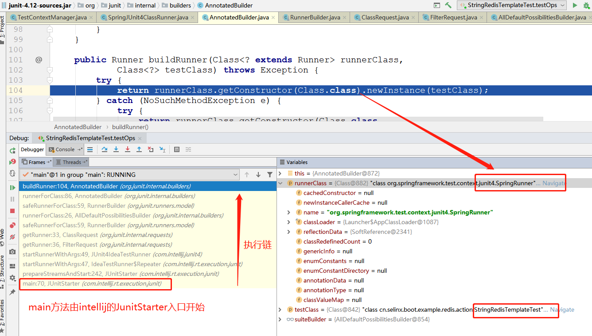
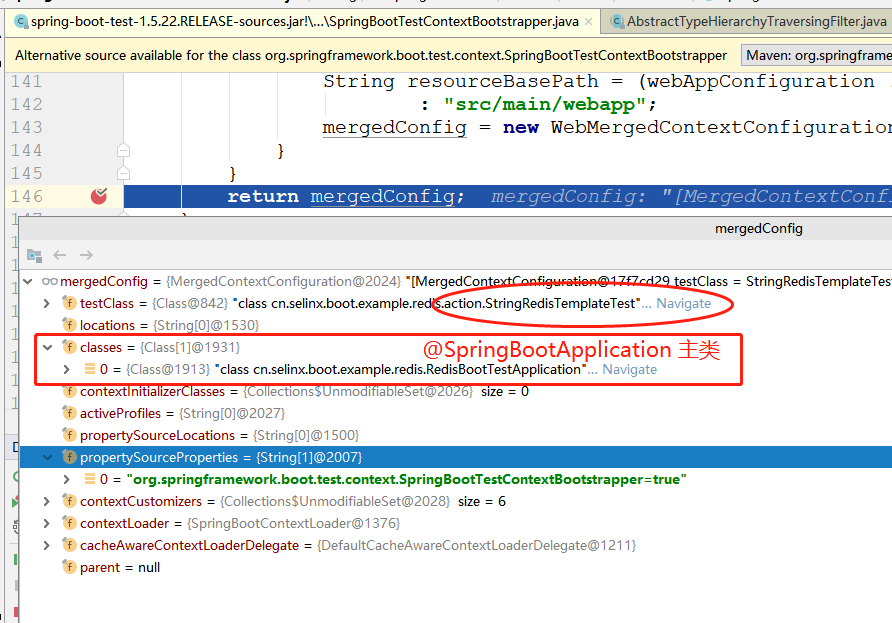
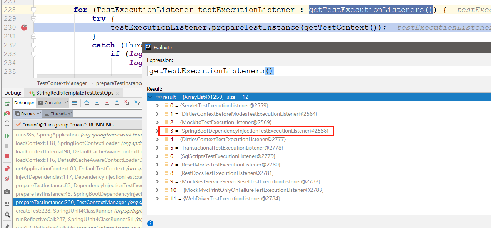

SpringBoot测试环境启动分析
================================

[TOC]

官方文档：

[https://docs.spring.io/spring-boot/docs/1.5.22.RELEASE/reference/htmlsingle/#boot-features-testing](https://docs.spring.io/spring-boot/docs/1.5.22.RELEASE/reference/htmlsingle/#boot-features-testing)


## 阅读本文前提示

加入pom.xml

```xml
<dependency>
	<groupId>org.springframework.boot</groupId>
	<artifactId>spring-boot-starter-test</artifactId>
	<scope>test</scope>
</dependency>
```

- [JUnit](https://junit.org/) — The de-facto standard for unit testing Java applications.
- [Spring Test](https://docs.spring.io/spring/docs/4.3.25.RELEASE/spring-framework-reference/htmlsingle/#integration-testing) & Spring Boot Test — Utilities and integration test support for Spring Boot applications.
- [AssertJ](https://joel-costigliola.github.io/assertj/) — A fluent assertion library.
- [Hamcrest](https://github.com/hamcrest/JavaHamcrest) — A library of matcher objects (also known as constraints or predicates).
- [Mockito](https://mockito.github.io/) — A Java mocking framework.
- [JSONassert](https://github.com/skyscreamer/JSONassert) — An assertion library for JSON.
- [JsonPath](https://github.com/jayway/JsonPath) — XPath for JSON.

## 测试SpringBoot应用

```java
@RunWith(SpringRunner.class)
@SpringBootTest(webEnvironment = SpringBootTest.WebEnvironment.NONE)
public class StringRedisTemplateTest {
	@Autowired
    StringRedisTemplate stringRedisTemplate;
	// 业务编写
}
```

下图展示，采用IDEA运行测试的执行调用链。入口是JunitStater，找到具体的Runner：SpringRunner.class



### @Runwith

Junit单元测试时，默认是一次只能测试一个类，而`@RunWith`最主要是声明测试的运行器，vaule参数必须Runner 的子类。

SpringRunner --》SpringJUnit4ClassRunner --》BlockJUnit4ClassRunner --》ParentRunner --》Runner。我们平时在写Junit测试类时，都没有写`@RunWith`，因为JUnit中有一个默认的Runner，它的名字叫`BlockJunit4ClassRunner`，但这是在JUnit4.5之后才引入的。以前版本叫做JUnit4ClassRunner。

在SpringFramework 2.5.x时代，测试Bean的方式如下：

```java
@RunWith(SpringJUnit4ClassRunner.class)
@ContextConfiguration(locations = { "classpath:applicationContext.xml" })
public class UserManagerTest {
　　@Autowired
　　ApplicationContext ctx;
 
　　@Test
　　public void testAddUser() {
　　　　try {
　　　　　　UserManager userManager = ctx.getBean(UserManager.class); 
　　　　　　userManager.addUser();
　　　　} catch (Exception e) {
　　　　　　e.printStackTrace();
　　　　}
　　}
}
```

#### @Runwith(SpringRunner.class) 

在SpringFramework 4.3 引入类：`SpringRunner` ,这个构造方法实例化：TestContextManager。

```java
/** 
 * @author Sam Brannen
 * @since 4.3
 * @see SpringJUnit4ClassRunner
 * @see org.springframework.test.context.junit4.rules.SpringClassRule
 * @see org.springframework.test.context.junit4.rules.SpringMethodRule
 */
public final class SpringRunner extends SpringJUnit4ClassRunner {

	/**
	 * Construct a new {@code SpringRunner} and initialize a
	 * {@link org.springframework.test.context.TestContextManager TestContextManager}
	 * to provide Spring testing functionality to standard JUnit 4 tests.
	 * @param clazz the test class to be run
	 * @see #createTestContextManager(Class)
	 */
	public SpringRunner(Class<?> clazz) throws InitializationError {
		super(clazz);
	}

}

// 父级构造方法：createTestContextManager
public SpringJUnit4ClassRunner(Class<?> clazz) throws InitializationError {
	super(clazz);
	if (logger.isDebugEnabled()) {
		logger.debug("SpringJUnit4ClassRunner constructor called with [" + clazz + "]");
	}
	ensureSpringRulesAreNotPresent(clazz);
	this.testContextManager = createTestContextManager(clazz);
}

/**
 * Create a new {@link TestContextManager} for the supplied test class.
 */
protected TestContextManager createTestContextManager(Class<?> clazz) {
	return new TestContextManager(clazz);
}
```

#### @RunWith(Suite.class)

使用JUnit执行一个测试套件。Suite类是JUnit自带的，意为套件，顾名思义，就是一套东西。通过它，可以把多个相关的测试类看做一个测试套件一起测试。看个例子：

```java
import org.junit.runner.RunWith;
import org.junit.runners.Suite;
 
@RunWith(Suite.class)
@Suite.SuiteClasses({ TestA.class, TestB.class, /*Any test class you want to run*/})
public class TestSuite {
    // Please note this case won't run. It will only run cases which
    // are configured in @Suite.SuiteClasses
    @Test
    public void testPrint() {
        System.out.println("Hello");
    }
}
```

@RunWith指定了Suite类，说明这个TestSuite类是一个套件。通过@Suite.SuiteClasses指定了要执行的测试类（这些类中的所有用例都会执行）。

需要注意的是，这个TestSuite类本身用例则不会执行了（如上面的testPrint()方法）。

参考文章：[JUnit高级用法之@RunWith](https://my.oschina.net/itblog/blog/1550753)


#### Junit获取Runner

```java
// Junit4运行测试类
public class AnnotatedBuilder extends RunnerBuilder {
    private static final String CONSTRUCTOR_ERROR_FORMAT = "Custom runner class %s should have a public constructor with signature %s(Class testClass)";

    private final RunnerBuilder suiteBuilder;

    public AnnotatedBuilder(RunnerBuilder suiteBuilder) {
        this.suiteBuilder = suiteBuilder;
    }

    @Override
    public Runner runnerForClass(Class<?> testClass) throws Exception {
        for (Class<?> currentTestClass = testClass; currentTestClass != null;
             currentTestClass = getEnclosingClassForNonStaticMemberClass(currentTestClass)) {
            RunWith annotation = currentTestClass.getAnnotation(RunWith.class);
            if (annotation != null) {
				// 创造运行类
                return buildRunner(annotation.value(), testClass);
            }
        }

        return null;
    }
	// 获取SpringRunner的对象实例
	public Runner buildRunner(Class<? extends Runner> runnerClass,
            Class<?> testClass) throws Exception {
        try {
			// 获取构造方法，执行实例化
            return runnerClass.getConstructor(Class.class).newInstance(testClass);
        } catch (NoSuchMethodException e) {
            try {
                return runnerClass.getConstructor(Class.class,
                        RunnerBuilder.class).newInstance(testClass, suiteBuilder);
            } catch (NoSuchMethodException e2) {
                String simpleName = runnerClass.getSimpleName();
                throw new InitializationError(String.format(
                        CONSTRUCTOR_ERROR_FORMAT, simpleName, simpleName));
            }
        }
    }
}
```


### @SpringBootTest

`@SpringBootTest`注解是SpringBoot自1.4.0版本开始引入的一个用于测试的注解。

首先看下SpringBootTest，里面有三个方法。properties（属性）、classes（配置类）、WebEnvironment

```java
@BootstrapWith(SpringBootTestContextBootstrapper.class)
public @interface SpringBootTest {

	/**
	 * Alias for {@link #properties()}.
	 * @return the properties to apply
	 */
	@AliasFor("properties")
	String[] value() default {};

	/**
	 * 属性内容：添加到Spring环境变量中
	 * Properties in form {@literal key=value} that should be added to the Spring
	 * {@link Environment} before the test runs.
	 * @return the properties to add
	 */
	@AliasFor("value")
	String[] properties() default {};

	/**
	 *
	 * @ContextConfiguration(classes=...)，配置Bean
	 */
	Class<?>[] classes() default {};

	/**
	 * MOCK：创建WebApplicationContext，默认
	 * RANDOM_PORT：创建EmbeddedWebApplicationContext(随机端口)
	 * DEFINED_PORT：创建EmbeddedWebApplicationContext(指定端口)
	 * NONE：创建ApplicationContext(非Web)
	 * 
	 */
	WebEnvironment webEnvironment() default WebEnvironment.MOCK;
	
}	
```

### TestContextManager

通过源码跟踪分析，发现上面的@RunWith，会去创建`TestContextManager` ：[@Runwith(SpringRunner.class) ](#@Runwith(SpringRunner.class) )

```java
public class TestContextManager {

	private static final Log logger = LogFactory.getLog(TestContextManager.class);

	private final TestContext testContext;

	private final List<TestExecutionListener> testExecutionListeners = new ArrayList<TestExecutionListener>();

	// 构造方法
	public TestContextManager(Class<?> testClass) {
		this(BootstrapUtils.resolveTestContextBootstrapper(BootstrapUtils.createBootstrapContext(testClass)));
	}

	// 构造方法
	public TestContextManager(TestContextBootstrapper testContextBootstrapper) {
        // 创建testContext：测试上下文，调用SpringBootTestContextBootstrapper方法。
		this.testContext = testContextBootstrapper.buildTestContext();
        // 注册listener
		registerTestExecutionListeners(testContextBootstrapper.getTestExecutionListeners());
	}
}
```

#### buildTestContext

##### SpringBootTestContextBootstrapper

SpringBootTestContextBootstrapper --》 DefaultTestContextBootstrapper --》AbstractTestContextBootstrapper --》TestContextBootstrapper

```java
// SpringBootTestContextBootstrapper 
@Override
public TestContext buildTestContext() {
    // 调用父类方法
	TestContext context = super.buildTestContext();
	verifyConfiguration(context.getTestClass());
	WebEnvironment webEnvironment = getWebEnvironment(context.getTestClass());
	if (webEnvironment == WebEnvironment.MOCK && hasWebEnvironmentClasses()) {
		context.setAttribute(ACTIVATE_SERVLET_LISTENER, true);
	}
	else if (webEnvironment != null && webEnvironment.isEmbedded()) {
		context.setAttribute(ACTIVATE_SERVLET_LISTENER, false);
	}
	return context;
}

// AbstractTestContextBootstrapper 
@Override
public TestContext buildTestContext() {
    // 测试类，引入buildMergedContextConfiguration方法
	return new DefaultTestContext(getBootstrapContext().getTestClass(), buildMergedContextConfiguration(),
			getCacheAwareContextLoaderDelegate());
}
```

buildMergedContextConfiguration() 方法 

```java
private MergedContextConfiguration buildMergedContextConfiguration(Class<?> testClass,
		List<ContextConfigurationAttributes> configAttributesList, MergedContextConfiguration parentConfig,
		CacheAwareContextLoaderDelegate cacheAwareContextLoaderDelegate,
		boolean requireLocationsClassesOrInitializers) {

	MergedTestPropertySources mergedTestPropertySources =
			TestPropertySourceUtils.buildMergedTestPropertySources(testClass);
	MergedContextConfiguration mergedConfig = new MergedContextConfiguration(testClass,
			StringUtils.toStringArray(locations),
			ClassUtils.toClassArray(classes),
			ApplicationContextInitializerUtils.resolveInitializerClasses(configAttributesList),
			ActiveProfilesUtils.resolveActiveProfiles(testClass),
			mergedTestPropertySources.getLocations(),
			mergedTestPropertySources.getProperties(),
			contextCustomizers, contextLoader, cacheAwareContextLoaderDelegate, parentConfig);
	
    // 处理合并上下文配置
	return processMergedContextConfiguration(mergedConfig);
}
```

###### MergedContextConfiguration

processMergedContextConfiguration方法，里面调用getOrFindConfigurationClasses()，方法获取配置了

`@SpringBootApplication`的注解类。

```java
/** 
 * SpringBootTestContextBootstrapper#processMergedContextConfiguration
 * 处理上下文配置
 */
@Override
protected MergedContextConfiguration processMergedContextConfiguration(MergedContextConfiguration mergedConfig) {
	// 1. 注意此时mergedConfig的classes属性，处理classes配置
	Class<?>[] classes = getOrFindConfigurationClasses(mergedConfig);
	// 2. 处理properties属性配置
	List<String> propertySourceProperties = getAndProcessPropertySourceProperties(mergedConfig);
    // 3. 创建 mergedConfig
	mergedConfig = createModifiedConfig(mergedConfig, classes,
			propertySourceProperties.toArray(new String[propertySourceProperties.size()]));
	WebEnvironment webEnvironment = getWebEnvironment(mergedConfig.getTestClass());
    // WebEnvironment配置
	if (webEnvironment != null && isWebEnvironmentSupported(mergedConfig)) {
		if (webEnvironment.isEmbedded() || (webEnvironment == WebEnvironment.MOCK && hasWebEnvironmentClasses())) {
			WebAppConfiguration webAppConfiguration = AnnotatedElementUtils
					.findMergedAnnotation(mergedConfig.getTestClass(), WebAppConfiguration.class);
			String resourceBasePath = (webAppConfiguration != null) ? webAppConfiguration.value()
					: "src/main/webapp";
			mergedConfig = new WebMergedContextConfiguration(mergedConfig, resourceBasePath);
		}
	}
	return mergedConfig;
}
```

##### 1. getOrFindConfigurationClasses

根据注解类的类路径，配置类扫描器去查找`@SpringBootApplication`的注解类。如果找到，此时会输出info日志信息 "Found @SpringBootConfiguration "

```java
// 获取配置启动类
protected Class<?>[] getOrFindConfigurationClasses(MergedContextConfiguration mergedConfig) {
	Class<?>[] classes = mergedConfig.getClasses();
	if (containsNonTestComponent(classes) || mergedConfig.hasLocations()) {
		return classes;
	}
	// 通过当前的TestClass查找
	Class<?> found = new SpringBootConfigurationFinder().findFromClass(mergedConfig.getTestClass());
	Assert.state(found != null, "Unable to find a @SpringBootConfiguration, you need to use "
			+ "@ContextConfiguration or @SpringBootTest(classes=...) " + "with your test");
	logger.info("Found @SpringBootConfiguration " + found.getName() + " for test " + mergedConfig.getTestClass());
	return merge(found, classes);
}

// SpringBootConfiguration配置类查找
SpringBootConfigurationFinder() {
	this.scanner = new ClassPathScanningCandidateComponentProvider(false);
	// 注解过滤器
	this.scanner.addIncludeFilter(new AnnotationTypeFilter(SpringBootConfiguration.class));
	this.scanner.setResourcePattern("*.class");
}

// 核心查找方法
public Class<?> findFromClass(Class<?> source) {
	Assert.notNull(source, "Source must not be null");
	return findFromPackage(ClassUtils.getPackageName(source));
}

// 从packageName扫描
public Class<?> findFromPackage(String source) {
	Assert.notNull(source, "Source must not be null");
	Class<?> configuration = cache.get(source);
	if (configuration == null) {
		configuration = scanPackage(source);
		cache.put(source, configuration);
	}
	return configuration;
}

// 扫描Package，一直迭代循环查找
private Class<?> scanPackage(String source) {
	while (source.length() > 0) {
		// 查找符合要求的Component，注意此时includeFilters是@SpringBootConfiguration配置类
		Set<BeanDefinition> components = this.scanner.findCandidateComponents(source);
		if (!components.isEmpty()) {
			Assert.state(components.size() == 1,
					"Found multiple @SpringBootConfiguration annotated classes " + components);
			return ClassUtils.resolveClassName(components.iterator().next().getBeanClassName(), null);
		}
        // 如果没有找到，获取父级目录
		source = getParentPackage(source);
	}
	return null;
}
```

##### 2. getAndProcessPropertySourceProperties

获取和处理properties配置信息

```java
// 处理properties属性
private List<String> getAndProcessPropertySourceProperties(MergedContextConfiguration mergedConfig) {
	List<String> propertySourceProperties = new ArrayList<String>(
			Arrays.asList(mergedConfig.getPropertySourceProperties()));
	// 得到：org.springframework.boot.test.context.SpringBootTestContextBootstrapper=true
	String differentiator = getDifferentiatorPropertySourceProperty();
	if (differentiator != null) {
		propertySourceProperties.add(differentiator);
	}
	// 处理属性
	processPropertySourceProperties(mergedConfig, propertySourceProperties);
	return propertySourceProperties;
}

protected void processPropertySourceProperties(MergedContextConfiguration mergedConfig,
			List<String> propertySourceProperties) {
	Class<?> testClass = mergedConfig.getTestClass();
	// 读取@SpringBootTest注解配置的properties(value)属性值
	String[] properties = getProperties(testClass);
	if (!ObjectUtils.isEmpty(properties)) {
		// Added first so that inlined properties from @TestPropertySource take
		// precedence
		propertySourceProperties.addAll(0, Arrays.asList(properties));
	}
	// 读取webEnvironment配置类
	if (getWebEnvironment(testClass) == WebEnvironment.RANDOM_PORT) {
		propertySourceProperties.add("server.port=0");
	}
}
```

##### 3. createModifiedConfig

```java
protected final MergedContextConfiguration createModifiedConfig(MergedContextConfiguration mergedConfig,
		Class<?>[] classes, String[] propertySourceProperties) {
	return new MergedContextConfiguration(mergedConfig.getTestClass(), mergedConfig.getLocations(), classes,
			mergedConfig.getContextInitializerClasses(), mergedConfig.getActiveProfiles(),
			mergedConfig.getPropertySourceLocations(), propertySourceProperties,
			mergedConfig.getContextCustomizers(), mergedConfig.getContextLoader(),
			getCacheAwareContextLoaderDelegate(), mergedConfig.getParent());
}
```



#### registerTestExecutionListeners

注册测试所用的Listener，调用地方查看：[prepareTestInstance](#prepareTestInstance)

```java
// 注册测试执行Listeners
public void registerTestExecutionListeners(List<TestExecutionListener> testExecutionListeners) {
	registerTestExecutionListeners(testExecutionListeners.toArray(new TestExecutionListener[testExecutionListeners.size()]));
}

// 循环注册测试执行Listeners
public void registerTestExecutionListeners(TestExecutionListener... testExecutionListeners) {
	for (TestExecutionListener listener : testExecutionListeners) {
		if (logger.isTraceEnabled()) {
			logger.trace("Registering TestExecutionListener: " + listener);
		}
		this.testExecutionListeners.add(listener);
	}
}
```

获取`TestExecutionListener`的方式

```java
// 获取TestExecutionListener列表
@Override
public final List<TestExecutionListener> getTestExecutionListeners() {
	Class<?> clazz = getBootstrapContext().getTestClass();
	Class<TestExecutionListeners> annotationType = TestExecutionListeners.class;
	List<Class<? extends TestExecutionListener>> classesList = new ArrayList<Class<? extends TestExecutionListener>>();
	boolean usingDefaults = false;

	AnnotationDescriptor<TestExecutionListeners> descriptor =
			MetaAnnotationUtils.findAnnotationDescriptor(clazz, annotationType);

	// Use defaults?，抹去默认的
	if (descriptor == null) {
		if (logger.isDebugEnabled()) {
			logger.debug(String.format("@TestExecutionListeners is not present for class [%s]: using defaults.",
					clazz.getName()));
		}
		usingDefaults = true;
        // 获取默认的
		classesList.addAll(getDefaultTestExecutionListenerClasses());
	}
	
	Collection<Class<? extends TestExecutionListener>> classesToUse = classesList;
	// Remove possible duplicates if we loaded default listeners.
	if (usingDefaults) {
		classesToUse = new LinkedHashSet<Class<? extends TestExecutionListener>>(classesList);
	}

	List<TestExecutionListener> listeners = instantiateListeners(classesToUse);
	// Sort by Ordered/@Order if we loaded default listeners.
	if (usingDefaults) {
		AnnotationAwareOrderComparator.sort(listeners);
	}

	if (logger.isInfoEnabled()) {
		logger.info("Using TestExecutionListeners: " + listeners);
	}
	return listeners;
}
```

getDefaultTestExecutionListenerClasses

采用工厂方法加载默认的，读取spring.factories配置的属性值。共12个

```properties
# spring-test-4.3.25.RELEASE.jar!\META-INF\spring.factories
org.springframework.test.context.TestExecutionListener = \
	org.springframework.test.context.web.ServletTestExecutionListener,\
	org.springframework.test.context.support.DirtiesContextBeforeModesTestExecutionListener,\
org.springframework.test.context.support.DependencyInjectionTestExecutionListener,\
	org.springframework.test.context.support.DirtiesContextTestExecutionListener,\
	org.springframework.test.context.transaction.TransactionalTestExecutionListener,\
	org.springframework.test.context.jdbc.SqlScriptsTestExecutionListener
	
# spring-boot-test-1.5.22.RELEASE.jar!\META-INF\spring.factories	
# Test Execution Listeners
org.springframework.test.context.TestExecutionListener=\
org.springframework.boot.test.mock.mockito.MockitoTestExecutionListener,\
org.springframework.boot.test.mock.mockito.ResetMocksTestExecutionListener

# spring-boot-test-autoconfigure-1.5.22.RELEASE.jar!\META-INF\spring.factories
# Test Execution Listeners
org.springframework.test.context.TestExecutionListener=\
org.springframework.boot.test.autoconfigure.restdocs.RestDocsTestExecutionListener,\
org.springframework.boot.test.autoconfigure.web.client.MockRestServiceServerResetTestExecutionListener,\
org.springframework.boot.test.autoconfigure.web.servlet.MockMvcPrintOnlyOnFailureTestExecutionListener,\
org.springframework.boot.test.autoconfigure.web.servlet.WebDriverTestExecutionListener
```

具体源码如下：

```java
@Override
protected Set<Class<? extends TestExecutionListener>> getDefaultTestExecutionListenerClasses() {
	Set<Class<? extends TestExecutionListener>> listeners = super.getDefaultTestExecutionListenerClasses();
	List<DefaultTestExecutionListenersPostProcessor> postProcessors = SpringFactoriesLoader
			.loadFactories(DefaultTestExecutionListenersPostProcessor.class, getClass().getClassLoader());
	for (DefaultTestExecutionListenersPostProcessor postProcessor : postProcessors) {
		listeners = postProcessor.postProcessDefaultTestExecutionListeners(listeners);
	}
	return listeners;
}

// 工厂方法加载TestExecutionListener
protected List<String> getDefaultTestExecutionListenerClassNames() {
	List<String> classNames =
			SpringFactoriesLoader.loadFactoryNames(TestExecutionListener.class, getClass().getClassLoader());
	if (logger.isInfoEnabled()) {
		logger.info(String.format("Loaded default TestExecutionListener class names from location [%s]: %s",
				SpringFactoriesLoader.FACTORIES_RESOURCE_LOCATION, classNames));
	}
	return Collections.unmodifiableList(classNames);
}
```

### 构造入口说明

当SpringRunner实例对象创建成功后，包含了testContextManager对象也已经创建。通过Filter.apply(Runner)，测试具体的@Test注解的方法。

#### FilterRequest

```java
public final class FilterRequest extends Request {
    private final Request request;
	/*
     * We have to use the f prefix, because IntelliJ's JUnit4IdeaTestRunner uses
     * reflection to access this field. See
     * https://github.com/junit-team/junit/issues/960
     */
    private final Filter fFilter;

    public FilterRequest(Request request, Filter filter) {
        this.request = request;
        this.fFilter = filter;
    }

    @Override
    public Runner getRunner() {
        try {
			// request = ClassRequest,里面有：fTestClass（测试类），runner（SpringRunner）
			// 最终得到对象SpringRunner
            Runner runner = request.getRunner();
            // JUnitTestRunnerUtil，具体执行@Test指向的方法
            fFilter.apply(runner);
            return runner;
        } catch (NoTestsRemainException e) {
            return new ErrorReportingRunner(Filter.class, new Exception(String
                    .format("No tests found matching %s from %s", fFilter
                            .describe(), request.toString())));
        }
    }
}

```

#### ClassRequest

```java
public class ClassRequest extends Request {
    private final Object runnerLock = new Object();
	// 测试主类
    private final Class<?> fTestClass;
    private final boolean canUseSuiteMethod;
    private volatile Runner runner;

    public ClassRequest(Class<?> testClass, boolean canUseSuiteMethod) {
        this.fTestClass = testClass;
        this.canUseSuiteMethod = canUseSuiteMethod;
    }

    public ClassRequest(Class<?> testClass) {
        this(testClass, true);
    }

    @Override
    public Runner getRunner() {
        if (runner == null) {
            synchronized (runnerLock) {
                if (runner == null) {
					// 上面的步骤是为了获取Runner
                    runner = new AllDefaultPossibilitiesBuilder(canUseSuiteMethod).safeRunnerForClass(fTestClass);
                }
            }
        }
        return runner;
    }
}
```


### 运行阶段

#### JUnitCore#run

最终调用SpringRunner#run --》SpringJUnit4ClassRunner#createTest

```java
/**
 * Do not use. Testing purposes only.
 */
public Result run(Runner runner) {
	Result result = new Result();
	RunListener listener = result.createListener();
	notifier.addFirstListener(listener);
	try {
		notifier.fireTestRunStarted(runner.getDescription());
        // SpringRunner#run,实际调用父类的run方法
		runner.run(notifier);
		notifier.fireTestRunFinished(result);
	} finally {
		removeListener(listener);
	}
	return result;
}

// SpringJUnit4ClassRunner
public void run(RunNotifier notifier) {
	if (!ProfileValueUtils.isTestEnabledInThisEnvironment(getTestClass().getJavaClass())) {
		notifier.fireTestIgnored(getDescription());
		return;
	}
	super.run(notifier);
}

// SpringJUnit4ClassRunner#methodBlock
@Override
protected Statement methodBlock(FrameworkMethod frameworkMethod) {
	Object testInstance;
	try {
		testInstance = new ReflectiveCallable() {
			@Override
			protected Object runReflectiveCall() throws Throwable {
				// 创建测试对象类
				return createTest();
			}
		}.run();
	}
	catch (Throwable ex) {
		return new Fail(ex);
	}

	Statement statement = methodInvoker(frameworkMethod, testInstance);
	statement = possiblyExpectingExceptions(frameworkMethod, testInstance, statement);
	statement = withBefores(frameworkMethod, testInstance, statement);
	statement = withAfters(frameworkMethod, testInstance, statement);
	statement = withRulesReflectively(frameworkMethod, testInstance, statement);
	statement = withPotentialRepeat(frameworkMethod, testInstance, statement);
	statement = withPotentialTimeout(frameworkMethod, testInstance, statement);
	return statement;
}

@Override
protected Object createTest() throws Exception {
    // 此时里面的属性为null
	Object testInstance = super.createTest();
    // 准备测试对象实例，通过listener给属性赋值
	getTestContextManager().prepareTestInstance(testInstance);
	return testInstance;
}

```

#### prepareTestInstance

准备测试对象实例。核心listener是`SpringBootDependencyInjectionTestExecutionListener` ,这个类是`DependencyInjectionTestExecutionListener`的子类。所以被实例化。

参考：[registerTestExecutionListeners](#registerTestExecutionListeners)



```java
public class SpringBootDependencyInjectionTestExecutionListener extends DependencyInjectionTestExecutionListener {

	@Override
	public void prepareTestInstance(TestContext testContext) throws Exception {
		try {
			// 父类方法
			super.prepareTestInstance(testContext);
		}
		catch (Exception ex) {
			outputConditionEvaluationReport(testContext);
			throw ex;
		}
	}
}

// DependencyInjectionTestExecutionListener 方法
@Override
public void prepareTestInstance(TestContext testContext) throws Exception {
	if (logger.isDebugEnabled()) {
		logger.debug("Performing dependency injection for test context [" + testContext + "].");
	}
	// 注入依赖
	injectDependencies(testContext);
}

protected void injectDependencies(TestContext testContext) throws Exception {
    // 测试主类
	Object bean = testContext.getTestInstance();
	// 1. 创建上下文，获取BeanFactory
	AutowireCapableBeanFactory beanFactory = testContext.getApplicationContext().getAutowireCapableBeanFactory();
    // 2. 给测试类的赋予属性，此时：StringRedisTemplate 被赋予了属性
	beanFactory.autowireBeanProperties(bean, AutowireCapableBeanFactory.AUTOWIRE_NO, false);
	beanFactory.initializeBean(bean, testContext.getTestClass().getName());
	testContext.removeAttribute(REINJECT_DEPENDENCIES_ATTRIBUTE);
}
```

##### 1.AutowireCapableBeanFactory

通过DefaultTestContext加载上下文，获取BeanFactory，核心是SpringBootContextLoader#loadContext

###### DefaultTestContext

核心方法：getApplicationContext()

```java
public ApplicationContext getApplicationContext() {
	// 代理类加载上下文：DefaultCacheAwareContextLoaderDelegate#loadContext
	ApplicationContext context = this.cacheAwareContextLoaderDelegate.loadContext(this.mergedContextConfiguration);
	if (context instanceof ConfigurableApplicationContext) {
		@SuppressWarnings("resource")
		ConfigurableApplicationContext cac = (ConfigurableApplicationContext) context;
		Assert.state(cac.isActive(), "The ApplicationContext loaded for [" + mergedContextConfiguration
				+ "] is not active. Ensure that the context has not been closed programmatically.");
	}
	return context;
}

// DefaultCacheAwareContextLoaderDelegate#loadContext 代理类加载上下文
@Override
public ApplicationContext loadContext(MergedContextConfiguration mergedContextConfiguration) {
	synchronized (this.contextCache) {
		ApplicationContext context = this.contextCache.get(mergedContextConfiguration);
		// 缓存中不存在，那么从内部加载
		if (context == null) {
			try {
				// 内部加载
				context = loadContextInternal(mergedContextConfiguration);
				if (logger.isDebugEnabled()) {
					logger.debug(String.format("Storing ApplicationContext in cache under key [%s]",
							mergedContextConfiguration));
				}
                // 放入缓存
				this.contextCache.put(mergedContextConfiguration, context);
			}
			catch (Exception ex) {
				throw new IllegalStateException("Failed to load ApplicationContext", ex);
			}
		}
		else {
			if (logger.isDebugEnabled()) {
				logger.debug(String.format("Retrieved ApplicationContext from cache with key [%s]",
						mergedContextConfiguration));
			}
		}

		this.contextCache.logStatistics();

		return context;
	}
}
```

loadContextInternal：内部加载ApplicationContext

```java
protected ApplicationContext loadContextInternal(MergedContextConfiguration mergedContextConfiguration)
		throws Exception {
	
	// 得到SpringBootContextLoader
	ContextLoader contextLoader = mergedContextConfiguration.getContextLoader();
	Assert.notNull(contextLoader, "Cannot load an ApplicationContext with a NULL 'contextLoader'. " +
			"Consider annotating your test class with @ContextConfiguration or @ContextHierarchy.");

	ApplicationContext applicationContext;

	if (contextLoader instanceof SmartContextLoader) {
		SmartContextLoader smartContextLoader = (SmartContextLoader) contextLoader;
		// 实际调用SpringBootContextLoader#loadContext
		applicationContext = smartContextLoader.loadContext(mergedContextConfiguration);
	}
	else {
		String[] locations = mergedContextConfiguration.getLocations();
		Assert.notNull(locations, "Cannot load an ApplicationContext with a NULL 'locations' array. " +
				"Consider annotating your test class with @ContextConfiguration or @ContextHierarchy.");
		applicationContext = contextLoader.loadContext(locations);
	}

	return applicationContext;
}
```

###### SpringBootContextLoader

加载ApplicationContext上下文的核心类，loadContext(mergedContextConfiguration)。核心是构造一个SpringApplication，然后读取上面获取的配置信息，设置主类和source。

```java
@Override
public ApplicationContext loadContext(MergedContextConfiguration config) throws Exception {
	// new SpringApplication()
	SpringApplication application = getSpringApplication();
	// 主类：测试类
	application.setMainApplicationClass(config.getTestClass());
	// 获取配置资源类
	application.setSources(getSources(config));
	// 环境变量
	ConfigurableEnvironment environment = new StandardEnvironment();
	if (!ObjectUtils.isEmpty(config.getActiveProfiles())) {
		setActiveProfiles(environment, config.getActiveProfiles());
	}
	// 资源加载器：DefaultResourceLoader
	ResourceLoader resourceLoader = (application.getResourceLoader() != null) ? application.getResourceLoader()
			: new DefaultResourceLoader(getClass().getClassLoader());
	// 将properties加入到environment里面
	TestPropertySourceUtils.addPropertiesFilesToEnvironment(environment, resourceLoader,
			config.getPropertySourceLocations());
    // 核心：Inlined Test Properties
	TestPropertySourceUtils.addInlinedPropertiesToEnvironment(environment, getInlinedProperties(config));
	// 给SpringApplication设置Enviroment
	application.setEnvironment(environment);
	// 获取initializers，初始化的6个和包装类6个
	List<ApplicationContextInitializer<?>> initializers = getInitializers(config, application);
	// 配置是否web环境
	if (config instanceof WebMergedContextConfiguration) {
		application.setWebEnvironment(true);
		if (!isEmbeddedWebEnvironment(config)) {
			new WebConfigurer().configure(config, application, initializers);
		}
	}
	else {
		application.setWebEnvironment(false);
	}
	application.setInitializers(initializers);
	// 标准SpringBoot的run()方法，获取上下文
	ConfigurableApplicationContext context = application.run();
	return context;
}
```

#### runLeaf(statement, description, notifier);

```java
protected final void runLeaf(Statement statement, Description description,
            RunNotifier notifier) {
	EachTestNotifier eachNotifier = new EachTestNotifier(notifier, description);
	eachNotifier.fireTestStarted();
	try {
		// SpringRepeat : testMethod指向具体的,即是@Test注释的方法
		statement.evaluate();
	} catch (AssumptionViolatedException e) {
		eachNotifier.addFailedAssumption(e);
	} catch (Throwable e) {
		eachNotifier.addFailure(e);
	} finally {
		eachNotifier.fireTestFinished();
	}
}
```

通过evaluate，调用具体的方法。

有前置RunBeforeTestMethodCallbacks，后置方法RunAfterTestMethodCallbacks


## SpringBoot-Mock

如果没有指定@SpringBootApplication类，会一直找，找不到抛出异常。提示采用@ContextConfiguration

```shell
java.lang.IllegalStateException: Unable to find a @SpringBootConfiguration, you need to use @ContextConfiguration or @SpringBootTest(classes=...) with your test
```

如果使用SpringFramework ，使用 SpringJUnit4ClassRunner 和@ContextConfiguration：详情看：[@Runwith](#@Runwith)

如果使用SpringBoot，使用SpringRunner和`@*Test`，找到一个`@SpringBootApplication`注解类.

```java
@RunWith(SpringRunner.class)
@SpringBootTest(properties = "spring.main.web-application-type=reactive")
@Import(MyTestsConfiguration.class) 
public class MyTests {

	@Test
	public void exampleTest() {
		...
	}

}
```

### Mockito基础知识

> Java 单元测试 Mock 框架 ：[https://github.com/mockito](Java 单元测试 Mock 框架)
>
> Mockito 并不需要“expectation（期望）”的概念。只有 stub 和验证。传统是expect-run-verify 

#### 什么是 Mock 测试

Mock 测试就是在测试过程中，对于某些不容易构造（如 HttpServletRequest 必须在Servlet 容器中才能构造出来）或者不容易获取比较复杂的对象（如 JDBC 中的ResultSet 对象），用一个虚拟的对象（Mock 对象）来创建以便测试的测试方法。

Mock 最大的功能是帮你把单元测试的耦合分解开，如果你的代码对另一个类或者接口有依赖，它能够帮你模拟这些依赖，并帮你验证所调用的依赖的行为。

Mock 不是 Stub，两者是有区别的：

- 前者被称为 mockist TDD，而后者一般称为 classic TDD ；
- 前者是基于行为的验证（behavior verification），后者是基于状态的验证 （state verification）；
- 前者使用的是模拟的对象，而后者使用的是真实的对象。


### Mock测试Web

#### MockMvc

可以采用 MockMvc进行mvc测试

```java
@RunWith(SpringRunner.class)
@SpringBootTest
@AutoConfigureMockMvc
public class MockMvcExampleTests {

	@Autowired
	private MockMvc mvc;

	@Test
	public void exampleTest() throws Exception {
		this.mvc.perform(get("/")).andExpect(status().isOk()).andExpect(content().string("Hello World"));
	}

}
```

#### WebTestClient

SpringBoot 2.0支持的

也可以采用WebTestClient进行mvc测试，如果测试一个正在运行的server服务，那么需要指定

`webEnvironment = WebEnvironment.RANDOM_PORT` 指定采用不同的端口。	

```java
@RunWith(SpringRunner.class)
@SpringBootTest(webEnvironment = WebEnvironment.RANDOM_PORT)
@AutoConfigureWebTestClient
public class MockWebTestClientExampleTests {

	@Autowired
	private WebTestClient webClient;

	@Test
	public void exampleTest() {
		this.webClient.get().uri("/").exchange().expectStatus().isOk().expectBody(String.class)
				.isEqualTo("Hello World");
	}

}
```

#### TestRestTemplate 

如果不适用spring-webflux，那么采用TestRestTemplate进行web测试。同时可以自定义TestRestTemplate的配置信息。

```java
@RunWith(SpringRunner.class)
@SpringBootTest(webEnvironment = WebEnvironment.RANDOM_PORT)
public class RandomPortTestRestTemplateExampleTests {

	@Autowired
	private TestRestTemplate restTemplate;

	@Test
	public void exampleTest() {
		String body = this.restTemplate.getForObject("/", String.class);
		assertThat(body).isEqualTo("Hello World");
	}
    
    @TestConfiguration
	static class Config {
		@Bean
		public RestTemplateBuilder restTemplateBuilder() {
			return new RestTemplateBuilder().setConnectTimeout(1000).setReadTimeout(1000);
		}

	}

}
```

### 测试Bean方法

采用`@MockBean` 注入一个远程bean，采用mockito。@Autowired注入一个本地bean。

```java
@RunWith(SpringRunner.class)
@SpringBootTest
public class MyTests {

	@MockBean
	private RemoteService remoteService;

	@Autowired
	private Reverser reverser;

	@Test
	public void exampleTest() {
		// RemoteService has been injected into the reverser bean
		given(this.remoteService.someCall()).willReturn("mock");
		String reverse = reverser.reverseSomeCall();
		assertThat(reverse).isEqualTo("kcom");
	}

}
```

### 自动装配测试

有时你测试springmvc ，不想启动springdatabase，不想启动JPA等信息。那么 `spring-boot-test-autoconfigure` 包含了一些 `@…Test`  注解，仅仅启用部分。

####  JSON tests

json序列化和反序列化测试

```
@RunWith(SpringRunner.class)
@JsonTest
public class MyJsonTests {

    @Autowired
    private JacksonTester<T> json;
    
}    
```

#### MVC tests

测试spring web mvc，可以采用MockMvc或者WebClient

```java
@RunWith(SpringRunner.class)
@WebMvcTest(UserVehicleController.class)
public class MyControllerTests {

    @Autowired
    private MockMvc mvc;
    
    @Autowired
    private WebClient webClient;

    @MockBean
    private UserVehicleService userVehicleService;

    @Test
    public void testExample() throws Exception {
        given(this.userVehicleService.getVehicleDetails("sboot"))
                .willReturn(new VehicleDetails("Honda", "Civic"));
        this.mvc.perform(get("/sboot/vehicle").accept(MediaType.TEXT_PLAIN))
                .andExpect(status().isOk()).andExpect(content().string("Honda Civic"));
    }

}
```

#### Data JPA tests

data jpa 测试，可以自定义Transactional和AutoConfigureTestDatabase

```java
@RunWith(SpringRunner.class)
@DataJpaTest
@Transactional(propagation = Propagation.REQUIRED)
@AutoConfigureTestDatabase(replace=Replace.NONE)
public class ExampleRepositoryTests {

    @Autowired
    private TestEntityManager entityManager;

    @Autowired
    private UserRepository repository;

    @Test
    public void testExample() throws Exception {
        this.entityManager.persist(new User("sboot", "1234"));
        User user = this.repository.findByUsername("sboot");
        assertThat(user.getUsername()).isEqualTo("sboot");
        assertThat(user.getVin()).isEqualTo("1234");
    }

}
```

#### JDBC tests

jdbc测试

```java
@RunWith(SpringRunner.class)
@JdbcTest
@Transactional(propagation = Propagation.NOT_SUPPORTED)
public class ExampleNonTransactionalTests {
	@Autowired
	private JdbcTemplate jdbcTemplate;

    //
}
```

#### MongoDB tests

如果不想包含默认mongodb配置，可以加上

`@DataMongoTest(excludeAutoConfiguration = EmbeddedMongoAutoConfiguration.class)`

```java
@RunWith(SpringRunner.class)
@DataMongoTest
public class ExampleDataMongoTests {

    @Autowired
    private MongoTemplate mongoTemplate;

    //
}
```

#### REST clients

The `@RestClientTest` annotation can be used if you want to test REST clients.

```java
@RunWith(SpringRunner.class)
@RestClientTest(RemoteVehicleDetailsService.class)
public class ExampleRestClientTest {

    @Autowired
    private RemoteVehicleDetailsService service;

    @Autowired
    private MockRestServiceServer server;

    @Test
    public void getVehicleDetailsWhenResultIsSuccessShouldReturnDetails()
            throws Exception {
        this.server.expect(requestTo("/greet/details"))
                .andRespond(withSuccess("hello", MediaType.TEXT_PLAIN));
        String greeting = this.service.callRestService();
        assertThat(greeting).isEqualTo("hello");
    }

}
```


