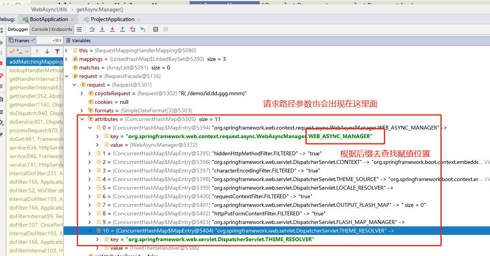

SpringBoot问题记录
=================

## 关于请求/{id}和/{id:.+} 问题

今天同事问到了一个请求`:.+}` 这个路径问题，这是个正则表达式匹配，为了满足SpringMVC 请求路径String，匹配string带有.号匹配一个及多个问题。

### 试验结果

于是我就测试不同springboot默认情况下是怎样的？

```java
@RestController
public class DemoController {
	// 在springboot 1.5.x 时，请求/demo/ha.aa.dd ,只能映射得到:ha.aa,最后一个舍弃
    // 在springboot 2.x 时，可以正常得到ha.aa.dd
    @GetMapping(path = "demo/{id}")
    public String demo(@PathVariable String id){
        return id;
    }
    // 在springboot 1.5.x和2.x 均能正常获取
    @GetMapping(path = "user/{id:.+}")
    public String user(@PathVariable String id){
        return id;
    }

}
```

### 原因分析

采用IDEA，分析，先从入口`org.springframework.web.servlet.DispatcherServlet#doDispatch` 方法入手

核心方法是获取当前handler`mappedHandler = getHandler(processedRequest);`

此时一路分析下去：

1. org.springframework.web.servlet.handler.AbstractHandlerMethodMapping#getHandlerInternal
2. org.springframework.web.servlet.mvc.method.RequestMappingInfo#getMatchingCondition
3. org.springframework.web.servlet.mvc.condition.PatternsRequestCondition#getMatchingCondition
4. org.springframework.web.servlet.mvc.condition.PatternsRequestCondition#getMatchingPattern

核心方法：

```java
/** 
 * 获取匹配规则
 * 
 * @param pattern 是requestmapping配置路径
 * @param lookupPath 是用户的url请求路径
 */
private String getMatchingPattern(String pattern, String lookupPath) {
	if (pattern.equals(lookupPath)) {
		return pattern;
	}
	// 核心参数：如果true，那么在url后加上.*，后缀模式匹配。springboot 2.x 默认false
	if (this.useSuffixPatternMatch) {
		if (!this.fileExtensions.isEmpty() && lookupPath.indexOf('.') != -1) {
			for (String extension : this.fileExtensions) {
				if (this.pathMatcher.match(pattern + extension, lookupPath)) {
					return pattern + extension;
				}
			}
		}
		else {
			// springboot 1.5默认true,请求：demo/{id}，实际采用demo/{id}.* 去进行匹配
			boolean hasSuffix = pattern.indexOf('.') != -1;
			if (!hasSuffix && this.pathMatcher.match(pattern + ".*", lookupPath)) {
				return pattern + ".*";
			}
		}
	}
	// springboot 2.x 直接采用demo/{id} 进行匹配
	if (this.pathMatcher.match(pattern, lookupPath)) {
		return pattern;
	}
	if (this.useTrailingSlashMatch) {
		if (!pattern.endsWith("/") && this.pathMatcher.match(pattern + "/", lookupPath)) {
			return pattern + "/";
		}
	}
	return null;
}
```

上面是获取匹配规则，下面是如何获取参数，主要是request里面的属性值



1. org.apache.catalina.connector.Request#attributes
2. org.springframework.web.servlet.handler.AbstractHandlerMethodMapping#getHandlerInternal
3. org.springframework.web.servlet.handler.AbstractHandlerMethodMapping#lookupHandlerMethod
4. org.springframework.web.servlet.mvc.method.RequestMappingInfoHandlerMapping#handleMatch
5. org.springframework.util.AntPathMatcher#extractUriTemplateVariables
6. org.springframework.util.AntPathMatcher.AntPathStringMatcher#matchStrings

核心读取参数源码如下：

```java
protected HandlerMethod lookupHandlerMethod(String lookupPath, HttpServletRequest request) throws Exception {
	List<Match> matches = new ArrayList<Match>();

	if (!matches.isEmpty()) {
		Comparator<Match> comparator = new MatchComparator(getMappingComparator(request));
		Collections.sort(matches, comparator);
		// 请求路径最佳匹配
		Match bestMatch = matches.get(0);
		// request赋值属性最佳匹配方法
		request.setAttribute(BEST_MATCHING_HANDLER_ATTRIBUTE, bestMatch.handlerMethod);
		// 处理匹配
		handleMatch(bestMatch.mapping, lookupPath, request);
		return bestMatch.handlerMethod;
	}
	else {
		return handleNoMatch(this.mappingRegistry.getMappings().keySet(), lookupPath, request);
	}
}

// 处理匹配
protected void handleMatch(RequestMappingInfo info, String lookupPath, HttpServletRequest request) {
	super.handleMatch(info, lookupPath, request);

	String bestPattern;
	Map<String, String> uriVariables;
	// url请求参数处理
	Map<String, String> decodedUriVariables;

	Set<String> patterns = info.getPatternsCondition().getPatterns();
	if (patterns.isEmpty()) {
		bestPattern = lookupPath;
		uriVariables = Collections.emptyMap();
		decodedUriVariables = Collections.emptyMap();
	}
	else {
		bestPattern = patterns.iterator().next();
		uriVariables = getPathMatcher().extractUriTemplateVariables(bestPattern, lookupPath);
		decodedUriVariables = getUrlPathHelper().decodePathVariables(request, uriVariables);
	}
	// 最佳模式匹配
	request.setAttribute(BEST_MATCHING_PATTERN_ATTRIBUTE, bestPattern);
	// url请求参数获取
	request.setAttribute(HandlerMapping.URI_TEMPLATE_VARIABLES_ATTRIBUTE, decodedUriVariables);

	if (isMatrixVariableContentAvailable()) {
		Map<String, MultiValueMap<String, String>> matrixVars = extractMatrixVariables(request, uriVariables);
		request.setAttribute(HandlerMapping.MATRIX_VARIABLES_ATTRIBUTE, matrixVars);
	}

	if (!info.getProducesCondition().getProducibleMediaTypes().isEmpty()) {
		Set<MediaType> mediaTypes = info.getProducesCondition().getProducibleMediaTypes();
		request.setAttribute(PRODUCIBLE_MEDIA_TYPES_ATTRIBUTE, mediaTypes);
	}
    // 最终request对象的attribute属性包含了，请求的所有内容信息
}
```

采用idea，查看`request`对象信息，可以调试出所有web请求参数内容。

### 修改配置

既然有默认配置，那么我们就可以修改默认配置

springboot 2.x 默认配置说明

```properties
# org.springframework.boot.autoconfigure.web.servlet.WebMvcProperties$Pathmatch
spring.mvc.pathmatch.use-suffix-pattern = false
```

后续经验，直接在idea的memory 输入对象：`PatternsRequestCondition` 查看实际配置说明。输入对象`PathMatchConfigurer` 查看配置信息。

* springboot 2.0.x 

  默认值是false，如果需要修改，参考下面配置。

  ```properties
  # 匹配 /user.* 模式，默认值：false，注意{id:.+}
  spring.mvc.pathmatch.use-suffix-pattern=true
  ```

* springboot 1.5.x

  由于`WebMvcProperties` 并没有开放`pathmatch` 参数配置，所以需要手动修改config。

  ```java
  /**
   * Spring Boot 1.5.x 自定义 Web MVC {@link WebMvcConfigurerAdapter}
   * @author JiePeng Chen
   * @since 2019/8/26 17:16
   */
  @Configuration
  public class WebMvcConfig extends WebMvcConfigurerAdapter{
  
      @Override
      public void configurePathMatch(PathMatchConfigurer configurer) {
          configurer.setUseSuffixPatternMatch(false);
      }
  }
  ```

  

通过上面，我们可以看出springboot 2.x 越来越多友好了。

参考配置

[https://docs.spring.io/spring/docs/5.0.15.RELEASE/spring-framework-reference/web.html#mvc-config-path-matching](https://docs.spring.io/spring/docs/5.0.15.RELEASE/spring-framework-reference/web.html#mvc-config-path-matching)

[https://docs.spring.io/spring/docs/4.3.25.RELEASE/spring-framework-reference/htmlsingle/#mvc-config-path-matching](https://docs.spring.io/spring/docs/4.3.25.RELEASE/spring-framework-reference/htmlsingle/#mvc-config-path-matching)

### MVC扩展

[https://docs.spring.io/spring-boot/docs/2.1.7.RELEASE/reference/htmlsingle/#boot-features-spring-mvc-auto-configuration](https://docs.spring.io/spring-boot/docs/2.1.7.RELEASE/reference/htmlsingle/#boot-features-spring-mvc-auto-configuration)

最新版本springboot2.1.7版本的参考文档，**这里的WebMvcConfigurerAdapter就被WebMvcConfigurer替代了**

If you want to keep Spring Boot MVC features and you want to add additional [MVC configuration](https://docs.spring.io/spring/docs/5.1.9.RELEASE/spring-framework-reference/web.html#mvc) (interceptors, formatters, view controllers, and other features), you can add your own `@Configuration` class of type `WebMvcConfigurer` but **without** `@EnableWebMvc`. If you wish to provide custom instances of `RequestMappingHandlerMapping`, `RequestMappingHandlerAdapter`, or `ExceptionHandlerExceptionResolver`, you can declare a `WebMvcRegistrationsAdapter` instance to provide such components.


[https://docs.spring.io/spring-boot/docs/1.5.22.RELEASE/reference/htmlsingle/#boot-features-spring-mvc-auto-configuration](https://docs.spring.io/spring-boot/docs/1.5.22.RELEASE/reference/htmlsingle/#boot-features-spring-mvc-auto-configuration)

If you want to keep Spring Boot MVC features, and you just want to add additional [MVC configuration](https://docs.spring.io/spring/docs/4.3.25.RELEASE/spring-framework-reference/htmlsingle#mvc) (interceptors, formatters, view controllers etc.) you can add your own `@Configuration` class of type `WebMvcConfigurerAdapter`, but **without** `@EnableWebMvc`. If you wish to provide custom instances of `RequestMappingHandlerMapping`, `RequestMappingHandlerAdapter` or `ExceptionHandlerExceptionResolver` you can declare a `WebMvcRegistrationsAdapter` instance providing such components.

If you want to take complete control of Spring MVC, you can add your own `@Configuration` annotated with `@EnableWebMvc`.

#### 为什么到了springboot 2.x就要废弃了`WebMvcConfigurerAdapter`

因为springboot 2.x 的依赖JDK基础版本是jdk1.8 , 在接口引入了default（默认）方法，而抽象类`WebMvcConfigurerAdapter` 里面全是抽象方法，在jdk8，可以用接口的抽象方法代替。所以到了springboot2.0就把这个抽象类废弃了。springboot 1.5.x 依然可以支持jdk1.6和jdk1.7 版本。